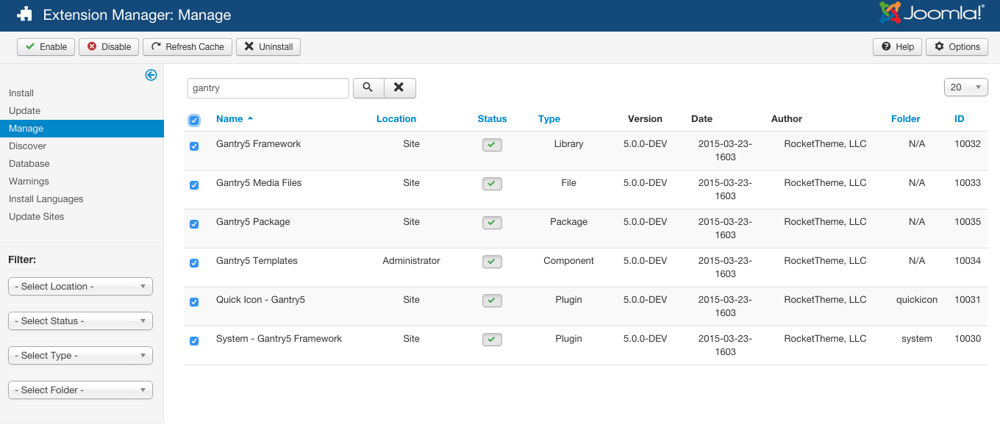
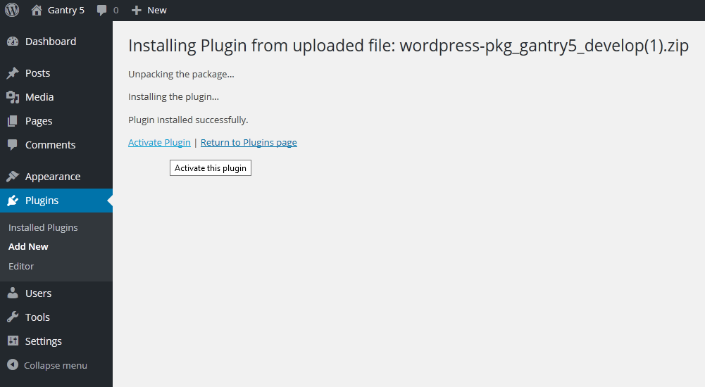
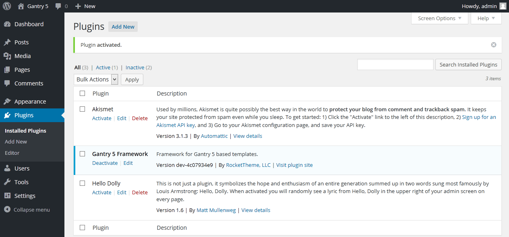
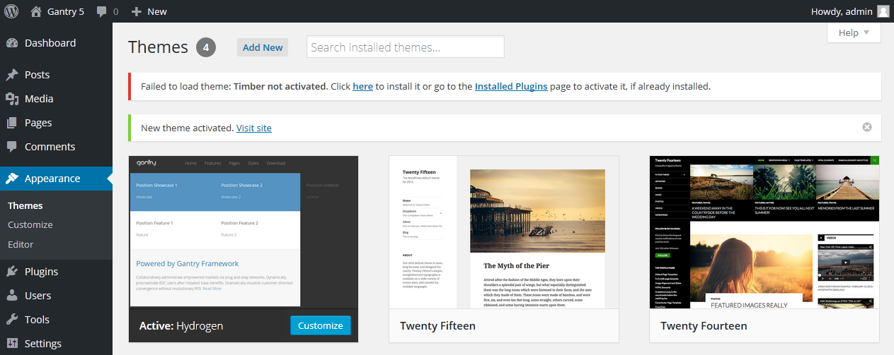
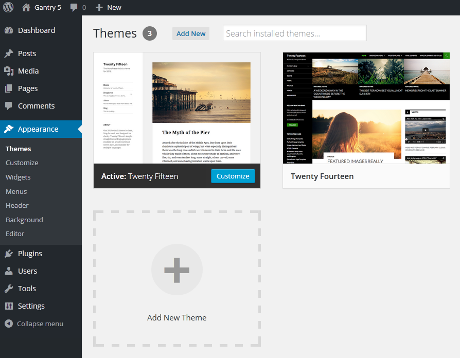
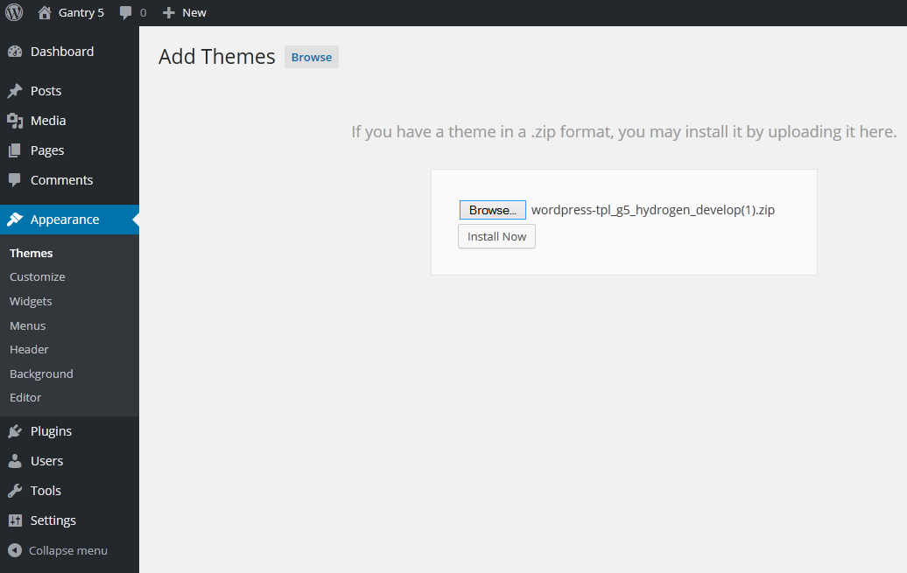
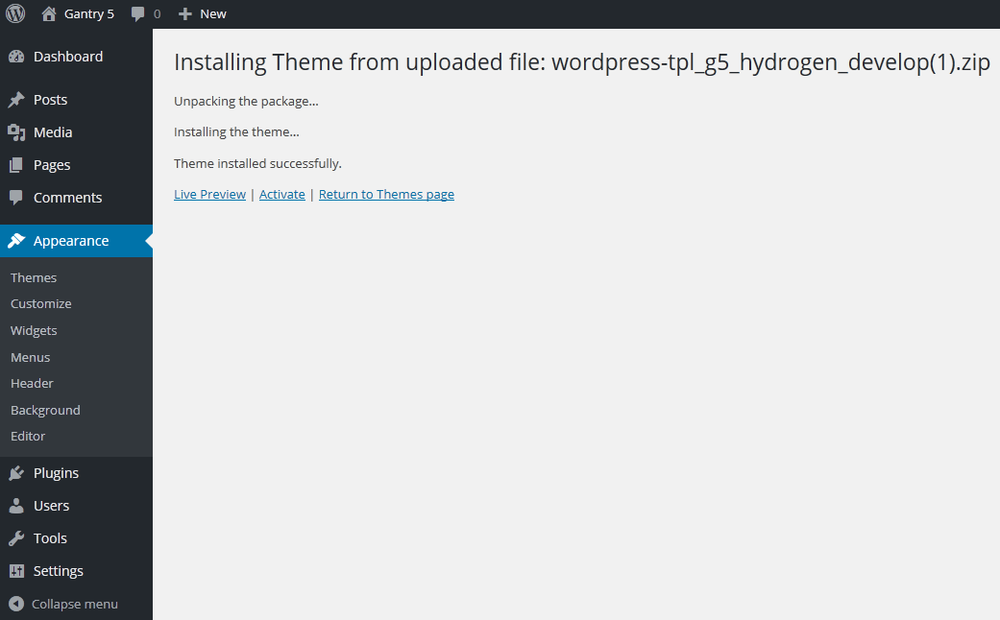

The Gantry framework itself is independent of any theme. Each Gantry-enabled theme relies on the Gantry framework to provide the underlying base and extensive functionality that enables the creation of such powerful sites. While a Gantry-powered theme does require the Gantry framework to work properly, Gantry is not inherently built in to the theme, itself.

## Downloading Gantry

Gantry requires two major parts to function. The first is the Gantry framework itself, a collection including the Gantry component, library, and associated plugins. This is the base by which the second part, a Gantry-powered theme functions. 

* **Gantry 5**: This contains the Gantry 5 framework and its associated bits and pieces (library, component, and plugins).
* **Theme**: This contains just the theme/template.

The installation process is exactly the same for each of these. The only difference is the file you are installing. The Gantry 5 component should be installed prior to a Gantry theme.

<a href="http://gantry.org/downloads" class="button"><i class="fa fa-fw fa-download"></i> Download Gantry 5 and the Hydrogen Theme</a>

## Installing the Gantry Framework

[ui-tabs position="top-left" active="0" theme="lite"]
[ui-tab title="Joomla"]

[plugin:youtube](https://www.youtube.com/watch?v=zCH10qrxPSc)

Install the **Gantry Framework** package file (named similarly to `pkg_gantry5-v5.0.0.zip`) by navigating to **Extensions → Extensions Manager → Install** and selecting the **Choose File** button. Locate the downloaded ZIP and click **Upload & Install** to begin the installation process.

 {.border .shadow}

After installing the Gantry Framework package, all of the Gantry extensions will appear in the **Extensions Manager**.

 {.border .shadow}

If you are having any issues, including the following error messages:

* `Failed to load 'g5_hydrogen' template: Please install Gantry5 Framework!` 
* `Error - Please install Gantry5 Framework!`
* `Error - Gantry5 Templates: Please enable 'System - Gantry5 Framework' plugin!`

You will want to make sure that all of Gantry's associated extensions are enabled. To do so, simply select any non-enabled extensions listed in the image above, and activate them by selecting the **Enable** button in the upper-left area of the **Extensions Manager**.

[/ui-tab]
[ui-tab title="WordPress"]

[plugin:youtube](https://www.youtube.com/watch?v=5o5GjHVX7AQ)

To install the Gantry plugin, you'll need to navigate to **Plugins → Add New** in the admin area of WordPress. At the top of the **Add Plugins** page, you will see an **Upload Plugin** botton. Click it.

From here, select the **Browse** button, locate the downloaded ZIP file, and click **Install Now** to begin installation.

 {.border .shadow}

Once installation is done, select the **Activate** shortcut to turn the Gantry 5 plugin on.

 {.border .shadow} 

Gantry 5 will now appear in your **Installed Plugins** list.

>>> The file name and version number of your Gantry framework installation will be different.

Gantry 5 requires one additional plugin to work. The **Timber** plugin enables WordPress to work with Twig templates. Because Gantry 5 uses Twig, this is a required step. You can find more information about Timber on the [project home page](http://upstatement.com/timber/).

 {.border .shadow}

If you attempt to activate a Gantry 5 theme without the Timber plugin installed, a red notice will appear at the top of the admin giving you a direct link to where you can install Timber to your site.

[/ui-tab]
[ui-tab title="Grav"]

Grav documentation is coming soon...

[/ui-tab]
[/ui-tabs]

## Installing a Gantry Theme

[ui-tabs position="top-left" active="0" theme="lite"]
[ui-tab title="Joomla"]

Install at **Extensions → Extensions Manager → Install**. Select the **Choose File** button, locate the downloaded ZIP and click **Upload & Install** to begin the installation.

 {.border .shadow}

The Gantry template will appear in the **Template Manager**, and all Gantry extensions will appear in the **Extensions Manager**.

[/ui-tab]
[ui-tab title="WordPress"]

Themes made on Gantry 5 install just like any other WordPress theme. The difference here is that you really want to have the Gantry framework installed and activated first, otherwise the theme itself won't be of much use.

 {.border .shadow}

To install the theme on WordPress, simply navigate to **Admin → Appearance** in the sidebar and select the **Add New** button at the top of the **Themes** page.

This will take you to the **Add Themes** page with another button on top called **Upload Theme**. Click it.

 {.border .shadow}

Just as you did with the Gantry framework, use the **Browse...** button to select the zip file for the theme you wish to install and select **Install Now**.

>>> The file name and version number of your Gantry framework installation will be different.

[/ui-tab]
[ui-tab title="Grav"]

Grav documentation is coming soon...

[/ui-tab]
[/ui-tabs]

## Setting a Gantry Theme as Default

[ui-tabs position="top-left" active="0" theme="lite"]
[ui-tab title="Joomla"]

If you are using the Gantry template, you will want to set it as the default template so it loads on the front end. Go to **Extensions → Template Manager**, select the **gantry** checkbox, and click **Default** in the button toolbar.

>>> For some Gantry-powered templates, this will happen automatically upon installation. This is a time-saving step intended to speed up deployment and reduce confusion for new users.

 {.border .shadow}

[/ui-tab]
[ui-tab title="WordPress"]

 {.border .shadow} 

Your Gantry-powered theme will be set as default upon activation. You can activate your theme during installation by selecting **Activate** from the shortcuts at the bottom of the installation screen.

You can also activate a theme by navigating to **Admin → Appearance** and selecting **Activate** in your desired theme's box.

[/ui-tab]
[ui-tab title="Grav"]

Grav documentation is coming soon...

[/ui-tab]
[/ui-tabs]
