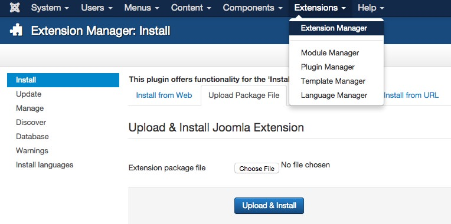

[ui-tabs position="top-left" active="0"]
[ui-tab title="Joomla"]

There are several parts to Gantry: The library, component, plugin, and template -- and each have a similar upgrading process.

[ui-callout]
[ui-callout-item title="Gantry 5 Templates" position="78%, 8%, se"]
Select this item to go directly to the Gantry 5 Administrator.
[/ui-callout-item]
[ui-callout-item title="Gantry 5 - Update Now!" position="87%, 8%, se"]
Select this item to go to the Extensions Manager's Update page where you can quickly update Gantry extensions and templates.
[/ui-callout-item]

[/ui-callout]

There are multiple methods to check for new updates, the first of which is available from the **Control Panel** in the Joomla administrator. Under the **Maintenance** section, the term `Gantry5 - Update now!` will appear, indicating that updates are available. Clicking this line will take you to the **Extension Manager's** Update page where you will see a filtered list of Gantry extensions that are available to update.

Another indicator that an update is available will appear as a notification in the Gantry 5 Administrator. If an update to either the Gantry framework or a Gantry-powered theme is available, a purple bar will appear giving you the option to **Update** (sending you to the **Extensions Manager's Update page**) or close the notification.

You can also navigate to **Extensions → Extensions Manager → Update**, select **Find Updates** to load all available updates, if they are not already shown. You can then select Gantry and any Gantry-powered templates listed here and click **Update**. Gantry will now be updated directly from the Web.

Another method of updating is similar to the process of installing Gantry in the first place. You would just need to download the latest Gantry files, and install at **Extensions → Extensions Manager → Install**. Select the **Choose File** button and locate the downloaded ZIP and click **Upload & Install** to begin the update. There is no need to uninstall first as the files will be updated during the installation process. We don't recommend this method first if you have the more standard method available to you, but it will work.

 {.border .shadow}

You can check to see if the correct Gantry version has been installed by going to **Extensions → Extensions Manager → Manage**, and searching for Gantry. The version number will appear in the table.

[/ui-tab]
[ui-tab title="WordPress"]

Upgrading the Gantry Framework plugin is a relatively straightforward and simple process. This can be done using the built-in WordPress updater. Go to **Admin Dashboard → Updates**, select **Check Again** to load all available updates. Then check the checkbox next to the Gantry Template Framework and click **Update Plugins**.. Gantry will now be updated directly from the web.

Alternatively, you can upload the updated version via FTP. You would just need to download the latest [Gantry files](http://gantry.org/downloads), extract them and overwrite the whole `gantry` directory under `wp-content/plugins`. There is no need to uninstall first, as the files will be overwritten during the FTP upload.

You can check to see if the correct Gantry version has been installed by going to **Plugins** and searching for Gantry. The version number will appear in the resulting table.

[/ui-tab]
[ui-tab title="Grav"]

Grav documentation is coming soon...

[/ui-tab]
[/ui-tabs]

