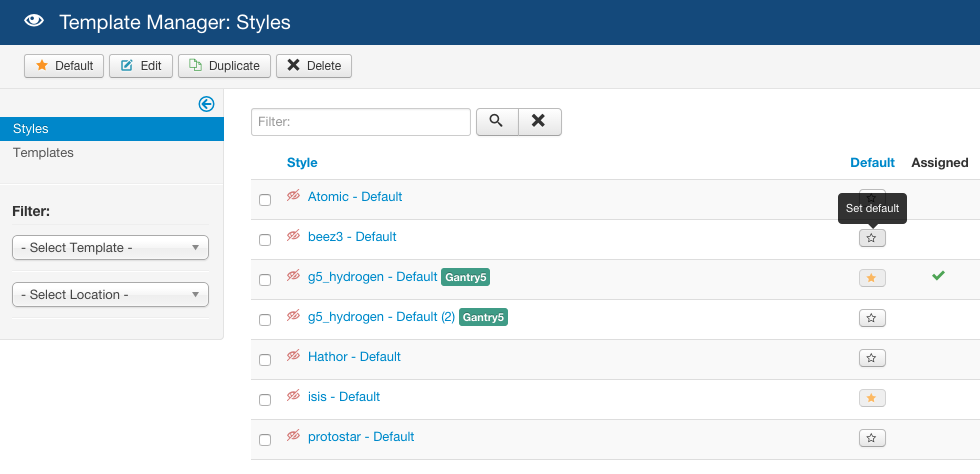

There are two main parts to Gantry -- the framework and the template. Therefore, there are two main parts to the uninstallation process. If you intend to uninstall only the template portion, then follow the instructions for removing the template only. Keeping the Gantry library installed really does not cause any harm or reduced performance as it is only used by a Gantry-enabled template. If you wish to uninstall the library, you can follow those steps.

## Unsetting the Gantry Template as Default

[ui-tabs position="top-left" active="0" theme="lite"]
[ui-tab title="Joomla"]

 {.border .shadow}

To uninstall the Gantry template, you will first have to ensure that it is not set as the default template. Go to **Extensions → Template Manager**, select the checkbox to any other site template that is not Gantry, and click **Default** in the button toolbar.

[/ui-tab]
[ui-tab title="WordPress"]

To uninstall the Gantry theme, you will first have to ensure that it's not activated. Go to **Appearance → Themes** and click on the **Activate** on any other theme that is not gantry. After that, you can simply click on the **Delete** button next to the Gantry theme.

[/ui-tab]
[ui-tab title="Grav"]

Grav documentation is coming soon...

[/ui-tab]
[/ui-tabs]

## Uninstall Gantry

[ui-tabs position="top-left" active="0" theme="lite"]
[ui-tab title="Joomla"]

 {.border .shadow}

Uninstall the Gantry component, library, plugin and template(s) from **Extensions → Extensions Manager → Manage**. Insert **gantry** into the **Filter** and click **Search**. Select the unlocked Gantry 5 extension, then click **Uninstall** in the button toolbar. Gantry will now be uninstalled.

[/ui-tab]
[ui-tab title="WordPress"]

There are two main parts to Gantry -- the framework and the theme. Therefore, there are two pieces to uninstall. If you intend to uninstall only the theme portion, then follow the instructions for removing the theme only. Keeping the Gantry plugin installed does not harm as it is only used by a Gantry-enabled theme, but if you wish to uninstall the plugin, you can follow those steps.

Uninstall the Gantry plugin and theme from **Plugins** admin page. Please search for **Gantry Template Framework** and **Deactivate** it first, then click **Delete** next to its name. Gantry will now be deleted.

[/ui-tab]
[ui-tab title="Grav"]

Grav documentation is coming soon...

[/ui-tab]
[/ui-tabs]

