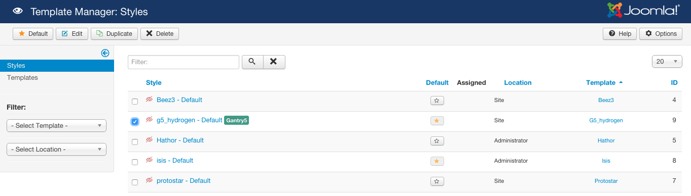

Because Gantry 5 is so different from any version of Gantry before it, we came up with some terms to help make sense of the relationships Gantry's new features have with one-another. In this section, we will define some of these terms and explain how they relate to one-another when you are building your Gantry-powered website.

### Configuration

A **Configuration** is essentially a style specific to one or more areas of your site. In Joomla, these styles are traditionally created in the **Template Manager** by duplicating an installed theme. This principal is very much the same in Gantry 5, however because we have integrated a global default as well as several system-specific styles that do not appear in the Template Manager, we decided to give them a more appropriate name of Configuration.

Each Configuration can have its own set of style, Particle, and layout settings and defaults. A Configuration can also be assigned to specific pages, such as the **Home** or **Contact** page, giving them a unique look that sits apart from the rest of your site.

The **Base Configuration** acts as the global default by which all other Configurations are based. This Configuration can't be assigned to any pages as it merely acts as a set of defaults which are overridden by other Configurations.



 {.border .shadow}

To create a new Configuration in Joomla, simply navigate to the **Template Manager** by going to **Administrator > Extensions > Template Manager**, select the Gantry-powered template, and click **Duplicate**.

This will create a new style, which Gantry 5 will pick up and treat as a Configuration.




Coming soon...


{{ gravui_tabs({'Joomla':tab1, 'WordPress':tab2}) }}

### Particle

A **Particle** is a piece of pre-written code which can be configured in the Gantry 5 Administrator and added directly to your page's Layout. Particles can do a variety of things from enabling you to insert a small block of HTML to presenting a large, detailed block of information with images, links, text, and more.

<a href="../particles/particles" class="button"><i class="fa fa-fw fa-graduation-cap"></i> Learn More</a>

### Atom

An **Atom** is a type of **Particle** that does not render visually on the frontend. These allow you to add scripted pieces to your page in a modular fashion, such as adding custom scripting you want to have run at the end of the page load, or a Google Analytics script for traffic tracking.

An **Atom** can be placed in your page's layout using a special **Non-Visual Particles** section in the **Layout Manager** and can be created in very much the same way as any standard particle.

<a href="../particles/particles#atoms" class="button"><i class="fa fa-fw fa-graduation-cap"></i> Learn More</a>