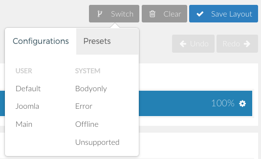

The **Layout Manager** in the Gantry-based theme administration interface provides several options for configuring the layout of the theme.

Choosing a Layout
-----

Lorem ipsum dolor sit amet, consectetur adipiscing elit. Suspendisse quis aliquam elit. Sed vulputate, turpis a ultrices feugiat, sem dui cursus tellus, eget semper risus nisl non mi. Duis eu urna maximus, tempor est eu, commodo massa. Nulla dolor lorem, molestie iaculis ante ac, semper fermentum erat. Morbi vestibulum dictum nunc vitae viverra. Duis sed dapibus odio. Sed fringilla enim quis pharetra malesuada. In dapibus elit vitae imperdiet hendrerit. Quisque eu ornare erat. Pellentesque vitae arcu id metus ultricies suscipit quis porta ante.

Creating a New Layout
-----

Lorem ipsum dolor sit amet, consectetur adipiscing elit. Suspendisse quis aliquam elit. Sed vulputate, turpis a ultrices feugiat, sem dui cursus tellus, eget semper risus nisl non mi. Duis eu urna maximus, tempor est eu, commodo massa. Nulla dolor lorem, molestie iaculis ante ac, semper fermentum erat. Morbi vestibulum dictum nunc vitae viverra. Duis sed dapibus odio. Sed fringilla enim quis pharetra malesuada. In dapibus elit vitae imperdiet hendrerit. Quisque eu ornare erat. Pellentesque vitae arcu id metus ultricies suscipit quis porta ante.

Sections
-----

Lorem ipsum dolor sit amet, consectetur adipiscing elit. Suspendisse quis aliquam elit. Sed vulputate, turpis a ultrices feugiat, sem dui cursus tellus, eget semper risus nisl non mi. Duis eu urna maximus, tempor est eu, commodo massa. Nulla dolor lorem, molestie iaculis ante ac, semper fermentum erat. Morbi vestibulum dictum nunc vitae viverra. Duis sed dapibus odio. Sed fringilla enim quis pharetra malesuada. In dapibus elit vitae imperdiet hendrerit. Quisque eu ornare erat. Pellentesque vitae arcu id metus ultricies suscipit quis porta ante.

### Settings

| Setting |             Description             |
| :------ | :---------------------------------- |
| Class   | Sets the CSS class for the particle |

Lorem ipsum dolor sit amet, consectetur adipiscing elit. Suspendisse quis aliquam elit. Sed vulputate, turpis a ultrices feugiat, sem dui cursus tellus, eget semper risus nisl non mi. Duis eu urna maximus, tempor est eu, commodo massa. Nulla dolor lorem, molestie iaculis ante ac, semper fermentum erat. Morbi vestibulum dictum nunc vitae viverra. Duis sed dapibus odio. Sed fringilla enim quis pharetra malesuada. In dapibus elit vitae imperdiet hendrerit. Quisque eu ornare erat. Pellentesque vitae arcu id metus ultricies suscipit quis porta ante.

Grids
-----

Lorem ipsum dolor sit amet, consectetur adipiscing elit. Suspendisse quis aliquam elit. Sed vulputate, turpis a ultrices feugiat, sem dui cursus tellus, eget semper risus nisl non mi. Duis eu urna maximus, tempor est eu, commodo massa. Nulla dolor lorem, molestie iaculis ante ac, semper fermentum erat. Morbi vestibulum dictum nunc vitae viverra. Duis sed dapibus odio. Sed fringilla enim quis pharetra malesuada. In dapibus elit vitae imperdiet hendrerit. Quisque eu ornare erat. Pellentesque vitae arcu id metus ultricies suscipit quis porta ante.

### Settings

| Setting |             Description             |
| :------ | :---------------------------------- |
| Class   | Sets the CSS class for the particle |

Lorem ipsum dolor sit amet, consectetur adipiscing elit. Suspendisse quis aliquam elit. Sed vulputate, turpis a ultrices feugiat, sem dui cursus tellus, eget semper risus nisl non mi. Duis eu urna maximus, tempor est eu, commodo massa. Nulla dolor lorem, molestie iaculis ante ac, semper fermentum erat. Morbi vestibulum dictum nunc vitae viverra. Duis sed dapibus odio. Sed fringilla enim quis pharetra malesuada. In dapibus elit vitae imperdiet hendrerit. Quisque eu ornare erat. Pellentesque vitae arcu id metus ultricies suscipit quis porta ante.

Placing Particles
-----

Lorem ipsum dolor sit amet, consectetur adipiscing elit. Suspendisse quis aliquam elit. Sed vulputate, turpis a ultrices feugiat, sem dui cursus tellus, eget semper risus nisl non mi. Duis eu urna maximus, tempor est eu, commodo massa. Nulla dolor lorem, molestie iaculis ante ac, semper fermentum erat. Morbi vestibulum dictum nunc vitae viverra. Duis sed dapibus odio. Sed fringilla enim quis pharetra malesuada. In dapibus elit vitae imperdiet hendrerit. Quisque eu ornare erat. Pellentesque vitae arcu id metus ultricies suscipit quis porta ante.

Resizing and Rearranging
-----

Lorem ipsum dolor sit amet, consectetur adipiscing elit. Suspendisse quis aliquam elit. Sed vulputate, turpis a ultrices feugiat, sem dui cursus tellus, eget semper risus nisl non mi. Duis eu urna maximus, tempor est eu, commodo massa. Nulla dolor lorem, molestie iaculis ante ac, semper fermentum erat. Morbi vestibulum dictum nunc vitae viverra. Duis sed dapibus odio. Sed fringilla enim quis pharetra malesuada. In dapibus elit vitae imperdiet hendrerit. Quisque eu ornare erat. Pellentesque vitae arcu id metus ultricies suscipit quis porta ante.

Importing and Exporting Layouts
-----

Lorem ipsum dolor sit amet, consectetur adipiscing elit. Suspendisse quis aliquam elit. Sed vulputate, turpis a ultrices feugiat, sem dui cursus tellus, eget semper risus nisl non mi. Duis eu urna maximus, tempor est eu, commodo massa. Nulla dolor lorem, molestie iaculis ante ac, semper fermentum erat. Morbi vestibulum dictum nunc vitae viverra. Duis sed dapibus odio. Sed fringilla enim quis pharetra malesuada. In dapibus elit vitae imperdiet hendrerit. Quisque eu ornare erat. Pellentesque vitae arcu id metus ultricies suscipit quis porta ante.

History
-----

Lorem ipsum dolor sit amet, consectetur adipiscing elit. Suspendisse quis aliquam elit. Sed vulputate, turpis a ultrices feugiat, sem dui cursus tellus, eget semper risus nisl non mi. Duis eu urna maximus, tempor est eu, commodo massa. Nulla dolor lorem, molestie iaculis ante ac, semper fermentum erat. Morbi vestibulum dictum nunc vitae viverra. Duis sed dapibus odio. Sed fringilla enim quis pharetra malesuada. In dapibus elit vitae imperdiet hendrerit. Quisque eu ornare erat. Pellentesque vitae arcu id metus ultricies suscipit quis porta ante.
