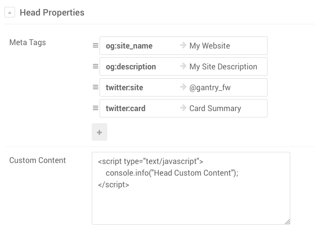
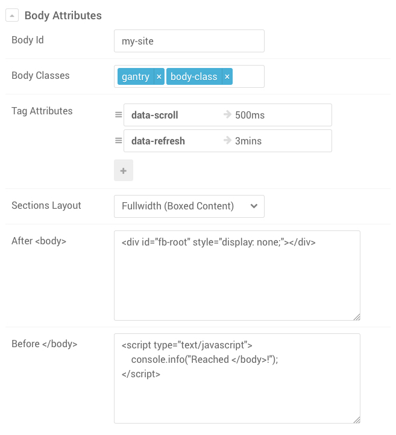
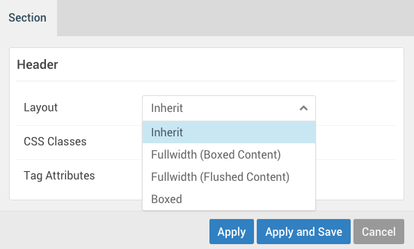
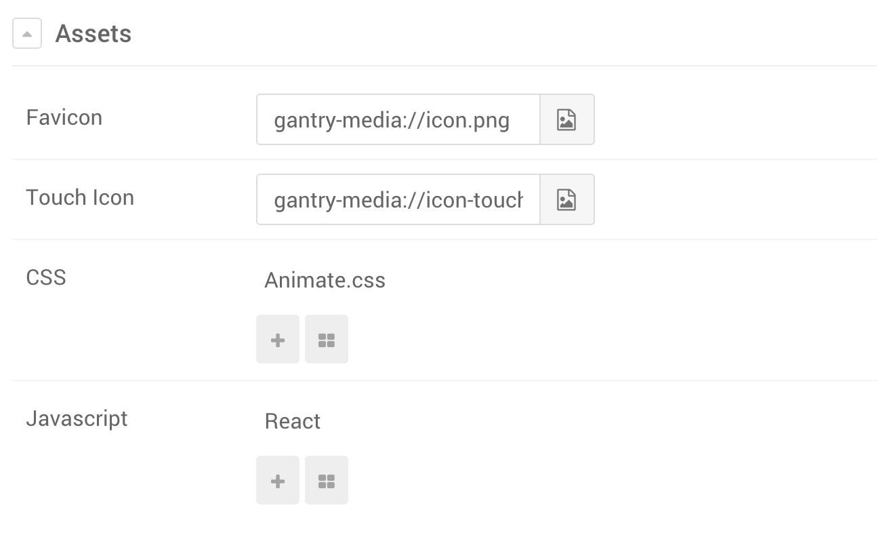
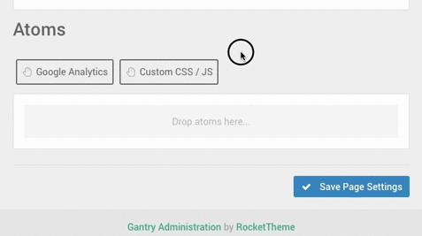

The **Page Settings** administrative panel allows you to extend the output of the page by letting you include additional elements. This includes elements such as the **favicon**, Facebook and Twitter **meta tags**, and even JavaScript and/or CSS files. All of these elements are meant to be shared across the entire site and **Page Settings** is what lets you do so.

In the traditional template approach, to add any of these elements, you would need to manually edit the file that includes the structure of the page. This is usually an `index.php` file. Page Settings simplifies this process exponentially by abstracting the manual editing labor into a simple and powerful form right into the admin.

Thanks to the Gantry's core concept and implementation of overrides, Page Settings can be global, as well as Outline independent, if ever needed. You could use it to add an analytics script to the whole site, or have a different one appear depending on which outline a page is assigned to.

## Controls


!!! Just as in the [Particle Defaults Panel](../particle-defaults#controls), overrides, filtering and collapsing work the same way.

## Head Properties

 {.border .shadow}

The **Head Properties** block allows you to customize anything that goes between the `<head></head>` tags. Often, you will want to add meta tags for Facebook or Twitter, or perhaps you simply want to add something custom.

The screenshot above demonstrates one of the many possible ways you could compile Head Properties.

### Meta Tags

**Meta Tags** is a Collection field that takes a list of keys and values, combines them, and renders them inside `<head></head>` in the form of a `<meta>` property.
The use of Meta Tags is countless. Usually meta tags are used to better define a site for search engines as well as define how the site gets displayed when embedded in Facebook or Twitter.

More details about **Facebook's Open Graph** and **Twitter's Cards** meta tags can be found at the following locations:

- [https://developers.facebook.com/docs/sharing/webmasters](https://developers.facebook.com/docs/sharing/webmasters)
- [https://dev.twitter.com/cards/markup](https://dev.twitter.com/cards/markup)
- [https://dev.twitter.com/cards/getting-started](https://dev.twitter.com/cards/getting-started)


### Custom Content

The Custom Content field is dedicated to anything specific that one wants to append to the `<head>` tag. Any metadata that is allowed by the specs to go inside <head> can be written in here, the same way you would do if you were editing an `index.html` file.

Common metadata tags are `<title>`, `<style>`, `<meta>`, `<link>`, `<script>`, and `<base>`.

! It is highly advised to handle Scripts and Styles via [Assets Section](#assets) or via [Atoms](#atoms). Although it can be tempting to write script and tags code directly in this field, it should only be used as a last resort in case. Evaluate properly whether Scripts and Styles should go in here.

## Body Attributes

 {.border .shadow}

**Body Attributes** allows users to customize the attributes for the `<body>` tag as well as inject content right after `<body>` opens or right before `</body>` closes.

### Body Id and Body Classes

The **Body Id** field allows users to specify an id for the `<body>`, while **Body Classes** allow users to add additional personal class names. Following the example in the screenshot above, the resulting output will render as:

```html
<body id="my-site" class="... gantry body-class ...">
```

Gantry itself already adds classes of its own to the body, based on various factors such as the menu item being viewed, what outline is being used, etc.

Most of the time you won't need to add any custom class name, although in case you need, this is the place for it.

### Tag Attributes

**Tag Attributes** is a Key/Value field that allows to render additional custom attributes for the `<body>`. Considering the screenshot example of above, imagine to have loaded a script that allows users to customize the scroll speed and page auto refresh via `data-scroll` and `data-refresh` attributes.

The resulting output will render as:


```html
<body id="my-site" class="... gantry body-class ..." data-scroll="500ms" data-refresh="3mins">
```

### Sections Layout

Since Gantry 5.2.0, by default, all Sections in the **Layout Manager** refer to this setting for their style. Sections Layout offers three types of styles:

1. **Fullwidth (Boxed Content)** _[Default - previously "Fullwidth"]_
2. **Fullwidth (Flushed Content)** _[new in 5.2.0]_
3. **Boxed**

And this is a visual representation of all three cases

| Fullwidth (Boxed Content) [Default]                     | Fullwidth (Flushed Content)                         | Boxed                                           |
| :-----:                                                 | :-----:                                             | :-----:                                         |
|  |  |  |

These styles allow users to customize the whole site or individual Sections to accommodate specific needs. The most common case scenario, for instance, is wanting a section to be fully flushed so that an image or background can be added to it making it flush to the edges.

To change the behavior of individual Sections, head to the Layout Manager panel and click the gear action icon of the desired section. You will then be able to pick a different value for the **Layout** field. **Inherit** will tell Gantry that it should be using the Setting from the **Page Settings** panel.

 {.border .shadow}

### After `<body>` and Before `</body>`

Sometimes you need to inject styles, scripts or elements to the page and they need to be inserted either at the beginning or the end of `<body>`.

A great example was [Facebook's SDK for JavaScript](https://developers.facebook.com/docs/javascript/quickstart/v1.0) at its version 1.0. Back then, Facebook required the site to provide a `<div id="fb-root"></div>` right after the `<body>` tag opened. As you can see from the screenshot example above, that would have been the perfect place for it.

You will often see scripts requiring that you do render elements up front in the page and instead of creating new Modules, Particles or Widgets, you can simply add your element in here. Popups are also a good example. The content of the modal is rendered in the page but invisible, until an element triggers the popup to open.

## Assets

 {.border .shadow}

**Assets** is a dedicated section for injecting specific CSS/JS or Favicons to the site. Even though anything you can do in Assets you could do with just [Head Properties](#head-properties) and [Body Attributes](#body-attributes), we decoupled these portions to its own section.

Assets serve a very important role in custom templating. Including 3rd party scripts or styles has become very common and for this very reason, having a dedicated section to keep everything well organized is important.

### Favicon and Touch Icon

The **Favicon** and **Touch Icon** features allow users to assign an image to the site that will then represent in form of an icon for the browser tab or in your device home screen.

Both fields are very similar, the **Favicon** field uses the more traditional way of rendering and associating an icon to the site. In the past, this has been always represented with a **16x16** or **32x32** icon size file.

These days, with the advent of touch devices and the possibility of saving into bookmarks or home screens a whole site, new standards have arisen allowing for bigger and more detailed icons. **Touch Icon** covers this and allows to let the devices be aware that your site can use icons with higher resolutions.

If you want to use **Touch Icon**, it is advised that you create an image that is at least **180x180** or **192x192**. Devices with a smaller resolution will adapt and downscale the image but the higher resolution will benefit of a nice looking icon.

! Gantry only covers the most common use of Touch Icons and supports iOS, Android and Windows. It also only downscales icons. If you are looking for a more sophisticated use of this and more targeted sizes, refer to [this article](https://mathiasbynens.be/notes/touch-icons). You can also use [Online tools for generating icons](http://realfavicongenerator.net/). The perfect place for adding custom generated icons code is [Head Properties: Custom Content](#head-properties).

### CSS and JavaScript

Both **CSS** and **JavaScript** Collection fields work identically to the [Custom CSS/JS Atom](#custom-css-js). The same behavior can be accomplished by adding an [Atom](#atom) as explained below. Although in some cases one would prefer to have separated assets between the Assets section and Atoms. Both methods are right and it just comes down to what you prefer.

## Atoms

 {.border .shadow}

Since Gantry 5.2.0, Atoms have been moved from the **Layout Manager** into the **Page Settings** panel. Even though Atoms are *de-facto* Particles and can be [created the same way](../../advanced/creating-a-new-particle), they behave differently.

Atoms are Particles that do not appear visually on the front end, but do serve an important purpose. They can be assigned on a per-page basis, or as a default which automatically applies to all of the pages on the site.

For all intents and purposes, Atoms such as **Google Analytics**, and **Custom CSS / JS** add scripting to the page which add or modify the page's scripting during load. This is useful for basic styling such as coloring, and analytics tracking.

! When using an Atom, the path to a local file is relative to the root of the site, and not to template folder. We recommend using a stream link, such as `gantry-theme://custom/thing.css` as an example, which enables the link to work even if you switch between G5 themes or platforms.

### Google Analytics


The **Google Analytics** Atom gives you the ability to quickly add your **Google Analytics UA code** to a Layout, which runs in the background of your page during page load. It adds the necessary scripting around the code you enter in the Atom's **settings**.

### Custom CSS / JS


### JavaScript Frameworks

The **JavaScript Frameworks** Atom gives you the ability to easily add popular JS libraries to your page.

[ui-tabs position="top-left" active="0"]
[ui-tab title="Joomla"]

! In Joomla the default **Bootstrap** library option will load your Joomla install's current implementation of Bootstrap based on Bootstrap 2.3.2.
[/ui-tab]
[ui-tab title="WordPress"]

[/ui-tab]
[ui-tab title="Grav"]

[/ui-tab]
[/ui-tabs]

### Lightcase

Lightcase is small, lightweight lightbox atom that gives you the ability to bring your images to life. It works in the background as an atom, being called with simple HTML. Here's an example:

```html
<a href="path/to/media.jpg"
   data-rel="lightcase"
   title="Your title"
>
    Your link description or thumb
</a>
```

All you need to do to take advantage of Lightcase is to activate it as an atom on the page (or pages) you wish to use it with, and to wrap images in HTML like that seen above.


