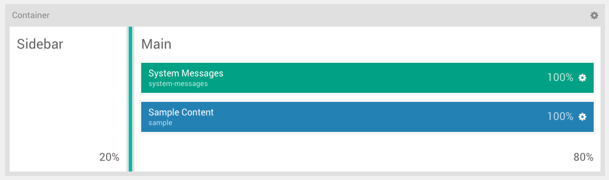
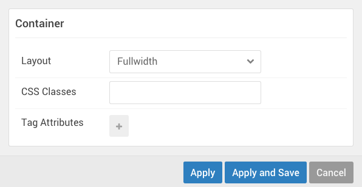

The **Layout Manager** in the Gantry-based theme administration interface provides several options for setting up the layout of the theme's Outlines. 

[plugin:youtube](https://www.youtube.com/watch?v=DN_U_W7LT_c)

Using the Load Button
-----

**Layout Presets** enable you to quickly switch between pre-configured layouts for your site. These layouts are included in the theme and feature a different set of sections. Some layout presets may include a sidebar, or multiple sidebars, and a number of sections intended to fit a specific page style.

Each **outline** is assigned to a **Layout Preset** which can be reassigned using the **Load** button in the **Layout Manager**. Once you have selected this button, a pop-up will appear with two tabs, **Presets** and **Outlines**.

If you select a **Preset**, your layout will be replaced with a preset one that comes with the theme. These presets act as starting points for your design, giving you a set of **Sections**, **Positions**, and/or pre-placed **Particles** to work with. The presets have been configured to cover a range of possible layouts a user would want to use on their design, as set by the theme creator. This includes layouts with and without sidebars, and range from incredibly simple to complex.

Selecting one of the **Outlines** options will copy the **Layout Manager** setup from the selected outline and load it into the one you are working in. This is a quick way to base your layout on another outline without having to manually duplicate it.

! The **Keep the Current Particles** option gives you the ability to keep your presently-configured Particles and load the new preset with them intact. If you want to completely load a new preset, along with its own Particles, you will want to uncheck this option. This will remove any Particles you have configured and load the ones that are included in the preset.

Controls
-----

The **Layout Manager** has a number of useful controls to help you configure, save, import, and export your layouts. In this section, we will go over some of the things you will find in the **Layout** administrative panel.

### Load

As covered in the above section, the **Load** button gives you the opportunity to load a **Layout Preset** based on pre-assembled presets included with the theme or on the **Layout** of another **outline**.

## Clear

The **Clear** button wipes out the Particles (including Positions, Standard Particles, and Atoms) from the **Layout Manager** and gives you a blank slate with just the [Sections](#sections) remaining.

### Save Layout

The **Save Layout** button is a quick and easy way to save the current layout, its Particles, and settings to the active outline. This is the button you would click before switching tabs to the frontend and refreshing the page to check your changes.

### History

The **History** buttons give you the ability to go back and forth between changes you have made in your Layout. This history is persistent through the current session, and makes it easy to go backwards and forwards, saving once you have reached a point you are happy with.

You can even go back after hitting **Save Layout**, should one of your changes not come out the way you expected after checking the frontend.

Particles
------

[ui-tabs position="top-left" active="0" theme="lite"]
[ui-tab title="Joomla"]

[/ui-tab]
[ui-tab title="WordPress"]

[/ui-tab]
[ui-tab title="Grav"]

Grav documentation is coming soon...

[/ui-tab]
[/ui-tabs]

The **Particles** section (which appears along the left-hand side of the **Layout Manager**) is where you will find draggable **Positions**, **Particles**, and **Atoms**. You can perform a quick search in the **Filter** field to narrow down the list to find just the option you are looking for.

Once you have decided on an item you would like to apply to the layout, simply **drag and drop** it to the desired place on the Layout.

These items will apply based on their default settings as set in the **Settings** administrative panel for the active outline. You can override these settings and apply a unique, specific set of settings on each individual particle from the main Layout area of this panel.

Layout
-----

The layout consists of several different sections, each with its own set of settings that enable you to customize the behavior and look of your site on the frontend. 

### Sections

For the Layout, the most basic parts of the page are **Sections**. These named divisions of the page give you the ability to create sections of content, each with one or more horizontal grids on which you can place **Blocks**, including **Particles**, **Positions**, and **Atoms**.

You can add **Grids** by selecting the **plus (+)** icon in the upper-right corner of a **Section**. This will create a new row at the bottom of the Section which you can click and drag to move it as needed.

#### Settings

| Setting        | Description                                                         |
| :------        | :----------------------------------                                 |
| Layout         | Enables you to set a `Fullwidth` or `Boxed` layout for the section. |
| CSS Classes    | Enables you to add a CSS class for the Section.                     |
| Tag Attributes | Enables you to add HTML attributes for the Section.                 |

The **Section** settings give you the ability to change the way a particular section renders and behaves on the front end. You can set the layout type, add **custom CSS classes**, or set **HTML attributes** and do things like change the way the section looks and add properties such as JS and other extras that aren't included in the base theme.

### Grids

Grids are the horizontal rows in which Blocks live. In a Grid, you can place **positions** and **particles**, but not **atoms**. The atoms can be only added to the specific **Atoms Section** at the bottom of the Layout.

#### Settings

Grids have very basic options. You can **move** them using the icon on the left-hand side or quickly **even out Block widths** by selecting the icon on the right-hand side.

### Blocks

Blocks are the Lego bricks of the Layout Manager. These are your individual pieces which make up the individual parts of your page. Your Logo, for example, would be a **Particle** placed in a **Block**, which sits in a **Grid** within a **Section**.

Resizing Blocks in a Grid is a simple process. Simply move your mouse cursor (or tap your finger in a touchscreen) on the dividing line between blocks and drag it left or right, depending on how you want it to go. 

The only type of Particle that can't be resized is the **Atom** which is a non-visible piece of script, such as Google Analytics or custom CSS / JS which affects the entire page.

#### Settings

Each block has its own settings, which can be accessed by selecting the cog-wheel icon on the left-hand side of the Particle. These settings override the default ones set in the **Settings** admin panel, and become unique to the single block. 

These are **Particle** level settings, which exist in every type of Block. They enable you to rename the Particle as it appears on the Layout Manager, as well as to configure Particle-specific settings sourced from the Particle's **YAML** file.

| Setting        | Description                                                                                                  |
| :------        | :----------------------------------                                                                          |
| CSS ID         | Enables you to set an ID attribute.                                                                          |
| CSS Classes    | This is where you would enter any CSS class you would like to have apply to the block.                       |
| Variations     | Clicking the field opens a dropdown, enabling you to select variation(s) to apply to the block.              |
| Tag Attributes | This field is where you would add any other Tag attributes to the block.                                     |
| Block Size     | This field gives you the ability to set a specific size (in percentage) the block will take up horizontally. |

The **block settings** make it easy to change the way a particular block looks and behaves, as well as gives you the ability to set a specific width percentage for the block.

### Sidebar Blocks and Grids

In the presence of a Sidebar, there is a unique situation. For the purposes of theme development, the sidebar and any horizontally-adjoining Sections are placed in a single Grid. Unlike the smaller Grids which exist inside sections, this Grid can't be freely moved. However, you can resize them using the divider bar between the Sidebar and its adjoining Sections.

The Sections next to the sidebar are all within a single Block, as is the Sidebar section itself.

There is also a container that wraps around the whole section, including the big grid. This container allows you to hook in to it as you would any other single section, and has a set of settings.

| Setting        | Description                                                         |
| :------        | :----------------------------------                                 |
| Layout         | Enables you to set a `Fullwidth` or `Boxed` layout for the section. |
| CSS Classes    | Enables you to add a CSS class for the Section.                     |
| Tag Attributes | Enables you to add HTML attributes for the Section.                 |

## Offcanvas Section

The **Offcanvas** section is intended to enable you to place modules and positions in a special hidden-until-opened sidebar. This sidebar houses the **Mobile Menu** Particle, a specialized Particle that loads the designated main menu in a way that is easy for mobile users to open and utilize.

The **Mobile Menu** Particle is exclusively made for the **Offcanvas** section, though it is not the only item that can be placed here. Arranged vertically on the front end, Particles and Modules can be placed in the Offcanvas section that you would like to have appear in this area of the page. Any Particle or Module other than the Mobile Menu will be available on both mobile and desktop devices, unless designated in the item's CSS.

One interesting note about the Offcanvas Section is in its settings. You can set the **Position** where the Offcanvas section appears on the front end. This enables you to decide if you want the sections' menu button and content to come in from the right or left side of the page.

In the **Styles** administrative panel the **Dropdown Width** field sets the width of the panel (in pixels) enabling you to set how much of the screen becomes the panel when it is active.

