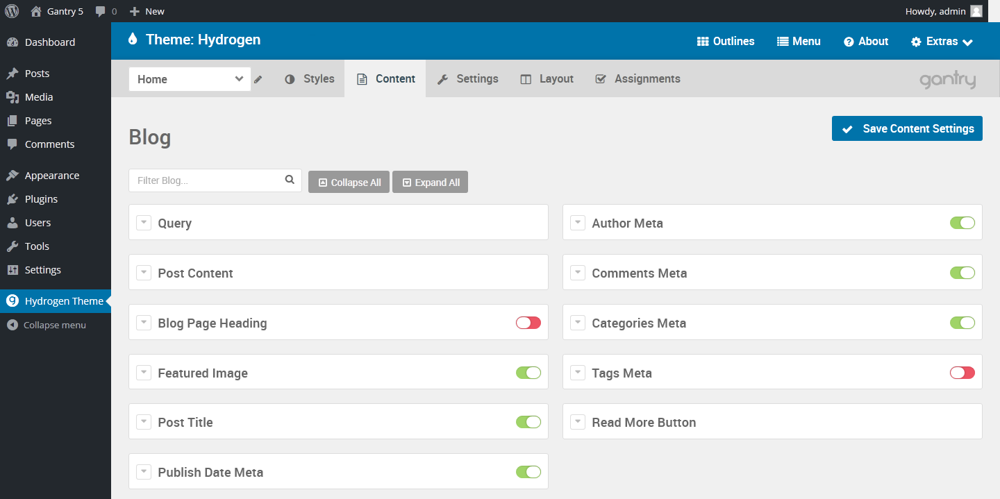

 {.border .shadow}

The **Content** administrative panel gives you quick access to settings that affect the way content is displayed on a given page. This is an outline-specific panel, so any changes made here will affect only the currently-selected outline.

This panel has several sections, each detailing a particular type of page. If you have this outline assigned to multiple contextual page types (for example: Category Archive and Single Page), these settings will enable you to differentiate how information is displayed without having to create a new outline.

All of these options enable you to turn various elements to your data on or off, as well as to customize how this data is displayed.

## Blog

The **Blog** content section enables you to set which types of content appears in a standard blog page. This includes:

* Including and excluding categories from the blog page's listing.
* Author Meta (link, prefix)
* Post Content (length of preview, trim excerpt)
* Comments Meta (link, prefix)
* Blog Page Heading (custom heading)
* Categories Meta (link, prefix)
* Featured Image (width, height, position)
* Tags Meta (link, prefix)
* Post Title (link)
* Read More Button (label, display mode)
* Publish Date Meta (link, date format, prefix)

## Post

This section is where you can set which and how information is displayed in a single post. When your users visit a single post on your site, the full post will be presented. You may or may not want various page elements (such as a link to the author's archives or the date of publishing) to appear. 

This is where you would set these options. These options include:

* Featured Image (width, height, position)
* Comments Meta (link, prefix)
* Categories Meta (link, prefix)
* Post Title (link)
* Publish Date Meta (link, date format, prefix)
* Tags Meta (link, prefix)
* Author Meta (link, prefix)
* Tags (specific to the individual post) (link, prefix)

## Page

WordPress has a different way of handling posts and pages. Pages are largely static, are intended to be visible/featured for a long period of time, and take on key roles in the site. For example, your site's about page would be a page, but a blog post about your latest project would be a post.

Page options include:

* Featured Image (width, height, position)
* Publish Date Meta (link, date format, prefix)
* Page Title (link)
* Author Meta (link, prefix)

## Archive

Archive pages are a bit different than Blog pages as they tend to be a bit more filtered. For example, all of your posts made in a specific category, or during a particular month would appear in an archive page.

* Post Content (length of preview, trim excerpt)
* Page Heading (custom heading)
* Author Meta (link, prefix)
* Comments Meta (link, prefix)
* Categories Meta (link, prefix)
* Featured Image (width, height, position)
* Tags Meta (link, prefix)
* Post Title (link)
* Read More Button (label, display mode)
* Publish Date Meta (link, date format, prefix)
