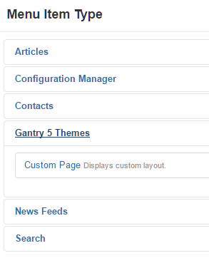

 {.border .shadow}

This particular feature of Gantry 5 is not found in the Gantry 5 Administrator. Instead, you will see it in Joomla's **Menu Manager**. You can create a custom page that doesn't necessarily pull from or even have anything to do with your Joomla content by creating a **Custom Page** menu item.

This menu item can be found under **Add New Menu Item > Menu Item Type > Gantry 5 Themes > Custom Page**. Once selected, it appears in your menu as any other page would, and can be assigned to an outline, given a layout, and appear on the front end. You can do just about anything you could with a standard menu item, except it is a non-Joomla menu item that doesn't render unnecessary component output such as bootstrap.

 {.border .shadow}

Another useful feature of the **Custom Page** menu item type is that you can choose a particle to act as your page content rather than any articles or common Joomla page content. This makes the Custom Page menu item type especially useful if you are building a page made up entirely of particle and/or modules.