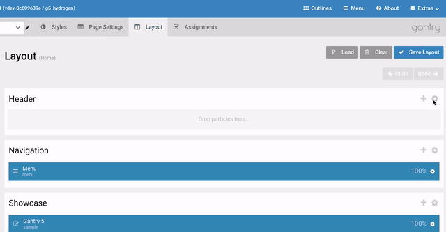
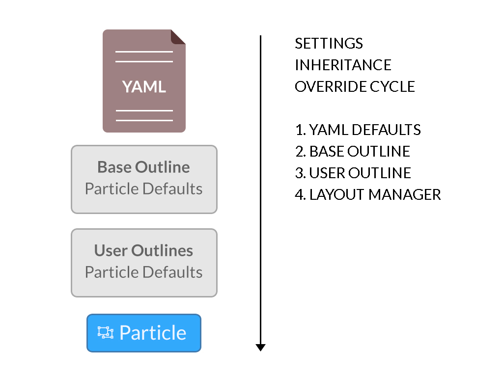
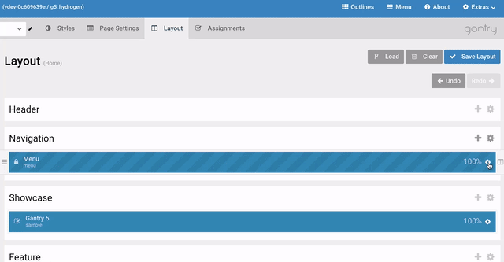
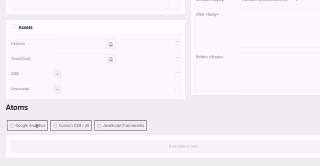
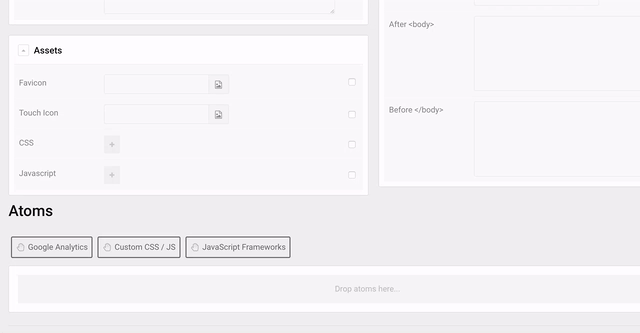

! Inheritance was introduced in **Gantry 5.3**. Most, if not all of the content discussed in this area of the documentation will only apply to websites running Gantry 5.3+.

In this guide, we will go over how inheritance works in Gantry 5. Inheritance is essentially the ability for one outline to inherit attributes, particles, and layout settings from another. This guide will focus primarily on how inheritance works as it relates to the [Layout Manager](../layout-manager).

However, to understand inheritance we will first break down what it is, and how you can use Gantry 5's inheritance system to make creating and managing your website incredibly easy.

## Understanding Inheritance

To get started, let's review the basic hierarchy of inheritance as it exists at the top level of Gantry 5. The Base Outline acts as the global default for any Gantry website. This is where global style, particle defaults, page settings, and layout options are set. The Base outline sets the default, and each outline below it either inherits or changes these settings.

Inheritance rules can apply to many different things. For example, you can inherit the following:

* One outline's **entire layout** to another.
* One **section's attributes** from one outline to another.
* One **section's child items (particles)** from one outline to another.
* One **particle's attributes** from one outline's layout to another.
* One **particle's block settings** from one outline to another.

Your site's **style** and **particle defaults** settings are naturally inherited from the Base outline, and are modified from a child outline's administration panels.

!! Gantry does not support nested inheritance. For example: if you are already inheriting sections in an outline, performing whole-outline inheritance will not override these individually inherited sections. Those sections will continue to inherit from their originally-assigned outline.

## Outline Inheritance

You can't set up active inheritance for an entire outline, unless you create a new outline and change absolutely nothing about it. But, if you want to link your layout to another outline entirely, you can do so very easily.

 {.border .shadow}

Simply select the **Load** button in the **Layout Manager** for the outline you wish to inherit the layout to, then select **Outlines** and toggle the **Inherit every Section and Children of the selected Outline** option on and choose the outline you wish to inherit the layout from. This will activate inheritance for all of that outline's sections and particles.

You can manually remove inheritance for individual sections and/or particles after doing this by disabling it from the individual section's settings and then from the particles.

## Section Inheritance

Individual sections can be targeted for inheritance. This includes both their section attributes, including the section's layout, CSS class, and tag attributes as well as the sections children, which include particles as well as their row positions and width settings.

 {.border .shadow}

You can access a section's inheritance settings by selecting its settings icon and then the **Inheritance** tab. Here, you can configure how the section inherits information.

[ui-callout]
[ui-callout-item title="Mode" position="35%, 35%, se"]
Enables you to choose between cloning the section from another outline as a one-time copy or inheriting for synchronization.
[/ui-callout-item]
[ui-callout-item title="Outline" position="45%, 35%, se"]
This dropdown enables you to select an outline to source the section's attributes and/or children from.
[/ui-callout-item]
[ui-callout-item title="Section Attributes" position="60%, 35%, se"]
This option enables you to inherit/clone a section's attributes, or particle-specific settings.
[/ui-callout-item]
[ui-callout-item title="Section Children" position="68%, 35%, se"]
This option enables you to inherit/clone a section's children, including particles, their positions, width, attributes, and block settings.
[/ui-callout-item]

[/ui-callout]

* **Mode**: Enables you to choose between cloning the section from another outline as a one-time copy or inheriting for synchronization.
* **Outline**: This dropdown enables you to select an outline to source the section's attributes and/or children from.
* **Section Attributes**: This option enables you to inherit/clone a section's attributes, or particle-specific settings.
* **Section Children**: This option enables you to inherit/clone a section's children, including particles, their positions, width, attributes, and block settings.

When you inherit a section's children, you are importing that section's particles and setting them to inherit, as well. So, if you were to remove **Section Children** from that section's inheritance settings later on, the particles will remain and will continue to inherit attributes and block settings from the original outline until manually disconnected and removed.

If you delete a particle, any sections inheriting its section's children will have the particle removed as well. This does not happen if **Section Children** is turned off in the section's inheritance settings.

## Particle Inheritance

A particle is essentially the item that is most affected by inheritance. It sits at the very bottom level of the inheritance tree, and can be directly inherited or inherited as part of a section or outline.

Here is a quick breakdown of the different inheritance levels of a **Particle**.

| Level                                                                                  | Description                                                                                                                                                                      |
| :-----                                                                                 | :-----                                                                                                                                                                           |
| Particle YAML File                                                                     | Any defaults assigned in this file act as the absolute top-level defaults for the particle. These defaults are overridden by any changes made in the Base Outline, Sub Outlines. |
| Base Outline Particle Defaults                                                         | Changes made in the **Particle Defaults** panel in the Base Outline become global defaults for the site.                                                                         |
| Non-Base Outline Particle Defaults                                                     | The **Particle Defaults** panel at this level sets defaults for the particle as it exists in that particular outline, affecting only that outline.                               |
| Individual Particle Defaults in Layout Manager, Menu Editor, module or widget | Changes made at this level are the overridden settings for the particle in only this instance or any directly inherited instances.                                               |

 {.border .shadow}

In short, inheritance for particle settings goes like this: **Particle YAML File > Base Outline Particle Defaults > Non-base Outline Particle Defaults > Individual Instance** with each step inheriting and/or overriding settings from the previous one.

! The **Particle Defaults** panel is being phased out in **user-created outlines** as it is not necessary under the new inheritance system. You will see it in the Base Outline as this will enable you to set global defaults for the particle. However, the panel is hidden by default for any user-defined outlines as the vast majority of users will be defining particles in an individual outline through the layout manager most of the time. 

 {.border .shadow}

If you want to access the **Particle Defaults** panel for a user-defined outline, you can still do so by navigating to the **Particle Defaults** panel in the **Base Outline**, then selecting the user outline from the outline dropdown. You will be initially greeted by a notice letting you know why this panel is hidden and giving you the option to manually access it.

### Particle Inheritance Setup

 {.border .shadow}

Setting up particle inheritance is pretty easy. All you need to do is navigate to the particle's settings and select the **Inheritance** tab. This will give you access to the inheritance settings, enabling you to select an outline and particle for your new particle to inherit attributes and block settings from.

The inheritance tab has several useful tools to enable you to either clone or inherit properties for any other particle in another outline's layout.

[ui-callout]
[ui-callout-item title="Mode" position="30%, 35%, se"]
Enables you to choose between cloning the particle from another outline as a one-time copy or inheriting for synchronization.
[/ui-callout-item]
[ui-callout-item title="Outline" position="40%, 35%, se"]
This dropdown enables you to select an outline to source your new particle's attributes from.
[/ui-callout-item]
[ui-callout-item title="Particle Instance" position="51%, 35%, se"]
Select a particle to inherit/clone from a list of particles of the same type currently in the selected outline's layout.
[/ui-callout-item]
[ui-callout-item title="Particle Attributes" position="65%, 35%, se"]
This option enables you to inherit/clone a particle's attributes, or particle-specific settings.
[/ui-callout-item]
[ui-callout-item title="Particle Block" position="73%, 35%, se"]
This option enables you to inherit/clone a particle's block settings.
[/ui-callout-item]

[/ui-callout]

* **Mode**: Enables you to choose between cloning the particle from another outline as a one-time copy or inheriting for synchronization.
* **Outline**: This dropdown enables you to select an outline to source your new particle's attributes from.
* **Particle Instance**: Select a particle to inherit/clone from a list of particles of the same type currently in the selected outline's layout.
* **Particle Attributes**: This option enables you to inherit/clone a particle's attributes, or particle-specific settings.
* **Particle Block**: This option enables you to inherit/clone a particle's block settings.

 {.border .shadow}

Once you have inheritance enabled, your particle's attributes and/or block settings will be locked, inheriting their properties from the selected particle.

!!! If the original source particle is deleted, any actively-inherited copies are **converted into clones** and maintained in their respective layouts. You would need to delete the particle from each layout to completely remove it from your site. This is only the case for **individually-inherited particles**, and not sections or outlines.

## Atom Inheritance

Atom inheritance works very similarly to particle inheritance. For example, if you have a Google Analytics code you want to have apply to multiple specific outlines, but not the Base Outline, you can do so easily through an atom's inheritance settings.

Below, we've created a chart to make it easy to determine what cases you would use inheritance for in an atom.

|                                                       | Base Outline | Outline A    | Outline B                | Outline C                |
| :-----                                                | :-----       | :-----       | :-----                   | :-----                   |
| All Outlines Use the Base Settings                    | Base         | Base Default | Base Default             | Base Default             |
| Outline A and B Use the Same non-Base Settings        | Base         | Custom Atom  | Inherited from Outline A | Base Default             |
| Outline A Doesn't Use the Atom, but Others Do         | Base         | Deleted Atom | Base Default             | Base Default             |
| Only Outline B and C Use the Atom, with Same Settings | No Atom      | No Atom      | Custom Atom              | Inherited from Outline B |

As an example, we'll create an atom in Outline A and have that atom inherit to Outline B.

 {.border .shadow}

First, you'll want to create the new atom. In our example, we will create a Google Analytics atom in Outline A. At this point, the only outline that will be affected by this atom is Outline A.

Next, we will switch to Outline B and create another Google Analytics atom. This time, instead of configuring it, we will navigate to the **Inheritance** tab and select **Outline A**, the **Analytics** atom, and toggle the **Atom Attributes** so we inherit both the atom and its attributes.

Here is a breakdown of the options in the **Inheritance** tab.

[ui-callout]
[ui-callout-item title="Mode" position="30%, 35%, se"]
Enables you to choose between cloning the atom from another outline as a one-time copy or inheriting for synchronization.
[/ui-callout-item]
[ui-callout-item title="Outline" position="40%, 35%, se"]
This dropdown enables you to select an outline to source your new atom's attributes from.
[/ui-callout-item]
[ui-callout-item title="Atom Instance" position="51%, 35%, se"]
Select an atom to inherit/clone from a list of particles of the same type currently in the selected outline.
[/ui-callout-item]
[ui-callout-item title="Atom Attributes" position="65%, 35%, se"]
This option enables you to inherit/clone a atom's attributes.
[/ui-callout-item]

[/ui-callout]

* **Mode**: Enables you to choose between cloning the atom from another outline as a one-time copy or inheriting for synchronization.
* **Outline**: This dropdown enables you to select an outline to source your new atom's attributes from.
* **Atom Instance**: Select an atom to inherit/clone from a list of particles of the same type currently in the selected outline.
* **Atom Attributes**: This option enables you to inherit/clone a atom's attributes.
