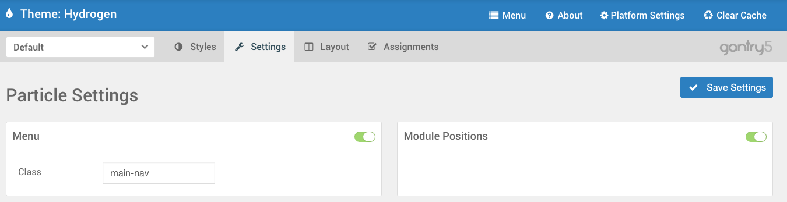
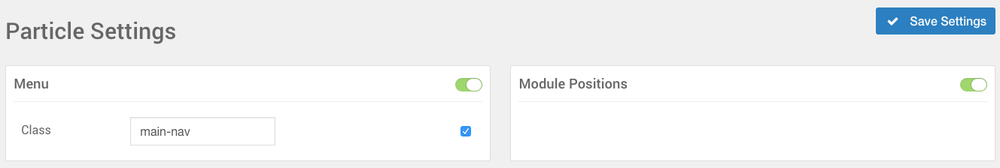
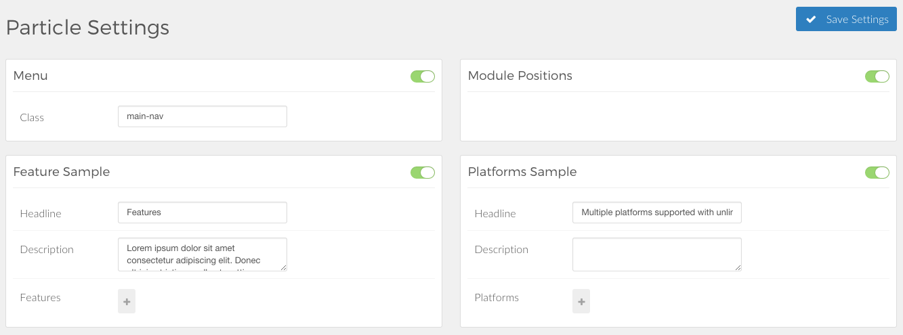

The **Settings** panel gives you the ability to turn particle types **on** or **off** as you please. Doing this will disable the particle for any assigned pages, even if you have it already set in the **Layout Manager**.

Think of this panel as the breaker panel of Gantry. It serves as a one-stop shop for enabling and disabling particles such as the **Logo**, **Date**, and **Google Analytics**. We have a full breakdown of Gantry's included particles [in the next chapter](../../particles).

Controls
-----

 {.border .shadow}

The **Save Settings** button applies any changes you have made to the **Settings** administrative panel to its associated Configuration. These changes apply as the new default for the setting for that Configuration only, and will only become a global default if you are using the theme's assigned default Configuration.

 {.border .shadow}

When using an override Configuration, you will notice checkboxes next to the different settings fields. When unchecked, these fields may appear grayed out until you either click the setting or the checkbox to indicate you would like to make a change. Once you have made a change and clicked the **Save Settings** button, your changes will be saved for the associated Configuration override. To revert this change back to its default setting, simply uncheck the checkbox.

Particle Settings
-----

 {.border .shadow}

Particles are visual blocks that render where they have been assigned on the **Layout** administrative panel. This section of the **Settings** administrative panel enables you to set defaults which apply to the currently-selected Configuration. If you are using the default Configuration, these settings become the global default for those particles.

These Particles can vary depending on the theme, but typically include things such as the Logo, Copyright, Menu, and Spacer.

Atom Settings
-----

 {.border .shadow}

Atoms are a lot like particles in that they are typically small, modular features you can apply to a configuration via the **Layout** administrative panel. The difference is that Atoms, unlike Particles, do not render on the frontend in a way the visitor can see. This makes Atoms a perfect place for scripted tasks such as adding Google Analytics or applying custom CSS and JavaScript.

The **Atom Settings** area of the **Settings** administrative panel gives you the ability to quickly and easily manage and configure these atoms to meet your individual needs. For example, you could add your **UA Code** to the **Google Analytics** Atom which is then applied by default to Configurations you have placed the **Google Analytics** Atom in the **Layout** administrative panel for.

Position Settings
-----

 {.border .shadow}

### Spacer

The **Spacer** setting gives you the ability to globally disable (or enable) spacer Particles for the Configuration. Doing this when Spacer particles are in place will cause them not to affect the frontend.

### Page Content

The **Page Content** setting area enables you to turn the Mainbody **on or off** for the Configuration. If you have the **Page Content** module already in place in the **Layout Manager** turning it off in the **Settings** administrative panel will disable it so it will not render on the front end.

### Module Position

The **Module Position** setting enables you to globally disable (or enable) module positions for the Configuration. Doing this when Module Position particles are in place will cause assigned modules not to appear the front end.
