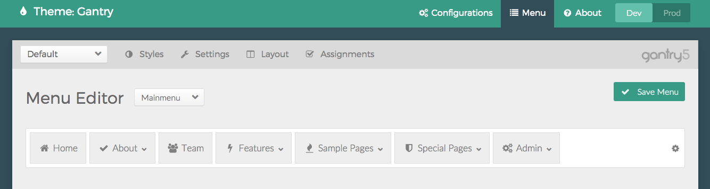
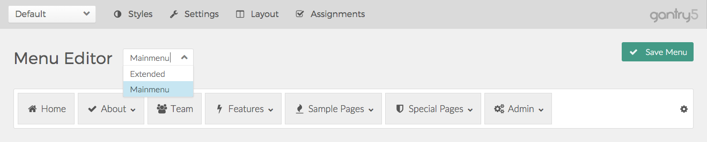
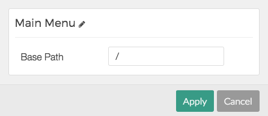
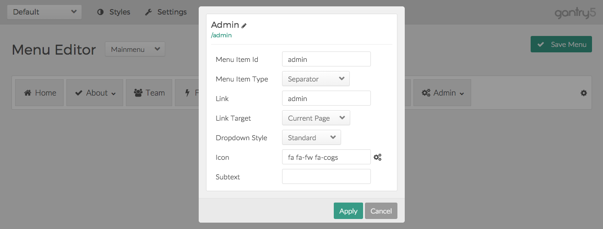

 {.border .shadow}

The **Menu Editor** panel in the **Gantry Admin** is where you can configure and refine menus used on the frontend of the site. This does not totally replace the **Menu Manager** provided by the platform, but gives you the ability to quickly and easily add elements, such as in-line particles, to make a better experience for your users.

The **Menu Editor** administrative panel takes what your CMS' built-in Menu Manager has and enables you to override it. Changes you make in this panel do not in any way affect the way the CMS handles Menu items.

This panel is a Global panel, that is not specific to any Configuration. It's because of this that the changes you make here will affect all instances of a particular menu as it appears in any Configuration.

Selecting a Menu
-----

 {.border .shadow}

The first thing you will want to do is select the menu you wish to edit. This can be done using the dropdown located near the top of the **Menu Editor** administrative panel. These menus are sourced from your CMS' **Menu Manager**. If you want to create a new menu, you will need to do so using the Menu Manager for your particular CMS.

When you have done this, simply select it in this dropdown and its contents will load, ready for you to work with.

Menu Settings
-----

 {.border .shadow}

The menu itself has a settings icon (cogwheel) on the right-hand side which gives you the option to access settings that relate to the menu as a whole. These settings may differ between content management systems (CMS).

One common setting is the **Base Path** which sets the base path by which the menu is rendered. For example, if you would like the menu to render on the front end from the `/blog` directory down, rather than the full menu as provided by the CMS, this is where you would set it.

Keep in mind that within the Menu Particle, you can further refine this, setting a **Base Path** as well as the **Start Level** and **End Level** which comes in handy when creating a split menu.

Menu Item Settings
-----

 {.border .shadow}

Each menu item has a set of settings which can be configured to meet your needs. These may vary slightly between CMS, but have the same basic functions. You can activate the **Menu Item** settings by selecting the cogwheel icon on the right-hand side of the menu item itself.

Here is a breakdown of these settings, and a what they can do.

| Menu Item Setting | Description                                                                                                                       |
| :-----            | :-----                                                                                                                            |
| Menu Item ID      | This is the ID specific to the menu item.                                                                                         |
| Menu Item Type    | Sets the type of menu item, controlling how it behaves and the role it plays in the menu.                                         |
| Link              | The link (relative or absolute) to which the menu item directs the user upon being selected.                                      |
| Link Target       | Sets the target window behavior for the link. You can set it to either open the link in a new window, or the current one.         |
| Dropdown Style    | Sets the style of dropdown for sub-menu items that appear under this particular menu item.                                        |
| Icon              | Powered by FontAwesome, this feature gives you the ability to add a vector icon to your menu item as it is displayed in the menu. |
| Subtext           | Enables you to enter a subtitle, displayed below the menu item's title.                                                           |

Once you have set the settings as you prefer, simply select **Apply** to save the changes and close the pop-up.

These settings expand on the capabilities of the CMS’ integrated menu system, enhancing them with additional functionality and customization options - but only in cases where the CMS does not already provide this feature and changing these options does not have an adverse affect on the menu's functionality.

In Joomla, for example, the **Menu Item ID**, **Menu Item Type**, and **Link** are provided by the CMS. Images can be as well, but overriding them in the Menu Editor is a visual change rather than a functional one, so you should be able to adjust this setting without issue.

Menu Item Types
-----


Menu Item Types [24%, 38%, se]
    : Indicated what type of menu item it is.



{{ gravui_callout(page.media['menu_item_settings.png'].url, callout_items, 'shadow border') }}

There are six types of menu items in the **Menu Editor**. Here is a breakdown of what five of these types are, and the role they play in the menu.

| Menu Item Type | Description                                                                                               |
| :-----         | :-----                                                                                                    |
| Link           | A link directs the user to an internal link within the site.                                              |
| Alias          | An alias points to another Menu item.                                                                     |
| External URL   | This type of menu item points directly to an external URL.                                                |
| Separator      | Non-clickable menu item that carries a name, usually used for top-level menus with one or more sub-menus. |
| Heading        | A non-clickable menu item that contains text only.                                                        |

>>>> **Particle** injection is not supported in the initial beta release as it is still in development.

The sixth type of menu item, which is added and configured in the **Menu Editor** are **Particles**. This will allow you to do things like create a block of information that appears in the menu.

>>> In cases where the **Menu Item Type** is supplied by the CMS, this may not be editable via the **Menu Editor** as it would conflict with the CMS' settings.

