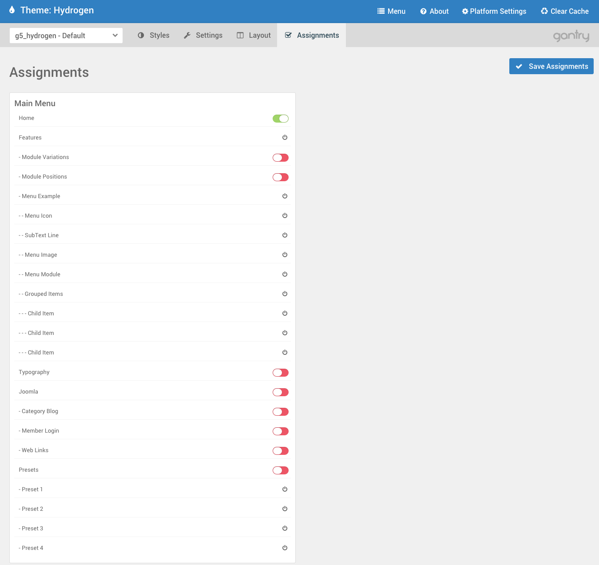

The **Assignments** panel gives you the ability to assign a set of options to specific pages or categories of content. This works a little differently from platform to platform, however the basic function remains the same. As an example, if you create a settings override within the **Gantry Admin** specifically for the home page of your site, you can link that set to the page through this panel.

The **Default** settings are, as the name implies, assigned automatically to all pages assigned in the CMS to the Gantry-powered theme unless assigned to an override using this panel.

Settings
-----

 {.border .shadow}

The **Assignments** panel acts as a quick and easy on/off switchboard for assigning Configurations to Pages, Article Categories, etc. The assignment options that appear in this screen vary from CMS to CMS and even site to site, depending greatly on the types and availability of pages the Configuration can be assigned to.

For a new website with only a home page, this may be the only available option until additional content is created.