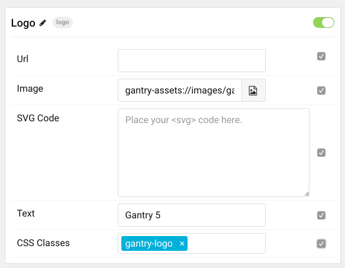

 {.border .shadow}

The **Logo** particle enables you to set the image and/or text you want to have appear as your logo in for the site. Through this particle, you can add your logo to the site in a position you set in the **Layout Manager**. 

Settings
-----

 {.border .shadow}

| Setting   | Description                                                            |
| :-----    | :-----                                                                 |
| URL       | Sets the URL the logo links to. If left blank, the home page is used.  |
| Image     | Sets the image that appears as the logo on the frontend.               |
| Text      | Sets the text which appears along with, or instead of, the logo image. |
| CSS Class | Set a specific CSS class for custom styling                            |
