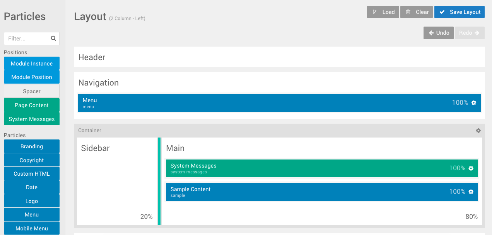
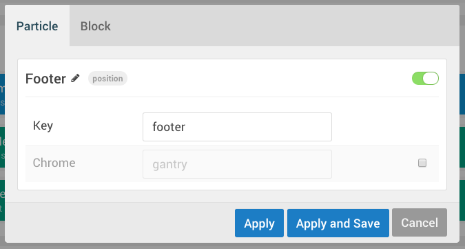
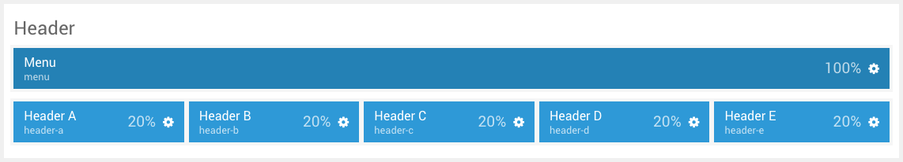
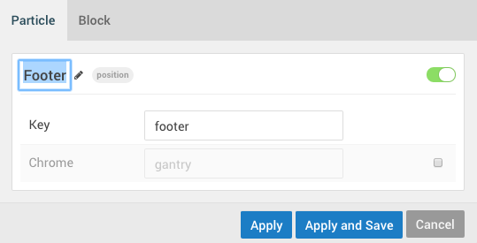
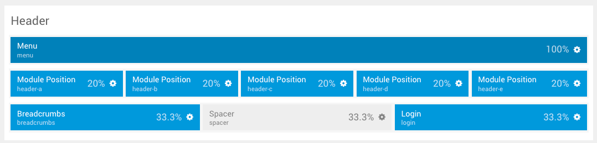
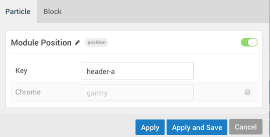

A **Module Position** or **Widget Position** particle plays an important role in the layout of a page. Each position particle represents a position where modules can be assigned.

Instead of breaking out your text editor to rename and/or create widget positions, you can do so with a few clicks of the mouse. This is also easier than going through the modules/widgets and reassigning them to the new positions scheme one-by-one.

In addition, you can easily create vastly different positions setups between outlines, enabling you to have an entirely different positions set and layout from one page to the next.

Creating, Deleting, and Moving Positions
-----

 {.border .shadow}

If you want to add a new widget/module position to a page, you simply need to drag-and-drop the **Module Position** particle and move it where you would like the new position to appear. At this point, you need but to rename the position Key which is the text reference you would assign modules/widgets to in order to have them appear in the position.

[ui-tabs position="top-left" active="0" theme="lite"]
[ui-tab title="Joomla"]

If you are migrating from an existing template, and you have modules that have already been assigned to positions that use the naming convention of the previous template, you can simply rekey your positions to match. That way, you can keep your existing modules without having to reassign them one-by-one.

 {.border .shadow}

For example, if you are setting up a Gantry 5 template on a site that had a batch of modules assigned to position `header-a`, you can include them in your new site very easily by placing a **Module Position** particle in the space you would like to have it load in the Layout Manager and set the **Key** field to `header-a`.

[/ui-tab]
[ui-tab title="WordPress"]

Coming Soon...

[/ui-tab]
[ui-tab title="Grav"]

Grav documentation is coming soon...

[/ui-tab]
[/ui-tabs]

Deleting a position is just as easy as creating one. Just drag-and-drop the position to the top of the **Layout Manager** to a section that appears with the label **Drop Here** to **Delete**. This will delete the position. If you change your mind, just click the **Back** arrow in the **History** tool to bring it back.

If you want to disable a position temporarily (which hides its assigned modules/widgets), you can do so by clicking the settings cogwheel on the right-hand side of the position in Layout Manager and toggling the red/green activation switch in the upper-right area of the Particle settings tab. The position will still show in the frontend but it won't be rendered, so if you would like to re-enable it later on, you can do so.

Moving positions around the layout is also just a matter of dragging and dropping them where you want them to go. If you want your main Showcase modules/widgets to appear under the features modules/widgets, you can move them without having to edit a single file.

Virtually Unlimited Positions Per row
-----

 {.border .shadow}

You could have 0, 1, 5, 10, or even 20 individual widget positions in the Header section if you wanted to. This enables you to have one or two positions where you need them, without the need to have positions in places you do not want them.

Quick and Easy Naming
-----

[ui-tabs position="top-left" active="0" theme="lite"]
[ui-tab title="Joomla"]

 {.border .shadow}

As we mentioned earlier, you can name and rename positions on the fly, making it easy to migrate existing modules without having to individually reassign them to specific positions.

You can also freely name them as you need, giving them specific tags that are easy to remember and reference what is and is not assigned there.

For example, you could name and key a position as branding where you have your branding and copyright modules. The reference name and the Key are unrelated to each other, so you could use anything as a reference name (or a key for that matter), as long as you are assigning your modules to the appropriate Key. Naming a position `Happy` and keying it `top-a` would be absolutely fine. Whatever works for you.

This frees you from standardized naming conventions that can be needlessly complex and confusing.

[/ui-tab]
[ui-tab title="WordPress"]

Coming Soon...

[/ui-tab]
[ui-tab title="Grav"]

Grav documentation is coming soon...

[/ui-tab]
[/ui-tabs]

Spacers
-----

 {.border .shadow}

We have created a new Spacer Particle which enables you to create a blank space between two Positions, a Particle and a Position, or two Particles.

Gantry 5 introduces many new features that are created to make life easier for developers, their clients, and ultimately the visitors of the site. With its new Layout Manager and this system for handling widget positions, it will undoubtedly be not only the most powerful version of Gantry yet, but also the easiest to use.

Settings
-----

The settings for a **Position** Particle can vary between content management systems (CMS). We have broken down the available options below.

[ui-tabs position="top-left" active="0" theme="lite"]
[ui-tab title="Joomla"]

 {.border .shadow}

| Setting | Description                                        |
| :------ | :----------------------------------                |
| Key     | Sets the reference key used in module assignments. |
| Chrome  | Sets the module chrome.                            |

There are two different sets of settings for a **Position**. The first is in the **Settings Administrative Panel** which enables you to set a default **Key**  and **Chrome** for the outline. In the event that you are editing the settings of the default outline, this key becomes the global default, which is used unless overridden in either another outline's **Settings Administrative Panel** or in the individual **Particle** settings within the **Layout Manager**.

[/ui-tab]
[ui-tab title="WordPress"]

Coming Soon...

[/ui-tab]
[ui-tab title="Grav"]

Grav documentation is coming soon...

[/ui-tab]
[/ui-tabs]
