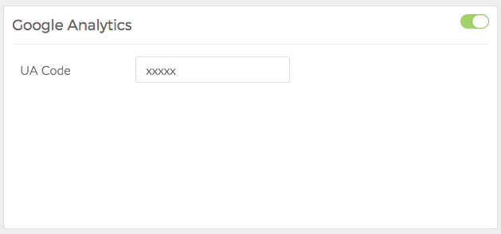
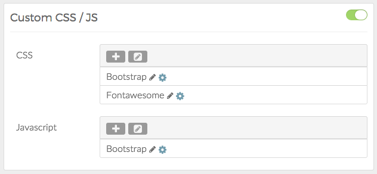

Atoms are Particles that do not appear visually on the frontend, but do serve an important purpose. They can be assigned on a per-page basis, or as a default which automatically applies to all of the pages on the site.

For all intents and purposes, Atoms such as **Google Analytics**, and **Custom CSS / JS** add scripting to the page which add or modify the page's scripting during load. This is useful for basic styling such as coloring, and analytics tracking.

Atoms can be assigned in the **Layout Manager** using a special line set up for non-visual particles. This is typically found at the bottom of the **Layout Manager** and Atoms can be dragged into place here in much the same way as regular rendered Particles would on a visible section.

Google Analytics
-----

The **Google Analytics** Atom gives you the ability to quickly add your **Google Analytics UA code** to a Layout, which runs in the background of your page during page load. It adds the necessary scripting around the code you enter in the Atom's **settings**.

Custom CSS / JS
-----

