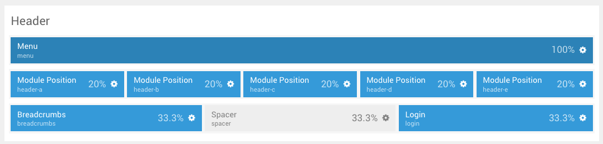
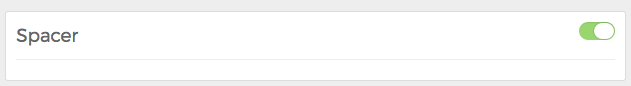

A **Spacer** Particle gives you the ability to add space between Particles, including **Positions** and standard **Particles**, which aids in the styling of a Layout.

Beyond creating white space between Particles, the Spacer doesn't serve any advanced purpose. It is strictly a styling tool.

Settings
-----

The **Spacer** Particle doesn't have any included settings outside of the activate/inactive switch located in the upper-right area of the **Settings** pop-up.
