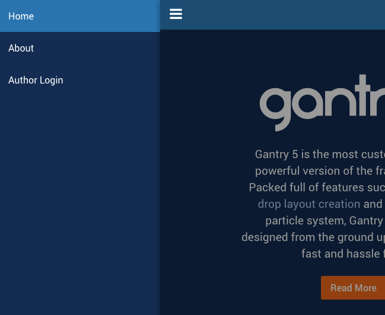
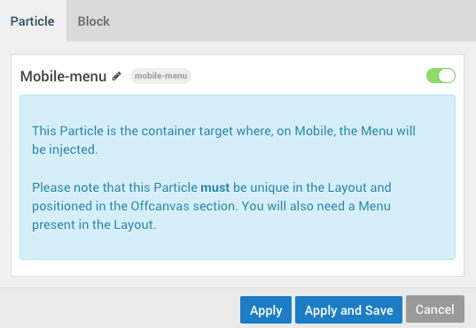
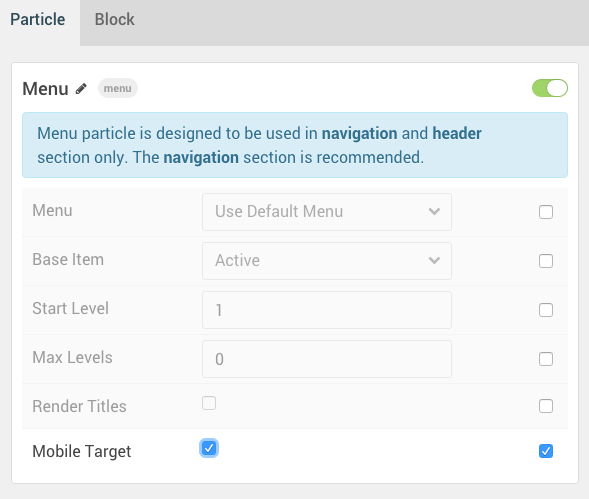

 {.border .shadow}

The **Mobile Menu** Particle is made for the **Offcanvas Section** in the **Layout Manager**. It has one primary purpose: to display a mobile version of the main menu for visitors displaying your site from a mobile device. Because of this, the Mobile Menu Particle does not appear on desktops and other larger-screened devices. Instead, the standard Menu Particle which is located elsewhere on the Layout is used.

Please note that this Particle **must** be unique in the Layout and positioned in the **Offcanvas** section. You will also need a **Menu** present in the **Layout**.

Settings
-----

 {.border .shadow}

Because the Mobile Menu acts as a container for the menu, it doesn't have any Particle-specific settings. You can, however, use standard Block-level settings to add custom CSS, Variations, etc.

Mobile Menu Targeting
----

 {.border .shadow}

Let's say you have multiple menus assigned in the page layout, but you have a specific one you want to have pulled for the mobile menu. This is where menu targeting comes in handy, and it's very simple to do.

All you have to do is open the settings for the **Menu** particle you would like to target for use as the mobile menu, and check the **Mobile Target** option. This will tell Gantry that this menu is the one that you want to have referenced by the mobile menu.

