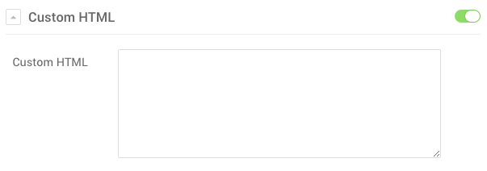

 {.border .shadow}

The **Custom HTML** Particle acts as an easy substitute to the **Custom HTML** module in Joomla, or the **Text** widget in WordPress. It's a quick way to create custom HTML content and add it to your page via either the **Layout Manager** or the **Menu Editor**.

Settings
-----

 {.border .shadow}

The Particle's settings are pretty simple. There is a big field you can insert HTML scripting. You can also edit the Block-level settings to refine the Particle's variations, tag attributes, CSS classes, etc.