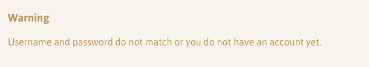
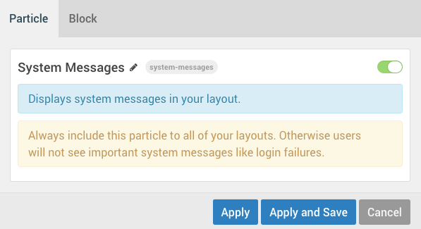

 {.border .shadow}

The **System Messages** particle displays system messages to users. This includes information such as login confirmations, warnings, etc. Always include this particle to all of your layouts. Otherwise, users will not see important system messages such as login failures.

Settings
-----

 {.border .shadow}

The **System Messages** particle itself doesn't have any specific particle settings. It's simply a portal by which system messages are displayed. You can still, of course, use the **Block** settings tab to refine the look and presentation of the content block as you would any other particle.