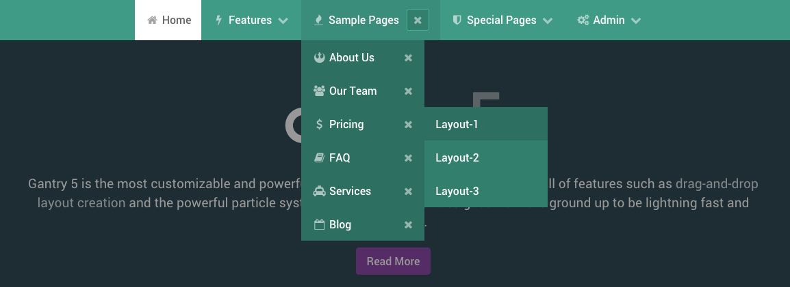
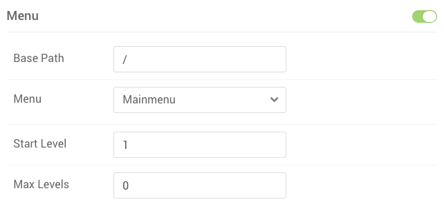

The **Menu** particle enables you to set the image and/or text you want to have appear as your logo in for the site. This particle gives you the ability to place menus and define how they appear on the frontned. 

The Menu particle settings are different than the ones found in the [**Menu** administrative panel](../configure/menu-editor.md). Here's a quick breakdown of the life cycle of a menu in Gantry5.

| Step                                      | Description                                                                                                                                                                                       |
| :-----                                    | :-----                                                                                                                                                                                            |
| CMS **Menu Manager**                      | **Creates and configures** the menu as it appears to the CMS. All menus start here.                                                                                                               |
| Gantry5 **Menu Administrative Panel**     | Enables you to **rearrange the menu**, and **add extras** such as Particles which are rendered by Gantry. These changes do not affect how the CMS sees the menu. It's basically just an override. |
| Gantry5 **Settings Administrative Panel** | Sets the default Menu Particle **display settings** for the Configuration. In the case of a default Configuration, this becomes the global default for the Menu particle.                        |
| **Layout Manager** Particle Settings      | Gives you the ability to **override the settings** that appear in the Settings Administrative Panel for that particular Particle. Does not affect any other instance of the Menu Particle.        |

Settings
-----

As menus are handled differently by different platforms, the settings may vary. See the options that appear by default on our main supported platforms below:



| Setting     | Description                                                    |
| :------     | :----------------------------------                            |
| ID          | Enables you to set a styling ID for the Particle.              |
| Class       | Enables you to assign CSS classes.                             |
| Menu        | Enter the name of the menu you wish to assign to the Particle. |
| Base Path   | Set the base path for the menu.                                |
| Start level | Sets the starting level for the menu.                          |




Coming Soon...




Coming Soon...




Coming Soon...




Coming Soon...


{{ gravui_tabs({'Joomla':tab1, 'WordPress':tab2, 'phpBB':tab3, 'Magento':tab4, 'Grav':tab5}) }}

