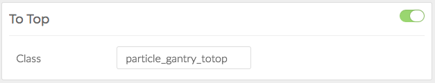

The **To Top** particle makes it easy to create and place a component on the frontend that visitors can use to jump back to the top of the page. It's a handy tool for the users, especially on lengthy pages.

Settings
-----

| Setting |             Description             |
| :------ | :---------------------------------- |
| Class   | Sets the CSS class for the particle |
