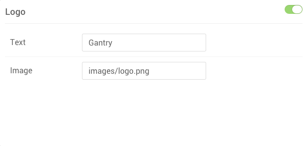
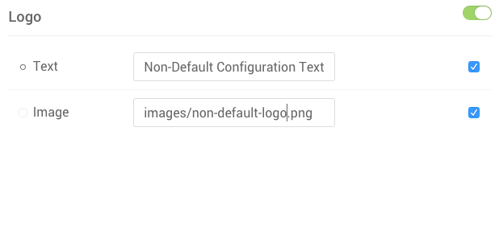

**Particles** are extremely flexible. You can access their settings on several levels, each determining how that Particle will be configured at a specific level.

Here is a quick breakdown of the different levels at which a **Particle** can be configured.

| Level                                          | Description                                                                                                             |
| :-----                                         | :-----                                                                                                                  |
| Default Configuration Settings Panel           | Sets the global defaults for a given Particle.                                                                          |
| Non-Default Configuration Settings Panel       | Sets the settings override for a given Configuration. These settings become the default for that Configuration only.    |
| Individual Particle Settings in Layout Manager | Sets the settings override for an individual particle. These settings affect only the single instance of that particle. |

Default Configuration Settings Panel
------------------

 {.border .shadow}

Within the **default** Configuration, you can set global default settings for any Particle in the **Settings Administrative Panel**. Settings placed here become the global defaults that apply to every Configuration and individual Particle instance unless overridden. This is where you would place your most commonly used settings for a given Particle.

For example, if you want your logo Particles to use the same source image across all of your pages except one or two, you would set that image here and override it using either the non-default Configuration settings applied to those exception pages, or in the individual Particle instances in the Layout Manager.

Non-Default Configuration Settings Panel
--------------------

 {.border .shadow}

Within Configurations that are not set as the default, you may notice that the **Settings Administrative Panel** has grayed out the **Particle Settings** for most (if not all) of your Particles. By changing a setting and/or selecting the checkbox on the right-hand side of the settings box for that Particle, you can override the default settings for the Configuration. 

Now, every Particle placed in the Layout Manager for that particular Configuration will have these new settings by default.

Individual Particle Settings in Layout Manager
------------------------------

 {.border .shadow}

When you place a Particle in a Configuration's **Layout Manager**, you create an **instance**. That instance enables you to adjust the Particle settings for that specific particle, affecting no other instances of that Particle. If, for example, you wanted to have the logo appear differently in one instance, you would change its settings here.

You can access these instance-specific settings by selecting the cogwheel on the right-hand side of the Particle within the Layout Manager.