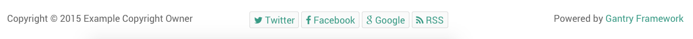
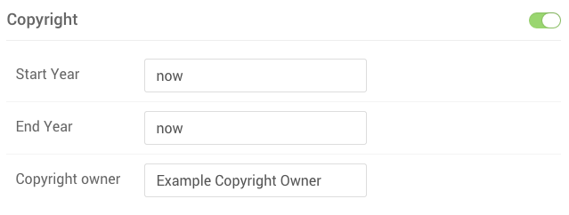
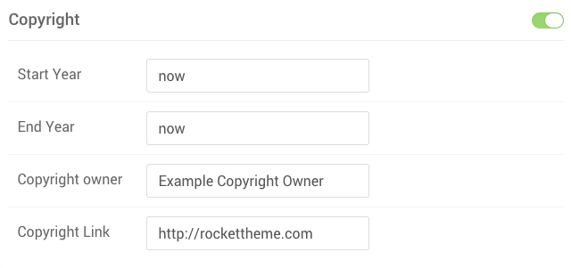
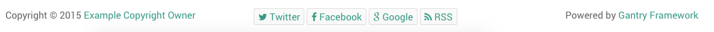

**Particles** are extremely flexible. You can access their settings on several levels, each determining how that Particle will be configured at a specific level.

Here is a quick breakdown of the different levels at which a **Particle** can be configured.

| Level                                          | Description                                                                                                             |
| :-----                                         | :-----                                                                                                                  |
| Base Outline Settings Panel                    | Sets the global defaults for a given Particle.                                                                          |
| Non-Base Outline Settings Panel                | Sets the settings override for a given outline. These settings become the default for that outline only.                |
| Individual Particle Settings in Layout Manager | Sets the settings override for an individual particle. These settings affect only the single instance of that particle. |

## Base Outline Settings Panel

 {.border .shadow}

Within the **default** outline, you can set global default settings for any Particle in the **Settings Administrative Panel**. Settings placed here become the global defaults that apply to every outline and individual Particle instance unless overridden. This is where you would place your most commonly used settings for a given Particle.

For example, if you want your logo Particles to use the same source image across all of your pages except one or two, you would set that image here and override it using either the non-Base Outline settings applied to those exception pages, or in the individual Particle instances in the Layout Manager.

## Non-Base Outline Settings Panel

 {.border .shadow}

Within outlines that are not set as the default, you may notice that the **Settings Administrative Panel** has grayed out the **Particle Settings** for most (if not all) of your Particles. By changing a setting and/or selecting the checkbox on the right-hand side of the settings box for that Particle, you can override the default settings for the outline. 

Now, every Particle placed in the Layout Manager for that particular outline will have these new settings by default.

## Individual Particle Settings in Layout Manager


Cogwheel [68%, 45%, se]
    : Selecting the cogwheel icon will bring up the **Settings** popup.

Particle Settings [15%, 50%, se]
    : The **Particle** tab in the **Settings** pop-up gives you the ability to override the default settings for a particular **Particle** instance.



{{ gravui_callout(page.media['particle_3.png'].url, callout_items, 'shadow border') }}

When you place a particle in an outline's **Layout Manager**, you create an **instance**. That instance enables you to adjust the Particle settings for that specific particle, affecting no other instances of that Particle. If, for example, you wanted to have the logo appear differently in one instance, you would change its settings here.

You can access these instance-specific settings by selecting the cogwheel on the right-hand side of the Particle within the Layout Manager.

## Overriding Particle Source Files

Sometimes, the changes you want to make to a particle require modifying the source files that make up the file. The source for all Particles includes **Twig** and **YAML** files.

In this example, we will add a link to the **Copyright** Particle that goes directly to the home page of the site from the name of the copyright holder. This is just a small example of what you can change. 

 {.border .shadow}

In the image above, you will see the **Copyright** Particle on the left-hand side. There are no links or anything included in the core Particle. If you wanted to have the name of the copyright-holder become a link to that copyright holder's website, you can add a few simple changes to the Particle's source files.



The first thing you will need to do is copy the `copyright.html.twig` and `copyright.yaml` files located in `ROOT/media/gantry5/engines/nucleus/particles/` and paste the copies to `TEMPLATE_DIR/custom/particles`. If the `particles` directory does not already exist in your `custom` folder, you will have to create it.

By duplicating the files and placing the copies in the custom folder, you are making your changes update proof. This ensures that your changes do not get wiped out when you update either the Gantry framework or the theme.

Anything you do to the duplicate particle files in your `TEMPLATE_DIR/custom/particles` folder will override what appears in the original file.




The first thing you will need to do is copy the `copyright.html.twig` and `copyright.yaml` files located in `ROOT/wp-content/plugins/gantry5/engines/nucleus/particles/` and paste the copies to `THEME_DIR/custom/particles`. If the `particles` directory does not already exist in your `custom` folder, you will have to create it.

By duplicating the files and placing the copies in the custom folder, you are making your changes update proof. This ensures that your changes do not get wiped out when you update either the Gantry framework or the theme.

Anything you do to the duplicate particle files in your `THEME_DIR/custom/particles` folder will override what appears in the original file.


{{ gravui_tabs({'Joomla':tab1, 'WordPress':tab2}) }}

Because we are adding a new field to the **Copyright** Particle, we will need to edit the YAML file. Here is what the `copyright.yaml` YAML file looks like before the changes.

```yaml
name: Copyright
description: Display copyright information.
type: particle

form:
  fields:
    enabled:
      type: input.checkbox
      label: Enabled
      description: Globally enable the particle.
      default: true

    date.start:
      type: input.text
      label: Start Year
      description: Select the copyright start year.
      default: now

    date.end:
      type: input.text
      label: End Year
      description: Select the copyright end year.
      default: now

    owner:
      type: input.text
      label: Copyright owner
      description: Add copyright owner name.
```

 {.border .shadow}

This creates the fields that appear in the Gantry Administrator's **Settings** panel, as well as in any instances in the **Layout Manager** where the **Copyright** particle has been placed. These settings are then linked to the Particle's **Twig** file. In this case, we are adding a link field so that users can add a link to the Particle.

We can create the link field by adding the following to the bottom of the YAML file.

```yaml
    site:
      type: input.url
      label: Copyright Link
      description: Add the link to the copyright owner's site.
```

 {.border .shadow}

Now, you will notice that the new field appears on the back end.

The `copyright.html.twig` file also needs to be changed, in order to incorporate the new data and create the link. Below is the original Twig file's content:


```twig






Copyright &copy;
{{ start_date|e }} - 
{{ end_date|e }}
{{ particle.owner|e }}

```

The `{{ particle.owner|e }}` line needs to be altered to add the link based on the variable assigned via the YAML file. In this example, we will replace it with these three lines:

```twig
<a href="{{ particle.site | default(gantry_base) }}">
{{ particle.owner }}
</a>
```


 {.border .shadow}

Now, on the front end of the site, the Particle appears with a link over the name of the copyright owner. This is just a small example of what you can do to extend a Particle's capabilities using Twig and YAML.