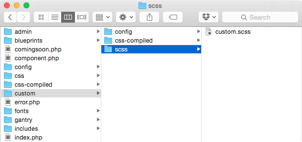
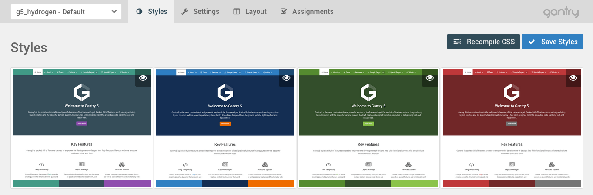

Adding a custom style sheet is a fairly straightforward process. The first thing you should do is create the custom SCSS/CSS file. You can do so in just about any text editor.

 {.border .shadow}



To do this, navigate in the directory structure to `(site root)/templates/(template directory)/custom/scss` and create a file called `custom.scss` if one doesn't already exist. If the `/custom/scss/` directory doesn't exist, you will need to create that, too. If it already does, just open it and make your additions/changes directly to the file.

>>>> Joomla doesn't support creating SCSS files in its built-in template customization tool. For this reason, custom SCSS files would need to be added via FTP. This hurdle is being addressed during Gantry 5's beta.




Coming soon...


{{ gravui_tabs({'Joomla':tab1, 'WordPress':tab2}) }}

This file will then be compiled as an override to the theme's core style sheet files. Anything you place in this file will override classes and defaults assigned in other areas of the theme.

You can format the file's content in either **SCSS** or **CSS**. Gantry will automatically pick it up and compile it properly.

 {.border .shadow}

Once you have added this file, and put your custom CSS/SCSS within, you will need to then navigate to the Gantry 5 administrator, select the **Styles** administrative panel, and click **Recompile CSS** for the outlines you wish to have the custom styling apply for. 

This will tell Gantry to take the new styling and apply it to the page(s). Once you have done this, you should be able to see your changes on the front end.

>>>> If you come across an error when you hit **Recompile CSS** this is likely due to an issue in the SCSS/CSS. At this stage, the compiler is pretty unforgiving and any syntax issues can cause issues. Double-check your code, save your changes to the `custom.scss` file, and try again.