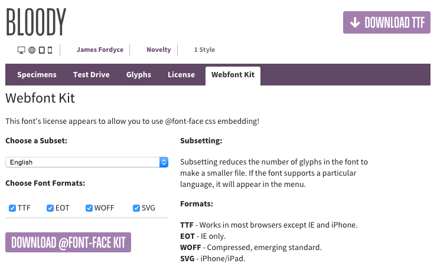

This tutorial will take you through the steps needed to add a custom font to your Gantry template and make it available on the Font Settings dropdown in the template parameters.

In this example, we will explain how you can add the custom free font **Bloody** to your Gantry template.

 {.border .shadow}

Step 1: Adding Your Custom Font Files
--------------------------------------

 {.border .shadow}

**Bloody** is a free font that you can download at [FontSquirrel](http://www.fontsquirrel.com/fonts/Bloody). Please ensure you download the **@font-face Kit**.



Unzip the package and move the following files to `/templates/[TEMPLATE]/custom/fonts/`:

* BLOODY-webfont.eot
* BLOODY-webfont.svg
* BLOODY-webfont.ttf
* BLOODY-webfont.woff

  {.border .shadow}




Coming soon...


{{ gravui_tabs({'Joomla':tab1, 'WordPress':tab2}) }}

Step 2: Adding the Necessary CSS
--------------------------------



[Create your custom stylesheet file](../adding-a-custom-stylesheet), `custom.scss`, and add it to `/templates/[TEMPLATE]/custom/scss/`. 

Add the following to the custom SCSS file:

```css
/* Adding Font BLOODY */

@import "vendor/bourbon/bourbon";
@include font-face('BloodyNormal', 'gantry-theme://fonts/BLOODY-webfont');

.font-family-bloody {
  font-family: 'BloodyNormal',Helvetica,Arial,sans-serif;
  font-weight: normal;
  font-style: normal;
}
```




Coming soon...


{{ gravui_tabs({'Joomla':tab1, 'WordPress':tab2}) }}

Font Usage
-------------------------------

 {.border .shadow}

Once you have added the font to your theme's custom content directory, you can apply it to your site. For example, if you wanted the title of a Particle to appear in the **Bloody** font, you would reference it in the Particle's Twig file.



```twig
<h1 class="font-family-bloody">{{ particle.headline|raw }}</h1>
```



As you can see, we set the **h1** style to `font-family: BloodyNormal;`. Because that font family is defined in the `custom.scss` file, it should pull the **Bloody** find and present it to the front end.

There is one more step left to do. You need to **Recompile CSS** in the **Styles** administrative panel in the Gantry administrator. Doing this will force Gantry to recompile the CSS including the changes you made in the `custom.scss` file. Once you have done this, you should now be able to reload the page and see your changes.

 {.border .shadow}

You can also reference it in **Span** tags within text fields in the Gantry administrator. For example, `<span style="font-family: BloodyNormal;">Key Features</span>` would also work in cases when you want to change the font for a single instance of the Particle.

 {.border .shadow}
