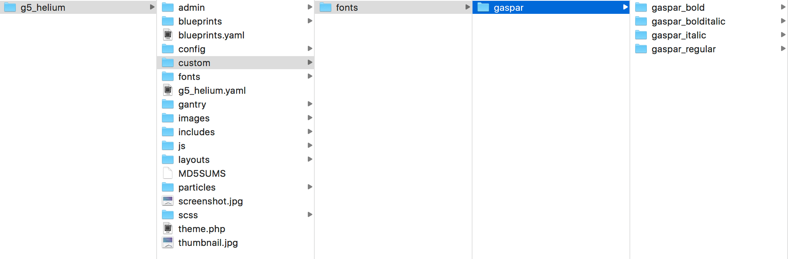
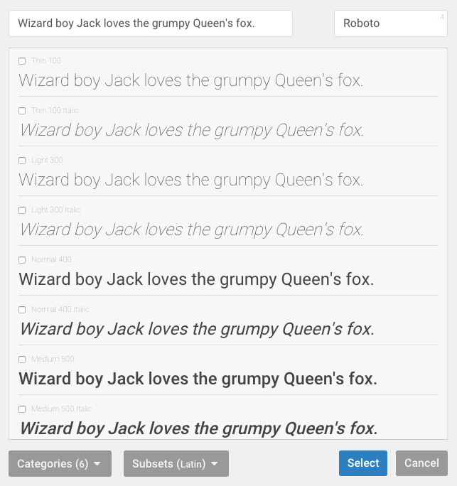
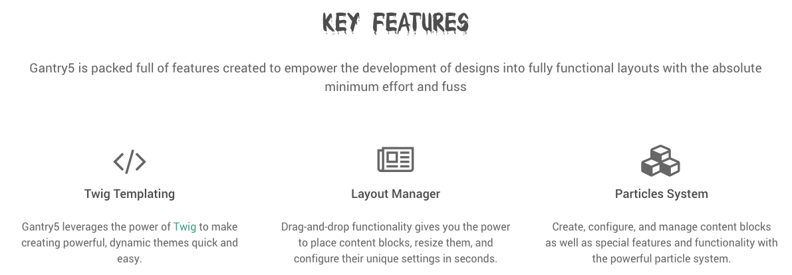
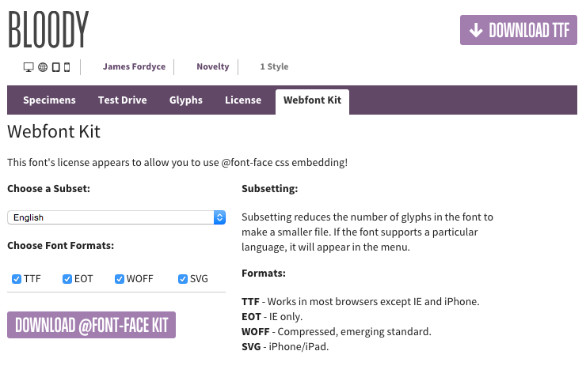
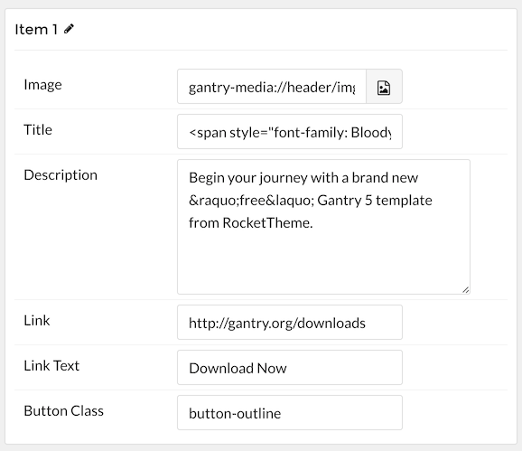

## How to Load Local Fonts in the Theme

There are two approaches to adding local fonts in a theme. The first adds your new local font(s) to the **Font Picker** which enables you to set the font to a specific area or aspect of your site within the Gantry administrator.

The second method sets the font active to the theme, globally. This method enables you to use the new local font within the theme, but not in the **Font Picker**. You can combine the two to have your font available to both, by editing the `theme.yaml` file and making the changes to your `custom.scss` file.

>>> In this guide we will be using **Roboto** as our new local font. You can pick it up from [FontSquirrel](http://www.fontsquirrel.com/fonts/roboto). Simply select the **WebFont Kit** tab and download `roboto-fontfacekit.zip`.

### Adding a New Font the Font Picker

If you would like to make your new font accessible to the **Font Picker**, you will need to make an edit to the `theme.yaml` file to add the font and set its font weight associations.

>>>> The `theme.yaml` file is essential for your theme to work. If you are making an edit to this file, be advised that this edit will likely be overwritten in the event of a theme update. This is really only recommended for developers creating their own Gantry theme or for advanced users.

Here are the steps you will need to take to make this happen.



 {.border .shadow}

Add the local font files to `TEMPLATE_DIR/custom/fonts/`.

Once this is done, you can add your new font to the YAML in the `fonts` section. Using RocketTheme's [Callisto](http://rockettheme.com/joomla/templates/callisto) template as an example, this is what the `theme.yaml` file looks like by default.

```yaml
fonts:
    sourcesanspro:
      700: 'gantry-theme://fonts/sourcesanspro/sourcesanspro_bold/sourcesanspro-bold-webfont'
      700italic: 'gantry-theme://fonts/sourcesanspro/sourcesanspro_bolditalic/sourcesanspro-bolditalic-webfont'
      400italic: 'gantry-theme://fonts/sourcesanspro/sourcesanspro_italic/sourcesanspro-italic-webfont'
      400: 'gantry-theme://fonts/sourcesanspro/sourcesanspro_regular/sourcesanspro-regular-webfont'
    lato:
      900: 'gantry-theme://fonts/lato/lato_black/lato-black-webfont'
      700: 'gantry-theme://fonts/lato/lato_bold/lato-bold-webfont' 
```

To add the Roboto font, the fonts section of the YAML file will look like this.

```yaml
fonts:
  sourcesanspro:
    700: 'gantry-theme://fonts/sourcesanspro/sourcesanspro_bold/sourcesanspro-bold-webfont'
    700italic: 'gantry-theme://fonts/sourcesanspro/sourcesanspro_bolditalic/sourcesanspro-bolditalic-webfont'
    400italic: 'gantry-theme://fonts/sourcesanspro/sourcesanspro_italic/sourcesanspro-italic-webfont'
    400: 'gantry-theme://fonts/sourcesanspro/sourcesanspro_regular/sourcesanspro-regular-webfont'
  lato:
    900: 'gantry-theme://fonts/lato/lato_black/lato-black-webfont'
    700: 'gantry-theme://fonts/lato/lato_bold/lato-bold-webfont'  
  roboto:
    400: 'gantry-theme://fonts/roboto/roboto_regular_macroman/Roboto-Regular-webfont'
    400italic: 'gantry-theme://fonts/roboto/roboto_italic_macroman/Roboto-Italic-webfont'
    400: 'gantry-theme://fonts/roboto/roboto_condensed_macroman/RobotoCondensed-Regular-webfont'
    400italic: 'gantry-theme://fonts/roboto/roboto_condenseditalic_macroman/roboto_condenseditalic_macroman'
    700: 'gantry-theme://fonts/roboto/roboto_bold_macroman/Roboto-Bold-webfont'
    700italic: 'gantry-theme://fonts/roboto/roboto_bolditalic_macroman/Roboto-BoldItalic-webfont'
    900: 'gantry-theme://fonts/roboto/roboto_black_macroman/Roboto-Black-webfont'
    900italic: 'gantry-theme://fonts/roboto/roboto_blackitalic_macroman/Roboto-BlackItalic-webfont'
```

The numbers listed here are the font weight. In general, `400` is a normal weight, `700` is bold, etc.

Duplicate the `TEMPLATE_DIR/gantry/theme.yaml` file and place the copy in a safe place if you haven't done so already. As you will be modifying this file directly, and not through a custom override, you will likely lose these changes during an update.




Coming soon...


{{ gravui_tabs({'Joomla':tab1, 'WordPress':tab2}) }}

### Adding a New Font to Your Theme

If you want to have local fonts load across your site, you can do so by completing these simple steps:



 {.border .shadow}

* Add the local font files to `TEMPLATE_DIR/custom/fonts/`.
* Add your font to your `custom.scss` file. If you haven't already created one, you will need to do so by adding it to `TEMPLATE_DIR/custom/scss`.

```css
@import "vendor/bourbon/bourbon";
@import "nucleus/theme/mixins/typography";
@include import-font('roboto’);
```




Coming soon...


{{ gravui_tabs({'Joomla':tab1, 'WordPress':tab2}) }}

## Font Weights

 {.border .shadow}

Here's a quick reference guide to the font weight numbers found in the `theme.yaml` file, as well as noted within the **Font Picker**.

| Weight | Description | Italic Variant |
| :----- | :-----      | :-----         |
| 100    | Thin        | 100italic      |
| 200    | Extra Light | 200italic      |
| 300    | Light       | 300italic      |
| 400    | Regular     | 400italic      |
| 500    | Medium      | 500italic      |
| 600    | Semi-Bold   | 600italic      |
| 700    | Bold        | 700italic      |
| 800    | Extra Bold  | 800italic      |
| 900    | Ultra Bold  | 900italic      |

## Installing a Custom Font: Example

In this example, we will explain how you can add the custom free font **Bloody** to your Gantry template.

 {.border .shadow}

### Step 1: Adding Your Custom Font Files

 {.border .shadow}

**Bloody** is a free font that you can download at [FontSquirrel](http://www.fontsquirrel.com/fonts/Bloody). Please ensure you download the **@font-face Kit**.



Unzip the package and move the following files to `/templates/[TEMPLATE]/custom/fonts/`:

* BLOODY-webfont.eot
* BLOODY-webfont.svg
* BLOODY-webfont.ttf
* BLOODY-webfont.woff

  {.border .shadow}




Coming soon...


{{ gravui_tabs({'Joomla':tab1, 'WordPress':tab2}) }}

### Step 2: Adding the Necessary CSS



[Create your custom style sheet file](../adding-a-custom-style-sheet), `custom.scss`, and add it to `/templates/[TEMPLATE]/custom/scss/`. 

Add the following to the custom SCSS file:

```css
/* Adding Font BLOODY */

@import "vendor/bourbon/bourbon";
@include font-face('BloodyNormal', 'gantry-theme://fonts/BLOODY-webfont');

.font-family-bloody {
  font-family: 'BloodyNormal',Helvetica,Arial,sans-serif;
  font-weight: normal;
  font-style: normal;
}
```




Coming soon...


{{ gravui_tabs({'Joomla':tab1, 'WordPress':tab2}) }}

### Font Usage

 {.border .shadow}

Once you have added the font to your theme's custom content directory, you can apply it to your site. For example, if you wanted the title of a Particle to appear in the **Bloody** font, you would reference it in the Particle's Twig file.



```twig
<h1 class="font-family-bloody">{{ particle.headline|raw }}</h1>
```



As you can see, we set the **h1** style to `font-family: BloodyNormal;`. Because that font family is defined in the `custom.scss` file, it should pull the **Bloody** find and present it to the front end.

There is one more step left to do. You need to **Recompile CSS** in the **Styles** administrative panel in the Gantry administrator. Doing this will force Gantry to recompile the CSS including the changes you made in the `custom.scss` file. Once you have done this, you should now be able to reload the page and see your changes.

 {.border .shadow}

You can also reference it in **Span** tags within text fields in the Gantry administrator. For example, `<span style="font-family: BloodyNormal;">Key Features</span>` would also work in cases when you want to change the font for a single instance of the Particle.

 {.border .shadow}
