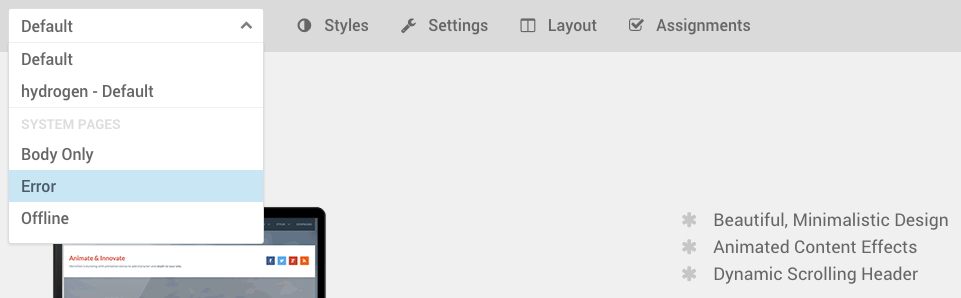
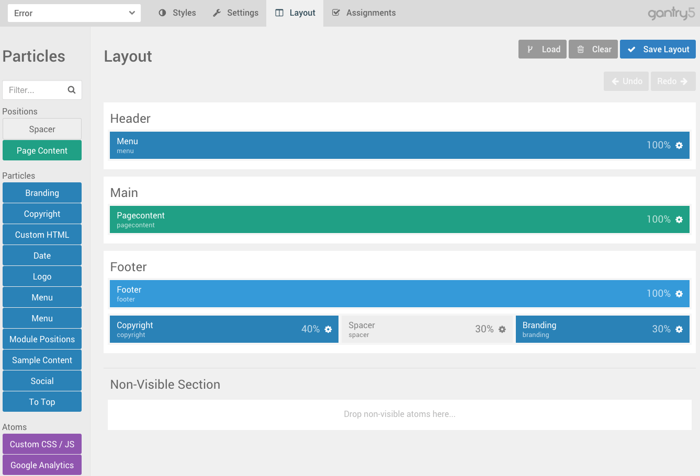

The **Error** page is considered a **System Page** in Gantry 5, and editing it to meet your needs is as easy as switching outlines in the **Gantry Administrator**.

You don't have to create a separate **Error** outline. It's actually included in the core of Gantry with its own **layout**, **settings**, and **styles** options.



The first step to customizing this page is to access the Gantry administrator by navigating to **Admin → Extensions → Template Manager** and selecting your active Gantry 5 template. This will take you to the Gantry Administrator. 

 {.border .shadow}

From there, you will need to click on the Outlines icon then click the edit icon for the Error page.  Doing so loads the outline for the Error page, giving you access to its **Layout Manager**, **Settings**, and **Styles** administrative panels.

 {.border .shadow}




Coming soon...


{{ gravui_tabs({'Joomla':tab1, 'WordPress':tab2}) }}
 
