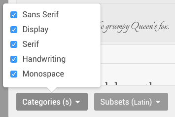
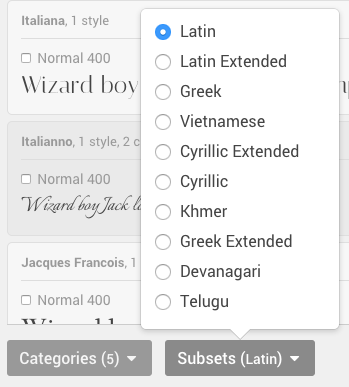
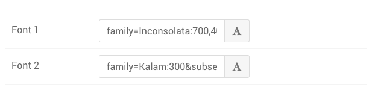

Gantry 5 includes a new **Font Picker** which gives you the ability to select fonts for a variety of situations including templates, Particles, and more.

The Font Picker makes it easy to quickly choose fonts in Particles. The picker itself pops up when you click a special field in the backend that gives you the ability to set a font for a Particle, or even for the theme itself.

Based on **Google Fonts**, the Font Picker gives you immediate access to over 600 open source fonts.

>>> You can find more information about adding a font to the font picker (as well as to your theme in general) [in our fonts guide](../fonts).

Browsing Fonts
-----


Test Text Field [3%, 1%, se]
    : Enter the text you would like to see in different fonts here.

Search [3%, 83%, se]
    : Use this field to search for a font by name. The number in the upper-right corner of the field indicates how many matches there are to your current string.

Font Browser [10%, 1%, se]
    : Available fonts are listed in this area of the **Font Picker**. You can scroll down to see all of the different options, each displaying your test text in the associated font.

Categories [91%, 1%, se]
    : This setting enables you to filter fonts by category. This is a useful tool for refining your search by type of font, rather than scrolling through the entire library.

Subsets [91%, 15%, se]
    : This setting gives you the ability to filter results by subset. For example, you could look for a font specifically in Latin characters.

Select [91%, 86%, se]
    : Use the green **Select** button to lock in your font of choice (listed in the text directly to the left). To choose a font, simply select the checkbox in that font's listing in the font browser.



{{ gravui_callout(page.media['font_picker_1.png'].url, callout_items, 'shadow border') }}

1. **Test Text Field**: Enter the text you would like to see in different fonts here.
2. **Search**: Use this field to search for a font by name. The number in the upper-right corner of the field indicates how many matches there are to your current string.
3. **Font Browser**: Available fonts are listed in this area of the **Font Picker**. You can scroll down to see all of the different options, each displaying your test text in the associated font. To select a font, click the checkbox located to the left of the font's weight you would like to use.
4. **Categories**: This setting enables you to filter fonts by category. This is a useful tool for refining your search by type of font, rather than scrolling through the entire library.
5. **Subsets**: This setting gives you the ability to filter results by subset. For example, you could look for a font specifically in Latin characters.
6. **Select**: Use the green **Select** button to lock in your font of choice (listed in the text directly to the left). To choose a font, simply select the checkbox in that font's listing in the font browser.

Upon clicking the font icon to the right of the **Font Picker** field, a popup appears that enables you to type a phrase and see it presented in over 670 different fonts from the [Google Font](http://www.google.com/fonts) library.

 {.border .shadow}

To make life a little easier, you can filter these results by Category and Subset, as well as search for a specific font using the search tool in the upper-right corner of the popup.

 {.border .shadow}

This is a very quick and easy way to not only get a preview of what a block of text might look like with a different font, but to apply that font to your page by simply choosing it and hitting **Select**.

Adding the Font Picker to Your Site
-----

 {.border .shadow}

The Font Picker is a Gantry 5 input. If you want to add it to your template or particle, you would do so by assigning the administrative input as `input.fonts` in the Particle's YAML file.

Here is an example of how this would look in the YAML file.

```yaml
target:
      type: input.fonts
      label: Font
      description: Select the font you would like to have used for content in the Particle.
      default: family=Inconsolata:700,400&subset=latin,latin-ext
```

You can find more information about how to use YAML files in Gantry 5 [in our guide](../../advanced/particle-yaml-field-types).
