## Introduction

Multilingual support in websites opens them up to a considerably larger audience than a single-language site might be able to. Developing a site with multilingual support takes a little know-how, and we have put together this guide to help you get through it.

Everything written here can be applied to any Gantry-powered template.

## Prerequisites

* Joomla 3.4+ (for use with Gantry 5)
* RocketTheme Template
* RokNavMenu Extension

! NOTE: This process is much easier when it is being done on a new website. You can accomplish this on an existing site using the same steps, but you may need to work a lot harder during menu configuration to achieve the desired result.

## Setup

### Step 1: Install Additional Languages

[ui-callout]
[ui-callout-item title="Install Language" position="37%, 14%, se"]
[/ui-callout-item]

[/ui-callout]

First thing that you should do is to install additional languages that will be used on the web site. You can do this by navigating to **Extensions Manager -> Install Languages**, selecting the language(s) you wish to install, and clicking the yellow **Install** button in the upper-right area of the page.

[ui-callout]
[ui-callout-item title="Languages" position="40%, 30%, se"]
[/ui-callout-item]
[ui-callout-item title="Install" position="22%, 10%, se"]
[/ui-callout-item]

[/ui-callout]

When you installed all the required languages go to **Language Manager** which can be reached by going to **Administrator -> Extensions -> Language Manager**. On the **Installed - Site** tab, you will see the list of all installed languages on the web site. Now, we just need to add content languages.

### Step 2: Create New Content Languages

[ui-callout]
[ui-callout-item title="Content Tab" position="50%, 10%, se"]
[/ui-callout-item]
[ui-callout-item title="New" position="28%, 10%, se"]
[/ui-callout-item]

[/ui-callout]

You can do this by selecting the **Content** tab and then selecting **New**. This will take you to a page that enables you to set up a new content language for your site.
 
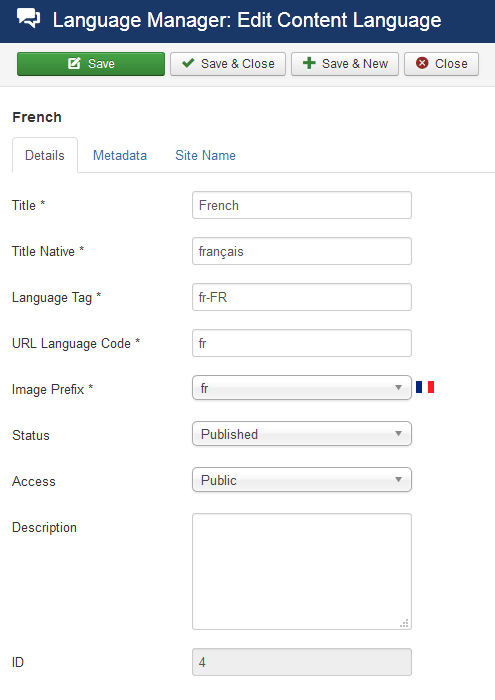 {.border .shadow}

Fill out the required information in this page. This information includes:

* **Title**: The Name of the language as it will appear on the site.
* **Title Native**: Title in its native language.
* **URL Language Code**: The language code is appended to the site URL. (Example: http://mysite.com/sp/)
* **Image Prefix**: Prefix of the image file for this language when using the *Use image flags* Language Switcher basic option. (Example: fr for fr.gif)
* **Language Tag**: Enter the exact prefix used for the language installed (or to be installed). (Example: en-GB)

>> NOTE: A lot of this information can be found on the **Installed Languages** page in the **Language Manager**. The **Language Tag** should be an exact match to what appears on this page.

Once you have filled in this information, click **Save and Close**. This will take you back to the **Content Languages** page where you will see your new language(s) listed along with any pre-existing content languages.

### Step 3: Configure and Enable the Language Filter Plugin

 {.border .shadow}

The next step requires you to navigate to **Extensions -> Plug-in Manager** in order to configure Joomla multilingual plugin. The plugin you need to find here is **System - Language Filter**. This plugin enables the CMS to recognize various installed languages and filter content so what is displayed matches the language selected.

Click the plugin to access the configuration page. Here, you can set the **Basic Options** as you see fit. Here are some example settings which should work in most cases.

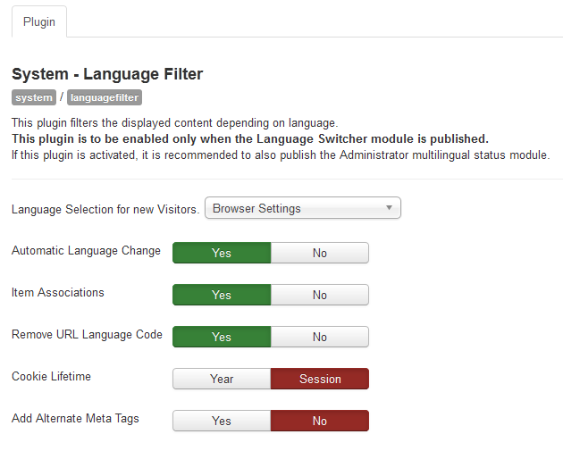 {.border .shadow}

| Option                              | Setting     |
| :----------                         | :---------- |
| Language Selection for New Visitors | Browser     |
| Automatic Language Change           | Yes         |
| Item Associations                   | Yes         |
| Remove URL Language Code            | Yes         |
| Cookie Length                       | Session     |
| Add Alternate Meta Tags             | No          |

Once this is configured, activate the plugin by switching the **Status** to **Enabled**.

### Step 4: Create New Content Categories for Each Language

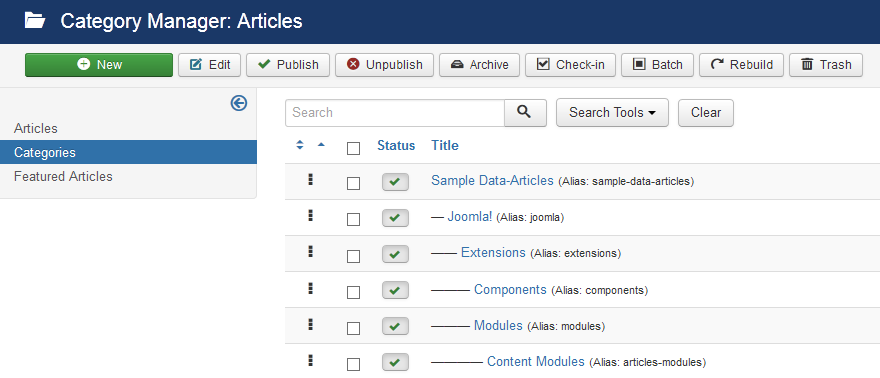 {.border .shadow}

The next step is to create a new category for each language you wish to use. You can do this by navigating to **Administrator -> Content -> Category Manager -> Create New Category**.

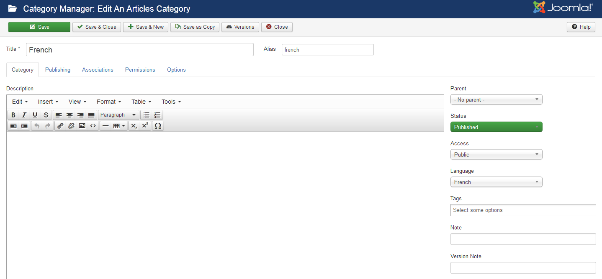 {.border .shadow}

Each category should have a language assigned. You can title this category after the name of the language you intend to use. Once you have done this, you can click **Save and Close**.

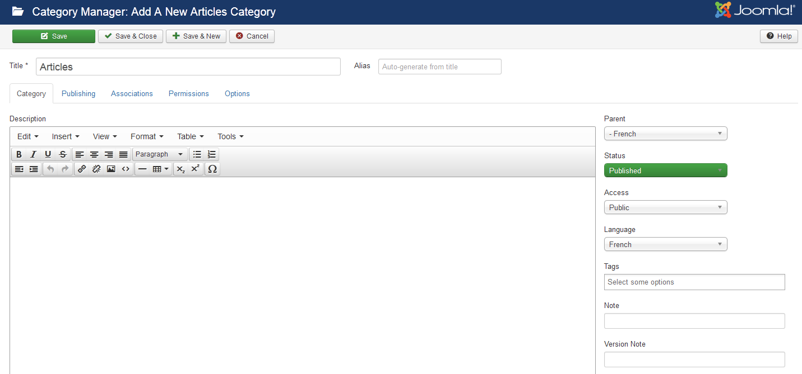 {.border .shadow}

You can then create content categories and assign their **Parent** category to the base category you have created for the language. For example, you can create a category called *Blog* and assign it the **English** category as a parent.

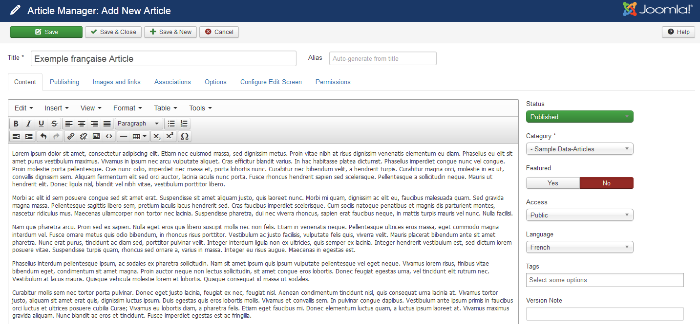 {.border .shadow}

At this point, you will want to create content for each category, if only so that you can test this configuration while creating menus and other upcoming steps. Give each subcategory for each language at least one article.

>> NOTE: Each of these articles should have the appropriate **Language** assigned to it, even if you are placing it in a language-specific content category.

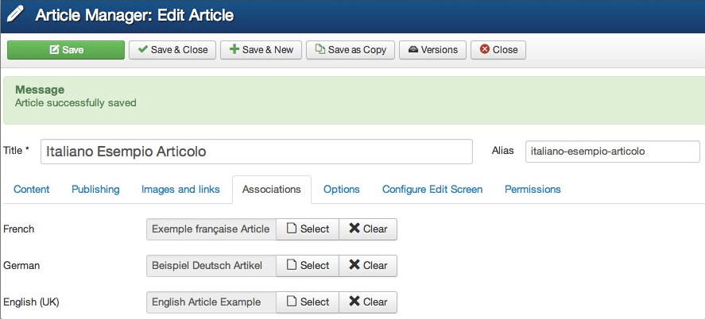 {.border .shadow}

Let us say you have a copy of an article for each language. You can assign these using the **Associations** area of the article editor. For example, if you have a single article that would act as your language-specific home page, these should all be associated with each other here.

### Step 5: Enable Unicode URL Aliases

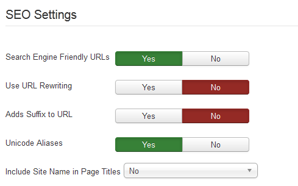 {.border .shadow}

The next thing you may want to do is to navigate to the **Global Configuration** page and access **SEO Settings**. This area of the administrator can be accessed by navigating to **Administrator -> Site -> Global Configuration**. 

You will likely want to turn on Unicode URL aliases, especially if you have special characters in one of the selected language, for example letter 'čćšđž' in the Croatian language.
 
### Step 6: Create a Menu for Each Language

In order for everything to work and look correctly, you will want to add menus that belongs to each language in **Menu Manager**. This step will enable each user to not only access a menu that is available in their preferred language, but also to filter the site experience itself by content language.

You can add a new menu by navigating to **Administrator -> Menus -> Menu Manager -> Add New Menu**. 

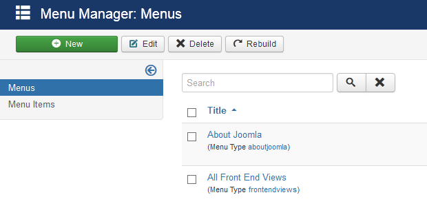 {.border .shadow}

Once you have created the menu, you can then go into that menu's **Menu Manager** page, filter menu items by one of the language-related menus, and select **New**.

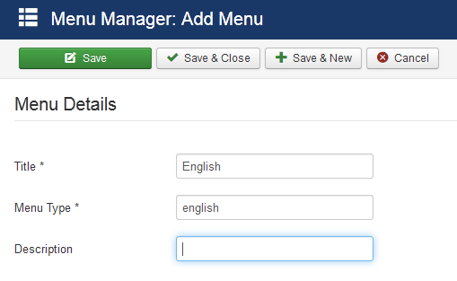 {.border .shadow}

When you create the new menu item, you can do so as you would normally. The only additional steps required is that you set the **Menu Location** and **Language** to your desired language-specific menu and language. You may also want to create a home page menu item for that individual language, as this will make each visitor's landing page appear in their native language.

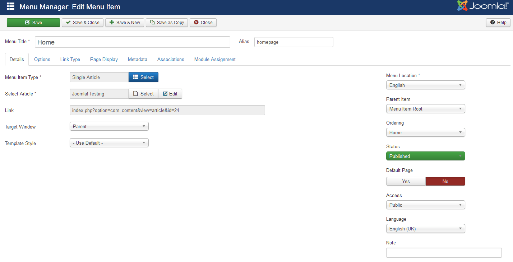 {.border .shadow}

#### Setting Menu Item Associations

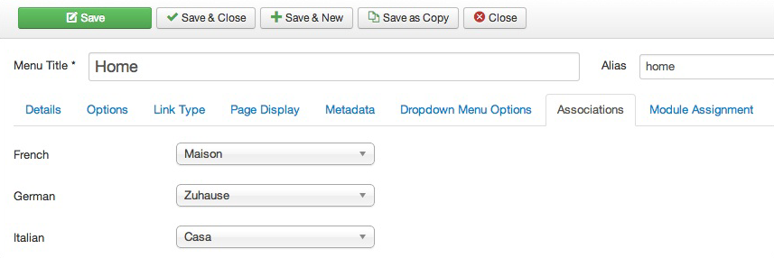 {.border .shadow}

One thing that you need to set (if you want specific article for example to change depending on selected language) is Menu Item Associations section's parameters. This needs to be done the same way you did the earlier article associations. 

Later on we will be using the **Language Switcher** module to provide language buttons on our front end. To have our site seamlessly transition from one language to another we have to set "Associations".

For a given language menu page and given language article content we have to "associate" what menu items and articles should appear for any of the other languages when selected by the user.

Let us say your site will use English and Italian. The frontend will have the three language buttons and we want to make sure the right menu page and article appears when the user selects a language.

Here is the menu structure:

* English Menu
    * Home
* French Menu
    * Maison
* German Menu
    * Zuhause
* Italian Menu 
    * Casa

Here are the language articles:

* English Category (Articles)
    * Article one
    * Article two
    * Article three
* French Category (Articles)
    * Article premier
    * Article deux
    * Article trois
* German Category (Atrikel)
    * Artikel eins
    * Artikel zwei
    * Artikel drei
* Italian Category  (Articoli)
    * L'articolo uno
    * Articolo due
    * Articolo tre

So we will setup our **English** Menu first. In the Home page item click on the Associations tab and you will see one or more language options with a corresponding dropdown boxes. In the case of our example, you will see three since there are three other languages in addition to the one the category/article is presently assigned.

We will focus on Italian settings in this example, but the same principal applies to any and all additional languages.

For Italian you would select the "Casa" menu item. When the user clicks the Italian language button this would be the menu page the user would land on.

Now lets set what article content should appear when the user selects a different language.
So we will setup our English "Article one" first. In the Article Editor item click on the Associations tab and you will see two language options with a corresponding dropdown boxes.

For Italian you have three choices: **L'articolo uno**, **Articolo due** and **Articolo tre**. Here you would probably select **L'articolo uno** as the article to replace the English **Article one** when the user clicks the Italian language.

This will enable you to switch seamlessly between languages on the frontend. After building all of the default pages, simply go back and associate them with their equivalent article on opposing pages using the **Associations** tab. When this is done, the menu item should appear like this:

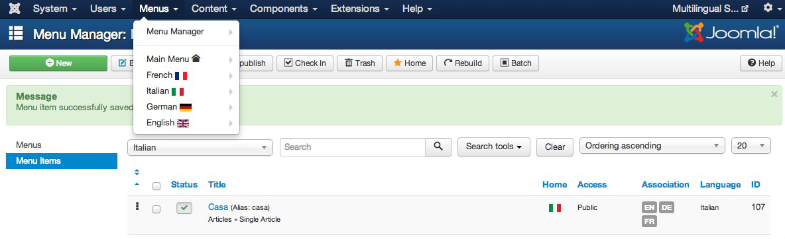 {.border .shadow}

### Step 7: Create a Template Outline for Each Language

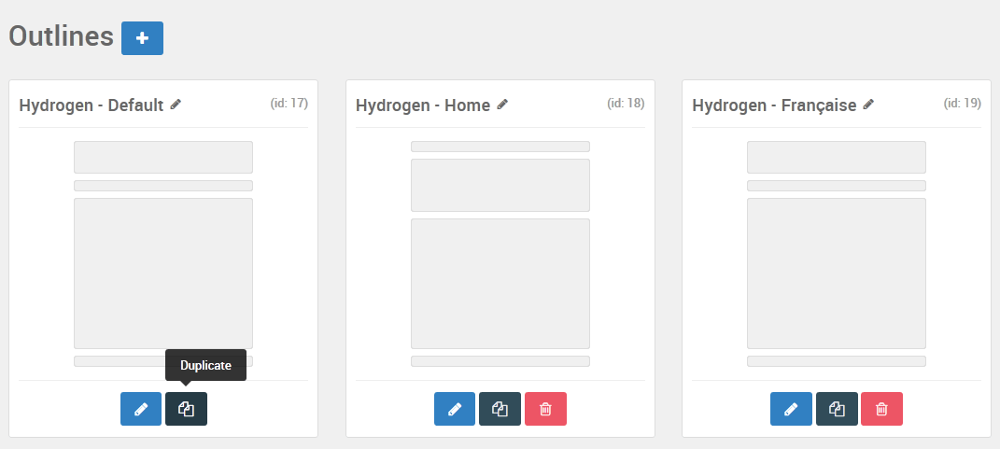 {.border .shadow} 
 
At the end, you have to assign template Outlines for each language installed. That is necessary so you can load different menus, depending on the selected language. You can do this by going to **Administrator -> Components -> Gantry 5 Themes**, selecting the theme you have as default, and selecting **Configure**. 

From here, you can access the **Outlines** administrative panel, select the outline you wish to base your new language-specific layout from, and select **Duplicate**. This will create a duplicate of the outline, which you can modify to include the language-specific menu and set assign a language to the override.
 
To do this, you will want to set the **Default** language to the language you wish to have this style assigned. You can do this in the **Overview** area of the **Template Settings**.

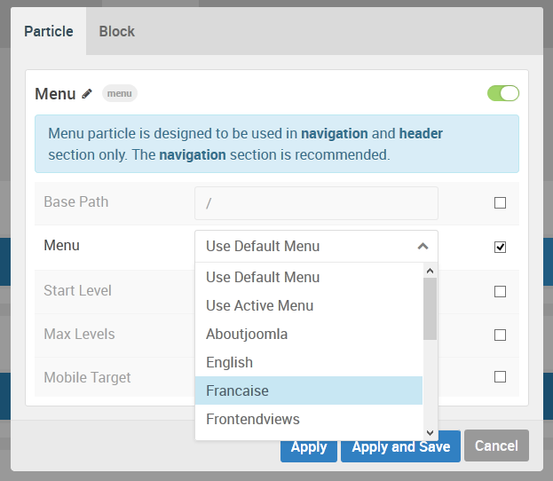 {.border .shadow}

Next, you will want to change the main menu to the one you created for the language. For example, if this template style is assigned to Française, then you will want to select the Française (French) menu.

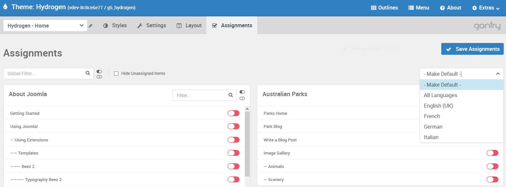 {.border .shadow}

You will also want to assign the outline to the given language. This is done in the **Assignments** administrative panel. Simply select the language you would like to assign to the outline from the dropdown list.

### Step 8: Create a Language Selector Module

This step is useful if you want to give your visitors the option to switch between languages as they please. You can do this by creating a **Language Selector** module and publishing it on the page.

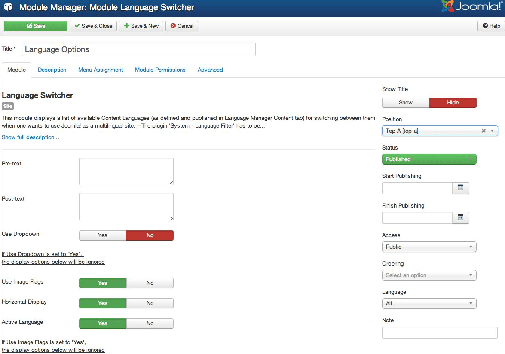 {.border .shadow}

You can do this as you would create any other module. By navigating to **Administrator -> Extensions -> Module Manager** and selecting **New**. Choose **Language Switcher** as the **Module Type** and configure it as you prefer.
 
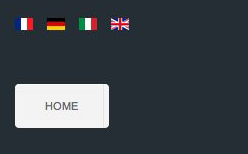 {.border .shadow}

Once this is done, you should see both the language selector module and the language-specific menu appear as expected. Your visitors can switch between languages by clicking its associated flag.