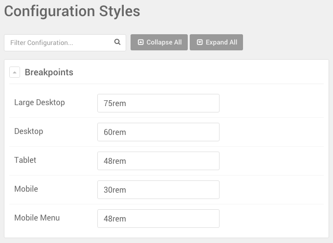

## Introduction

Gantry 5 has a ton of useful utilities baked in to its core. Among them are its assortment of utility classes that make it easy to quickly set up elements and have them appear how you want and when you want them to.

## Responsive Utility Classes

These classes are used to hide and make visible various blocks depending on the size of the browser window used to view the page. This makes possible for you to create a seamless, yet optimized experience for a variety of devices from mobile to large desktops.

| Class             | Phones            | Tablets             | Desktops              | Large Desktops       |
| :---------------- | :---------------- | :------------------ | :-------------------- | :------------------- |
| `visible-phone`   | **Visible**       | Hidden              | Hidden                | Hidden               |
| `visible-tablet`  | Hidden            | **Visible**         | Hidden                | Hidden               |
| `visible-desktop` | Hidden            | Hidden              | **Visible**           | **Visible**          |
| `visible-large`   | Hidden            | Hidden              | Hidden                | **Visible**          |
| `hidden-phone`    | Hidden            | **Visible**         | **Visible**           | **Visible**          |
| `hidden-tablet`   | **Visible**       | Hidden              | **Visible**           | **Visible**          |
| `hidden-desktop`  | **Visible**       | **Visible**         | Hidden                | Hidden               |
| `hidden-large`    | **Visible**       | **Visible**         | **Visible**           | Hidden               |

 {.border}

You can set the breakpoints for these classes in the **Styles** administrative panel. Just navigate to the bottom of the administrative panel and look for the **Configuration Styles** section.

 {.border}

As an example, let's say you have a block that you want to appear only on desktop devices. You would enter `visible-desktop` in the **CSS Class** field of the block settings for the block.

This doesn't just affect blocks, either. You can do in-line applications such as `The Great Gatsby` to have the word "The" only appear on devices other than phones.
 
## Padding and Margin Adjustments

This set of utility classes give you the ability to adjust the padding and margin settings for the element. They're pretty straightforward, and we have broken them down in the table below.

| Class             | Description                                                                      |
| :-----            | :-----                                                                           |
| `nomarginall`     | Sets the margin for the top, bottom, left, and right of the element to 0.        |
| `nomargintop`     | Sets the margin for just the top of the element to 0.                            |
| `nomarginbottom`  | Sets the margin for just the bottom of the element to 0.                         |
| `nopaddingall`    | Sets the padding value for the top, bottom, left, and right of the element to 0. |
| `nopaddingtop`    | Sets the padding value for just the top of the element to 0.                     |
| `nopaddingbottom` | Sets the padding value for just the bottom of the element to 0.                  |
| `g-flushed`       | Sets both the padding and margin for the element to 0.                           |
