## Introduction

Multilingual support in websites opens them up to a considerably larger audience than a single-language site might be able to. Developing a site with multilingual support takes a little know-how, and we have put together this guide to help you get through it.

Everything written here can be applied to any Gantry 5 theme. We'll provide instructions for setting up a multilingual site using two popular WordPress plugins: [Polylang](https://wordpress.org/plugins/polylang/) and [WPML](https://wpml.org/). 

## Recommend Approach

When developing a multi-lingual site we recommend that your complete your development and testing for a single language first. Then, add one language at a time and thorougly test that before moving on to the next. Adding many languages all at the same time will lead to confusion and make your site hard to debug and diagnose should anything found to be not working correctly.

## Prerequisites

Begin by installing the following:

* Polylang or WPML
* Gantry 5 Plugin and Theme

## Polylang (Free)

### Step 1: Install Additional Languages

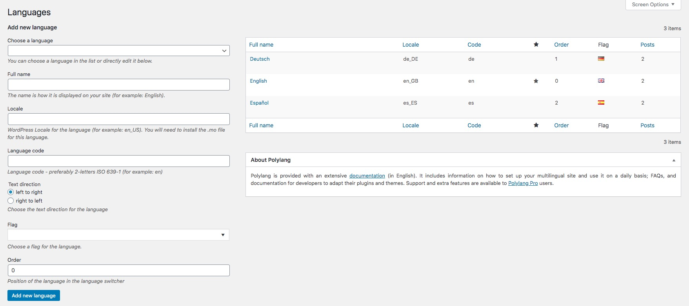

First thing that you should do is to install additional languages that will be used on the web site via Polylang settings.

### Step 2: Create Pages for each Language

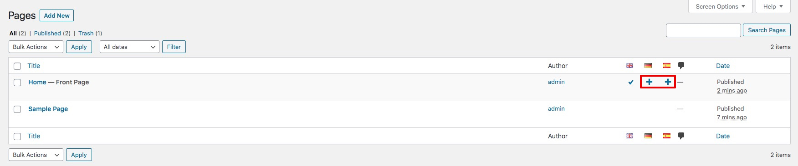

In your WordPress admin, select Pages. Select the plus icons next to your Home page (and subpages) and begin setting up each page in the languages you have set up.

### Step 3: Create Menus for each Language

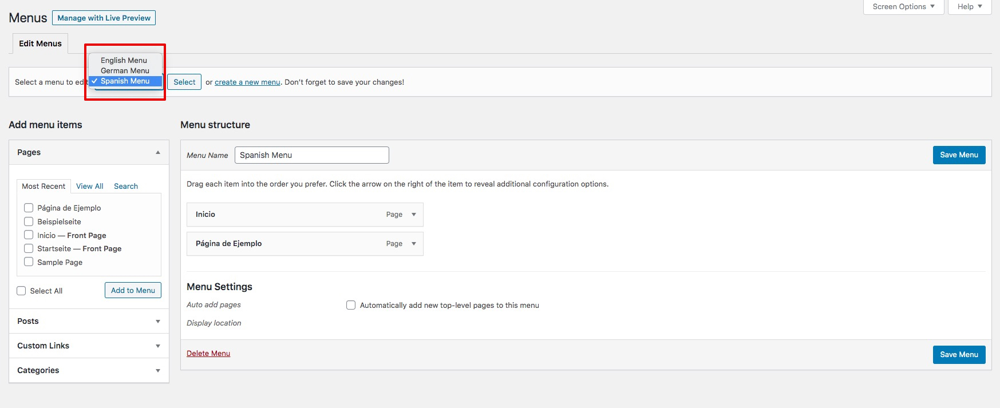

In your WordPress admin, select Appearance -> Menus. Create menus for each Language with the desired pages.

### Step 4: Create Base Outlines and Home Outlines for each Language

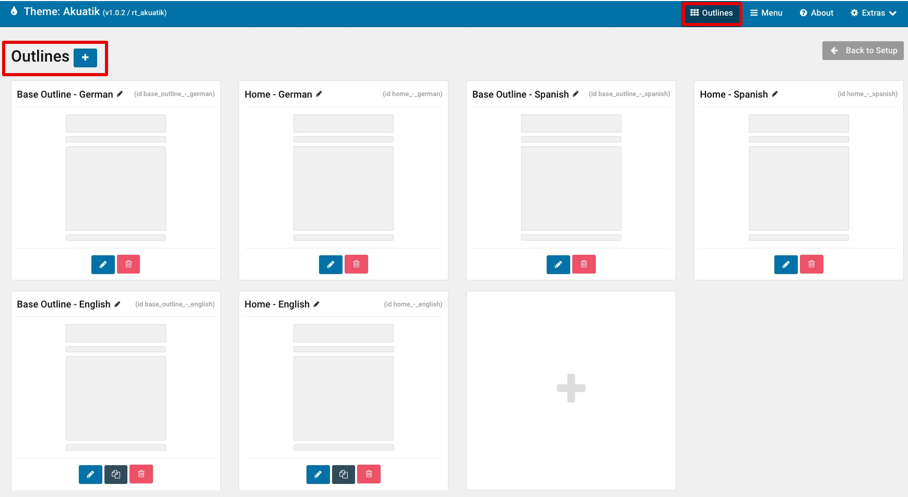

Next visit your Gantry theme settings -> Outlines. Begin creating Base Outlines (which will serve as the default layout) and Home outlines for each language. 

### Step 5: Edit the Menu particle in each Base Outline 

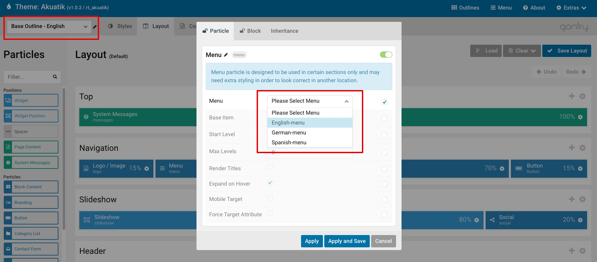

In one of your newly created Base Outlines, select the Layout tab. Then edit (or create) the Menu particle to display the desired menu associated with that outline's language. Do this for each Base Outline you have created.

### Step 6: Create a Language Switcher position and widget

In this same Base Outline, create a new widget position specifically for the Language switcher. Do this in all your Base Outlines.

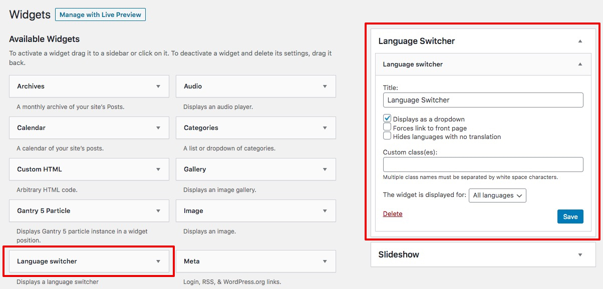

In your WordPress admin, select Appearance -> Menus. Set the language switcher in this newly created position (you only need to set this up once).

### Step 7: Assignments

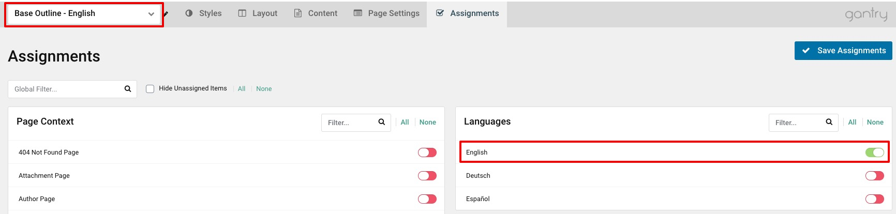

Go back to your theme settings, and select one of your Base Outlines and click on the Assignments tab. Assign it to Single Page (Assignments -> Page Context -> Single Page) and also the Language associated with this outline. Repeat this step for each of your Base Outlines.

### Step 8: Home Outline

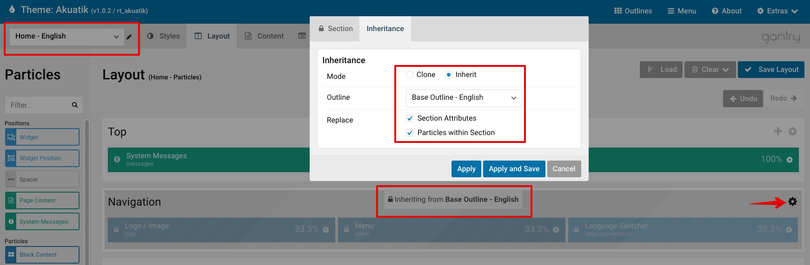

Now select one of your Home Outlines and click on the Layout tab. Select the Cog icon on the far right of the section that contains the Menu / Language Switcher from your Base Outlines (usually Navigation). Click on the Inheritance tab and inherit the **Particles within Section** (can also inherit **Section Attributes**) of the Base Outline that is the **same language** as the Home outline you are editing. Repeat this same step for each Home outline for each language.

Now select the Assignments tab on one of your Home outlines. Simply assign it to the Front Page and associated Language (if you do not have a specific page as Front Page/Home Page, simply assign it to your desired page).

### Step 9: Subpages

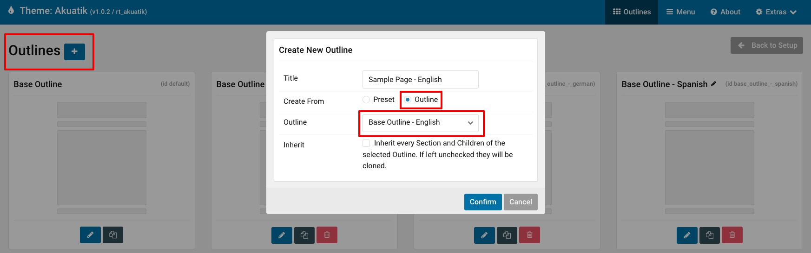

Click on Outlines in your theme settings to begin creating new Subpage outlines. You can clone them from any of your Base or Home outlines.

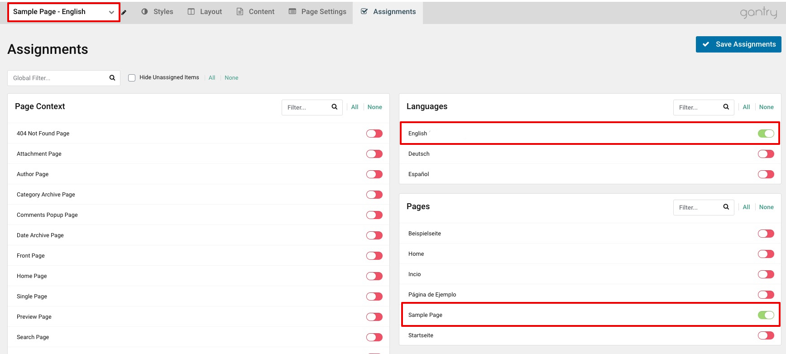

Then assign your subpage outline to your desired language and page.

### Step 10: Frontend

Visit the frontend of your site and you should now see the language switcher and the associated Menu when selecting each language. 

## WPML (Premium)

### Step 1: Install Additional Languages

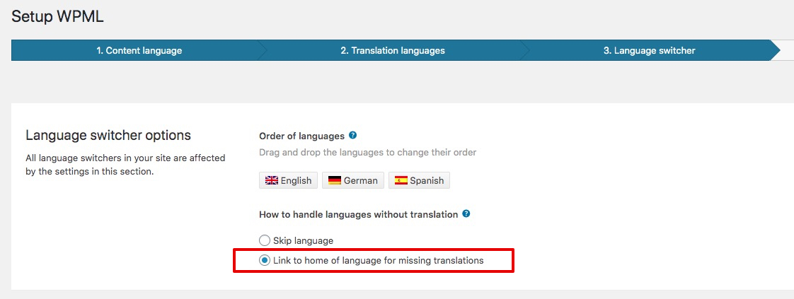

First thing that you should do is to install additional languages that will be used on the web site via WPML settings. Set Language switcher options -> How to handle languages without translation to "Link to home of language for missing translations".

### Step 2: Create Pages for each Language

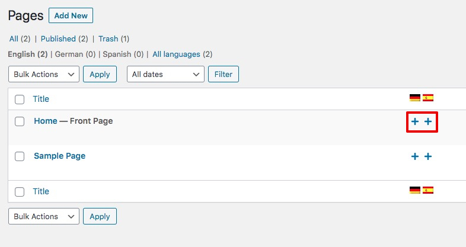

In your WordPress admin, select Pages. Select the plus icons next to your Home page (and subpages) and begin setting up each page in the languages you have set up.

### Step 3: Create Menus for each Language

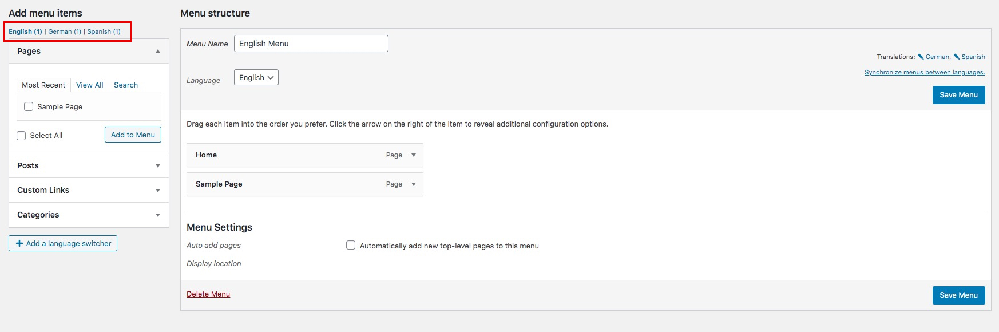

In your WordPress admin, select Appearance -> Menus. Create menus for each Language with the desired pages.

### Step 4: Create Base Outlines and Home Outlines for each Language

Next visit your Gantry theme settings -> Outlines. Begin creating Base Outlines (which will serve as the default layout) and Home outlines for each language. 

### Step 5: Edit the Menu particle in each Base Outline 

In one of your newly created Base Outlines, select the Layout tab. Then edit (or create) the Menu particle to display the desired menu associated with that outline's language. Do this for each Base Outline you have created.

### Step 6: Create a Language Switcher position and widget

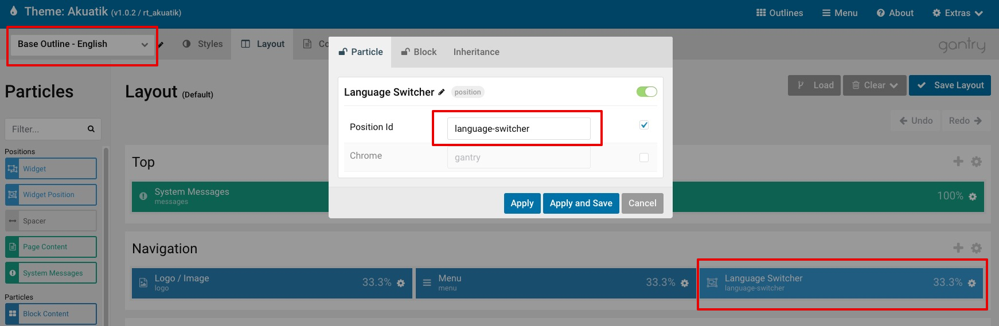

In this same Base Outline, create a new widget position specifically for the Language switcher. Do this in all your Base Outlines.

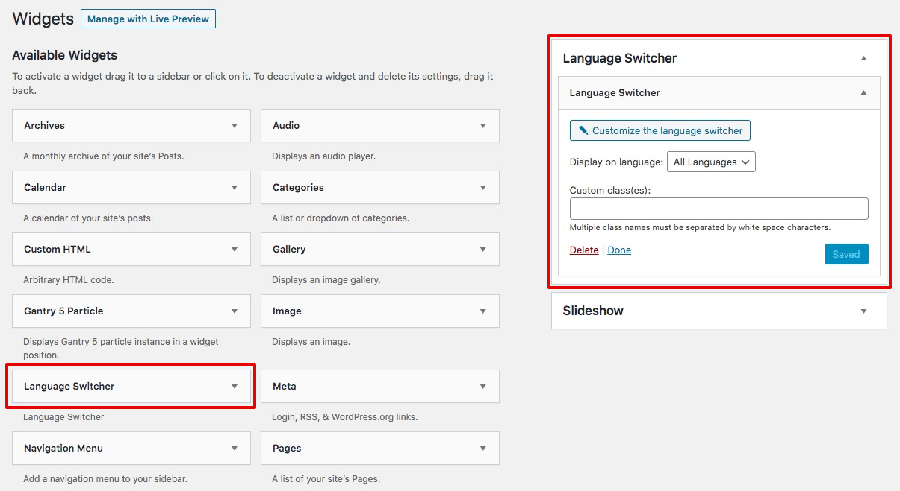

In your WordPress admin, select Appearance -> Menus. Set the language switcher in this newly created position (you only need to set this up once).

### Step 7: Assignments

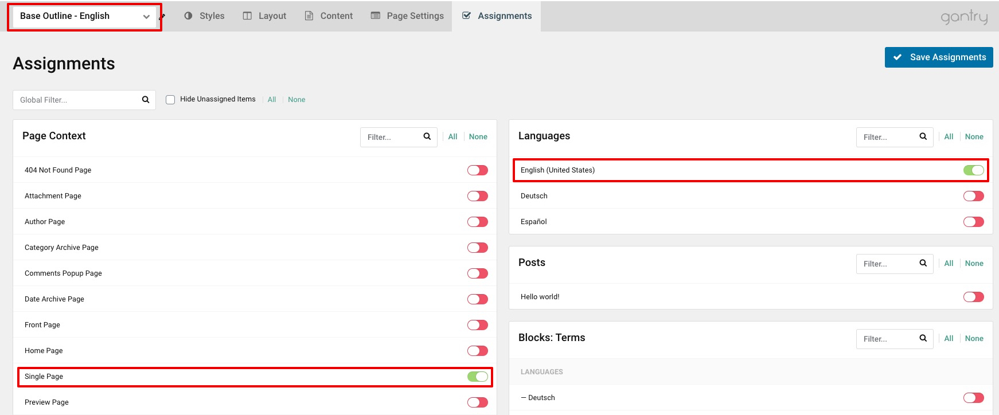

Go back to your theme settings, and select one of your Base Outlines and click on the Assignments tab. Assign it to Single Page (Assignments -> Page Context -> Single Page) and also the Language associated with this outline. Repeat this step for each of your Base Outlines.

### Step 8: Home Outline

Now select one of your Home Outlines and click on the Layout tab. Select the Cog icon on the far right of the section that contains the Menu / Language Switcher from your Base Outlines (usually Navigation). Click on the Inheritance tab and inherit the **Particles within Section** (can also inherit **Section Attributes**) of the Base Outline that is the **same language** as the Home outline you are editing. Repeat this same step for each Home outline for each language.

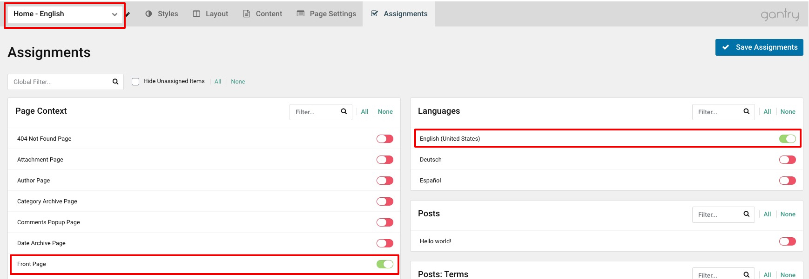

Now select the Assignments tab on one of your Home outlines. Simply assign it to the Front Page and associated Language (if you do not have a specific page as Front Page/Home Page, simply assign it to your desired page).

### Step 9: Subpages

Click on Outlines in your theme settings to begin creating new Subpage outlines. You can clone them from any of your Base or Home outlines.

Then assign it to your desired language and page.

### Step 10: Frontend

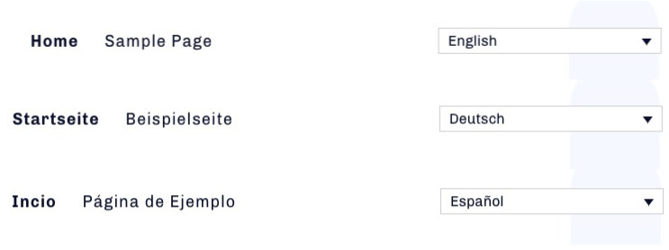

Visit the frontend of your site and you should now see the language switcher and the associated Menu when selecting each language.
