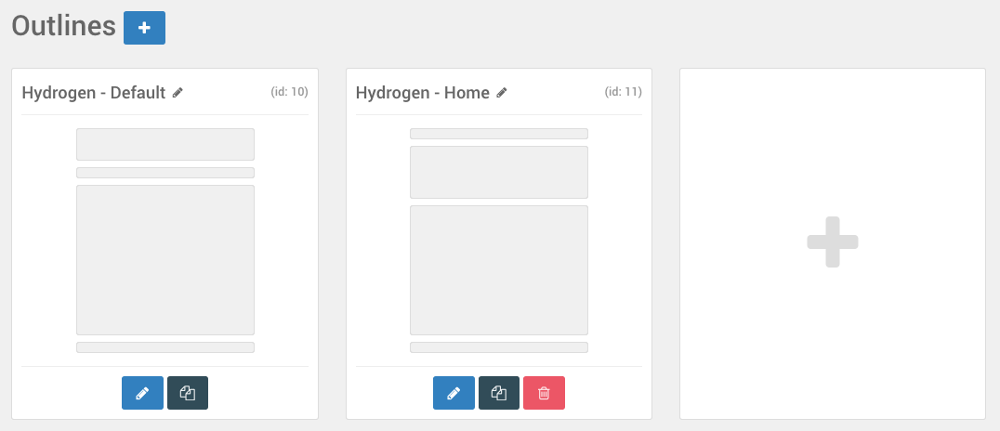
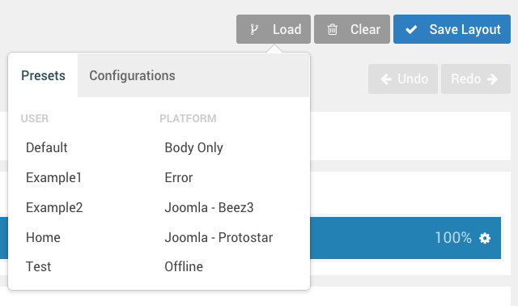
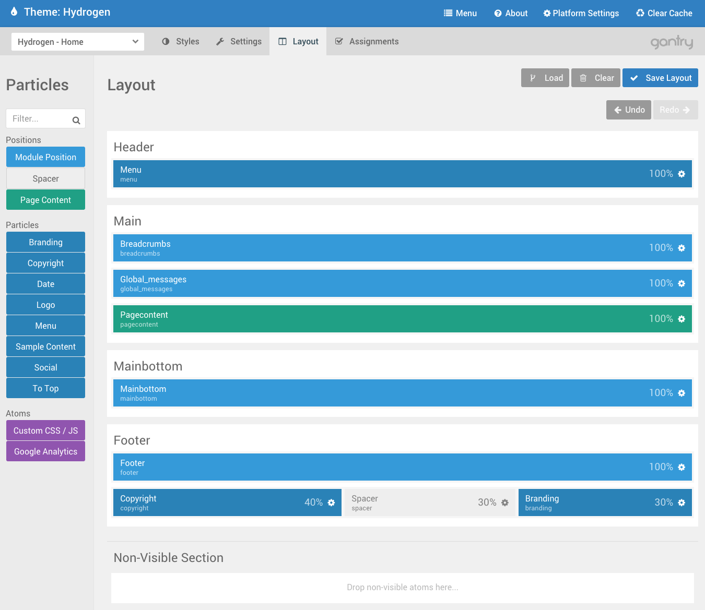
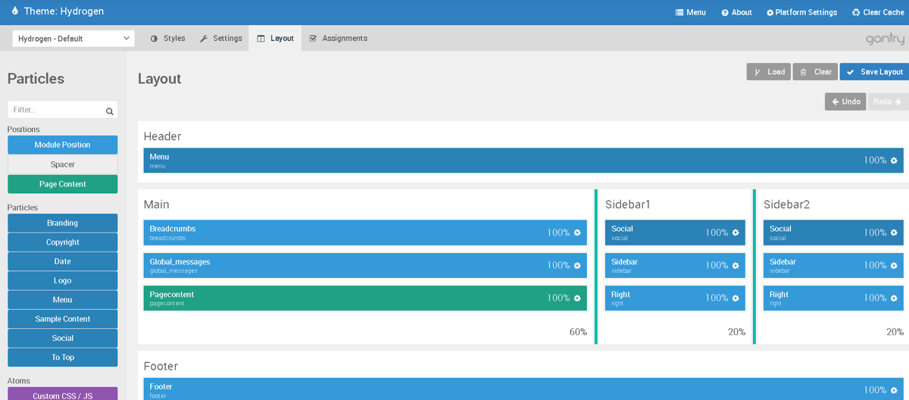

Layout Presets are the basic building blocks the Layout Manager uses as a starting point for you to customize the layout of your site. Each preset gives you a new set of sections, each linked to styling, making up the look and feel of the site. You can then place Particles and Positions into these sections, add rows, and arrange the page the way you would like it to look.

If you're not finding a preset that meets your needs, you can create a new one. 

It is very easy for a skilled developer to create a **Layout Preset**. This is a great way to take an existing Layout Preset and add or remove **Sections** to it, or to build an entirely new Layout Preset from scratch, if you are so inclined.

Unlike adding rows in a section, creating an entirely new section (either stand-alone or as a sidebar) gives you the ability to create custom CSS styling affecting the new area of the page.

It's important to note that this is an advanced action, and Gantry 5 themes generally do not include built-in styling support for new sections. You will have to add the styling yourself, either linking it to an existing section or creating it from scratch in your `custom.scss` file located in `THEME_DIR/custom/scss`. 

## Preset Images

 {.border .shadow}



There is a section of the YAML files for the layout presets that deals with the preset image. This is an important part of the file as it creates the preview image you see when you are browsing the **Outlines** administrative interface. It can serve as a quick reference to the outline, giving you an at-a-glance look at what the layout looks like without having to visit the layout manager.

Gantry includes a set of these images that you can choose from. They are located in the `SITE_ROOT/administrator/components/com_gantry5/images/layouts/` directory and can be easily referenced with a stream link. For example, if you wanted to link to the `2-col-left.png` file in that folder, you would use the URL: `gantry-admin://images/layouts/2-col-left.png` as the preset image.

You can also add custom images. For example, let's say we have `example.png` and we want to use it as the preset image. We would place it in `/templates/TEMPLATE_DIR/custom/images/admin/layouts` and reference it in the YAML file as `gantry-media://images/admin/layouts/example.png`.




There is a section of the YAML files for the layout presets that deals with the preset image. This is an important part of the file as it creates the preview image you see when you are browsing the **Outlines** administrative interface. It can serve as a quick reference to the outline, giving you an at-a-glance look at what the layout looks like without having to visit the layout manager.

Gantry includes a set of these images that you can choose from. They are located in the `SITE_ROOT/wp-content/plugins/gantry5/admin/images/layouts/` directory and can be easily referenced with a stream link. For example, if you wanted to link to the `2-col-left.png` file in that folder, you would use the URL: `gantry-admin://images/layouts/2-col-left.png` as the preset image.

You can also add custom images. For example, let's say we have `example.png` and we want to use it as the preset image. We would place it in `THEME_DIR/custom/images/admin/layouts` and reference it in the YAML file as `gantry-media://images/admin/layouts/example.png`.


{{ gravui_tabs({'Joomla':tab1, 'WordPress':tab2}) }}

## Creating a New Layout Preset

 {.border .shadow}

Creating a new **Layout Preset** is pretty simple. The first thing you will need to do is create a new YAML file in `THEME_DIR/custom/layouts`. For our example, we will name this file `example1.yaml`.

Here is the example code that will be in our new YAML file:

```yaml
preset:
  image: gantry-media://images/admin/layouts/example.png

layout:
  header:
    container:
      - particle-menu

  main:
    container:
      - position-breadcrumbs
      - position-global_messages
      - pagecontent

  mainbottom:
    container:
      - position-mainbottom

  footer:
    container:
      - position-footer
      - [particle-copyright 40, spacer 30, particle-branding 30]
```

 {.border .shadow}

This is a basic layout preset, featuring three sections included in the theme's original styling (`header`, `main`, and `footer`) with one additional section being added (`mainbottom`) that is not included with the original theme. We don't recommend adding new sections if you don't have to, but doing so can be done by adding it in a custom Layout Preset.

Once you have added a new section, it will display without any styling beyond the template's defaults. To add your own styling, you will want to do so via the `custom.scss` file located in `THEME_DIR/custom/scss`. For example, if you wanted the H1 tag to output a red font, you would add the line `#g-mainbottom h1 {color: red;}`. 

>>> Gantry sections appear in scss under the tag g-(section name). The `main` section would be `g-main`, as an example. This is done to separate your section names from other potentially conflicting third-party styling assignments.

## How to Create a Sidebar Section

 {.border .shadow}

In this section, we will explain how to create a new Layout Preset with double sidebar. Each sidebar section represents a **block** within the **grid** container that makes up the **Main**, **Sidebar 1**, and **Sidebar 2** sections. You can find more information about how sidebars work in the [Sidebar Blocks and Grids section of the Layout Manager guide](../../configure/layout-manager#sidebar-blocks-and-grids).

The first thing you will need to do is create a new YAML file in `THEME_DIR/custom/layouts`. For our example, we will name this file `example2.yaml`.

Here is the example code that will be in our new YAML file:

```yaml
preset:
  image: gantry-media://images/admin/layouts/example.png

layout:
  header:
    container:
      - particle-menu

  container:
    1:
      - main 60:
        - position-breadcrumbs
        - position-global_messages
        - pagecontent

      - sidebar1 20:
        - particle-social
        - position-sidebar
        - position-right

      - sidebar2 20:
        - particle-social
        - position-sidebar
        - position-right

  footer:
    container:
      - position-footer
      - [particle-copyright 40, spacer 30, particle-branding 30]
```

The `1:` in the example above indicates that the three child sections are inside of a wrapper. 

This is a very simple Layout Preset, giving the user **Header**, **Main**, and **Footer** sections in addition to two independent **Sidebar** sections. Each section gets its own base styling that provides the base by which added **Particles** and **Positions** are placed.

>>> Each horizontal row needs to equal 100% width. In the example above, you will notice that `main` has a width set of 60%, followed by two sidebars each at 20% width. It's also very important to remember that YAML files only support spaces divisible by 2, and not tabs.

## Spanning a Sidebar Across Multiple Sections

In this section, we will demonstrate two YAML files that create one and two sidebar sections that span across multiple sections of the site. This is useful in cases where you want to have additional sections, such as your header and footer, share vertical space with the sidebar.

```yaml
preset:
  image: gantry-admin://images/layouts/2-col-left.png

layout:
  1:
    -
      header:
      - [position-header]
      navigation:
      - [particle-menu]
      messages:
      - system-messages
      main:
      - pagecontent
      footer:
      - [particle-copyright 40, spacer 30, particle-branding 30]
    -
      aside:
      - position-aside

  offcanvas:
    - particle-mobile-menu
```

As you can see in the example above, we have nested multiple sections including the **header**, **navigation**, **messages**, and **footer** in the same group as the **aside** section, which acts as a sidebar.

In the example below, you will see a two-sidebar layout preset YAML with a sidebar to the left and an aside section to the right of multiple sections.

```yaml
preset:
  image: gantry-admin://images/layouts/3-col.png

layout:
  1:                              # main row
    -                               # main column 1
      sidebar:                        # section
       - position-sidebar               # content row

    -                               # main column 2
      header:                         # section
      - position-header                 # content row
      navigation:                     # section
      - particle-menu                   # content row
      main:                           # section
      - system-messages                 # content row
      - pagecontent                     # content row
      footer:                         # section
      - particle-copyright              # content row

    -                               # main column 3
      aside:                          # section
      - position-aside                  # content row

  offcanvas:
    - particle-mobile-menu
```

The `1:` in the examples given in this section could be replaced with a dash, but it's used here to make it easier to decipher that there is a top-level container that stores all of these sections.

## Syntax Guide

There are four main rules to keep in mind when creating a layout preset.

1. tiered content is ordered as `row - column - row - column - row - column`. See the earlier examples.
2. `foo:` creates a section.
3. Multiple particles in a row are put within `[ ]` brackets. Example: `- [particle-logo, particle-menu]`
4. You don't need brackets for single-particle rows. Example: `- particle-menu` is the shorthand of `- [particle-menu]`

