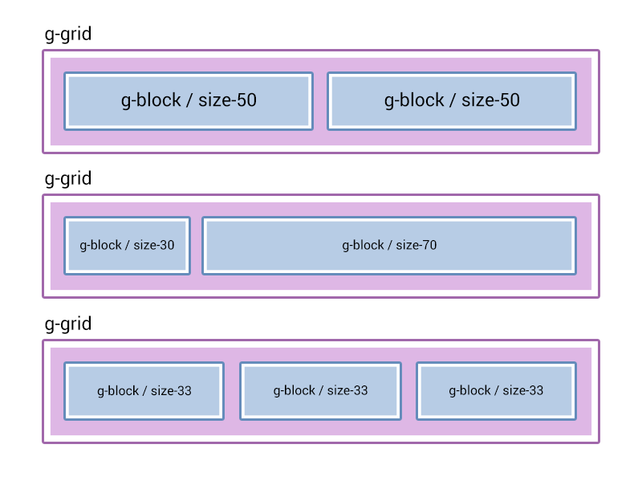
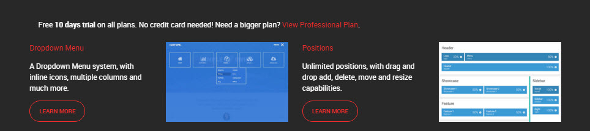
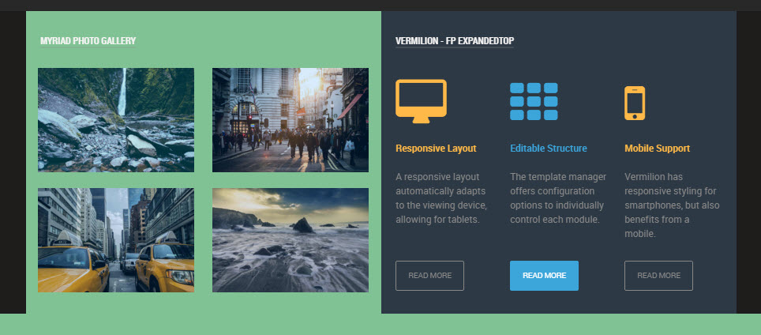

Sometimes, you will want to create custom responsive content within the bounds of a simple content area. For example, within an article/post on your site, as opposed to being created dynamically through a particle.

The way this is done in Gantry 5 is a lot easier than it was in Gantry 4. Gantry 5 comes with a built-in and lightweight CSS framework that we called `Nucleus`. Nucleus main focus is to provide a flex-ready layout. This means that if you just follow a few rules in building your responsive layout, you will never have a problem, no matter how deep your layout is going to be.

For your content you will only need to know about 3 types of classes that come with `Nucleus`:

#### `g-grid`
This is the container of your content surroundings and side-by-side columns. A grid (or row), will always occupy entirely the space it's been added to. Think of it as a 100% wide `div`.

A `g-grid` can contain only `g-block` elements in it, nothing else. This is important in order to have the flex-grid working responsively.

#### `g-block` and `size-%`
This is the container of your actual content. A `g-block`, by default, is `100%` wide and in it you can put any desired content, whether it's an image, a paragraph or even another `g-grid > g-block` layout.

When your `g-block` is accompanied by a `size-%` class, you can change its default `100%` size. Sizes can go from `5` to `95` with a multiplier of `5`.

The available custom widths are `.size-5 .size-10`, `.size-15`, `.size-20`, `.size-25`, `.size-30`, `.size-33`, `.size-40`, `.size-50`, `.size-60`, `.size-66`, `.size-70`, `.size-75`, `.size-80`, `.size-85`, `.size-90 .size-95`.

In **mobile** view, these blocks will stack on top of each other while in **tablet** or **desktop** view, these blocks will scale responsively.
     
> When you have multiple blocks inside a grid, make sure that the size of the blocks sum up to 100%

 


The structure is always going to be the same, first a `grid` then a `block`, inside the block goes your final content which might include another `grid` and another `block`.

```
.g-grid
    .g-block.size-50
        [your content for left column]
    .g-block.size-50
        [your content for right column]
```

## Example 1


In this example we create a one row/four column pricing table.

```html
<div class="g-grid">
    <div class="g-block size-100">
        <p>All plans come with awesome support by email and phone. There is no hidden fee!</p>
    </div>
</div>

<div class="g-grid">
    <!-- Column1 - Basic -->
    <div class="g-block size-25">
        <ul class="rt-table">
            <li class="rt-table-title">Basic</li>
            <li class="rt-table-price">$28</li>
            <li class="rt-table-description">Globally incubate standards compliant channels</li>
            <li class="rt-table-item">5GB Storage</li>
            <li class="rt-table-item">10 Users</li>
            <li class="rt-table-item">20 Emails</li>
            <li class="rt-table-cta-button"><a class="readon" href="http://www.rockettheme.com/joomla/templates/osmosis">Sign Up</a></li>
        </ul>
    </div>
    <!-- Column2 - Standard -->
    <div class="g-block size-25">
        <ul class="rt-table">
            <li class="rt-table-title">Standard</li>
            <li class="rt-table-price">$58</li>
            <li class="rt-table-description">Globally incubate standards compliant channels</li>
            <li class="rt-table-item">25GB Storage</li>
            <li class="rt-table-item">20 Users</li>
            <li class="rt-table-item">30 Emails</li>
            <li class="rt-table-cta-button"><a class="readon" href="http://www.rockettheme.com/joomla/templates/osmosis">Sign Up</a></li>
        </ul>
    </div>
    <!-- Column3 - Titanium -->
    <div class="g-block size-25">
        <ul class="rt-table">
            <li class="rt-table-title">Titanium</li>
            <li class="rt-table-price">$88</li>
            <li class="rt-table-description">Globally incubate standards compliant channels</li>
            <li class="rt-table-item">50GB Storage</li>
            <li class="rt-table-item">30 Users</li>
            <li class="rt-table-item">40 Emails</li>
            <li class="rt-table-cta-button"><a class="readon" href="http://www.rockettheme.com/joomla/templates/osmosis">Sign Up</a></li>
        </ul>
    </div>
    <!-- Column4 - Platinum -->
    <div class="g-block size-25">
        <ul class="rt-table rt-table-last-col">
            <li class="rt-table-title">Platinum</li>
            <li class="rt-table-price">$288</li>
            <li class="rt-table-description">Globally incubate standards compliant channels</li>
            <li class="rt-table-item">500GB Storage</li>
            <li class="rt-table-item">100 Users</li>
            <li class="rt-table-item">200 Emails</li>
            <li class="rt-table-cta-button"><a class="readon" href="http://www.rockettheme.com/joomla/templates/osmosis">Sign Up</a></li>
        </ul>
    </div>
</div>
```

## Example 2
 


This is a straight forward example of a one row/four column presentation of alternating text content and images.

```html
<div class="g-grid">
    <div class="g-block size-100">
        <p>Free <strong>10 days trial</strong> on all plans. No credit card needed! Need a bigger plan? <a href="http://www.rockettheme.com/joomla/templates/osmosis">View Professional Plan</a>.</p>
    </div>
</div>

<div class="g-grid">
    <!-- Row1 Column1 - Text -->
    <div class="g-block size-25">
        <div class="g-block">
            <a href="#">Dropdown Menu</a>
            <p>A Dropdown Menu system, with inline icons, multiple columns and much more.</p>
            <p>
                <a href="#" class="button button-3 button-small">Learn More</a>
            </p>
        </div>
    </div>
    <!-- Row1 Column2 - Image -->
    <div class="g-block size-25">
        <div class="g-block">
            <span class="rt-image">
                
            </span>
        </div>
    </div>
    <!-- Row1 Column3 - Text -->
    <div class="g-block size-25">
        <div class="g-block">
            <a href="#">Positions</a>
            <p>Unlimited positions, with drag and drop add, delete, move and resize capabilities.</p>
            <p>
                <a href="#" class="button button-3 button-small">Learn More</a>
            </p>
        </div>
    </div>
    <!-- Row1 Column4 - Image -->
    <div class="g-block size-25">
        <div class="g-block">
            <span class="rt-image">
                
            </span>
        </div>
    </div>
</div>
```

## Example 3
 


The first portion is a two row/two column photo gallery, the second is a one row/three column Image & Text layout.

```html
<div class="g-grid">
    <!-- Left 50% Sidebar Wrapper -->
    <div class="g-block size-50">
        <!-- Left 50% Sidebar -> Inner Row 1 with Side by Side Images -->
        <div class="g-grid">
            <!-- Top Left Image -->
            <div class="g-block size-50">
                <div class="rt-image-effect">
                    
                    <div class="rt-image-effect-caption">
                        <p>
                            <a href="/component/content/article?id=1&Itemid=111"><i class="fa fa-fw fa-file-text-o"></i></a>
                            <a href="http://www.rockettheme.com/joomla/templates/myriad"><i class="fa fa-fw fa-file-image-o"></i></a>
                            <a data-rokbox href="/images/rocketlauncher/home/fp-feature/img-01.jpg"><i class="fa fa-fw fa-search"></i></a>
                        </p>
                    </div>
                </div>
            </div>
            <!-- Top Right Image -->
            <div class="g-block size-50">
                <div class="rt-image-effect">
                    
                    <div class="rt-image-effect-caption">
                        <p>
                            <a href="/component/content/article?id=1&Itemid=111"><i class="fa fa-fw fa-file-text-o"></i></a>
                            <a href="http://www.rockettheme.com/joomla/templates/myriad"><i class="fa fa-fw fa-file-image-o"></i></a>
                            <a data-rokbox href="/images/rocketlauncher/home/fp-feature/img-02.jpg"><i class="fa fa-fw fa-search"></i></a>
                        </p>
                    </div>
                </div>
            </div>
        </div>

        <!-- Right 50% Sidebar -> Inner Row 2 with Side by Side Images -->
        <div class="g-grid">
            <!-- Bottom Left Image -->
            <div class="g-block size-50">
                <div class="rt-image-effect">
                    
                    <div class="rt-image-effect-caption">
                        <p>
                            <a href="/component/content/article?id=1&Itemid=111"><i class="fa fa-fw fa-file-text-o"></i></a>
                            <a href="http://www.rockettheme.com/joomla/templates/myriad"><i class="fa fa-fw fa-file-image-o"></i></a>
                            <a data-rokbox href="/images/rocketlauncher/home/fp-feature/img-03.jpg"><i class="fa fa-fw fa-search"></i></a>
                        </p>
                    </div>
                </div>
            </div>
            <!-- Bottom Right Image -->
            <div class="g-block size-50">
                <div class="rt-image-effect">
                    
                    <div class="rt-image-effect-caption">
                        <p>
                            <a href="/component/content/article?id=1&Itemid=111"><i class="fa fa-fw fa-file-text-o"></i></a>
                            <a href="http://www.rockettheme.com/joomla/templates/myriad"><i class="fa fa-fw fa-file-image-o"></i></a>
                            <a data-rokbox href="/images/rocketlauncher/home/fp-feature/img-04.jpg"><i class="fa fa-fw fa-search"></i></a>
                        </p>
                    </div>
                </div>
            </div>
        </div>
    </div>

    <!-- Right 50% Sidebar Wrapper -->
    <div class="g-block size-50">
        <!-- Inner Row -->
        <div class="g-grid">
            <!-- Left Block -->
            <div class="g-block size-33">
                <div>
                    <div class="rt-icon-badge rt-text-accent2"><span class="fa fa-desktop"></span></div>
                    <h5 class="medpaddingtop rt-text-accent2">Responsive Layout</h5>
                    <p>A responsive layout automatically adapts to the viewing device, allowing for tablets.</p>
                    <a href="/component/content/article?id=1&Itemid=111" class="readon4">Read More</a>
                </div>
            </div>

            <!-- Middle Block -->
            <div class="g-block size-33">
                <div>
                    <div class="rt-icon-badge rt-text-accent3"><span class="fa fa-th"></span></div>
                    <h5 class="medpaddingtop rt-text-accent3">Editable Structure</h5>
                    <p>The template manager offers configuration options to individually control each module.</p>
                    <a href="/component/content/article?id=1&Itemid=111" class="readon3">Read More</a>
                </div>
            </div>

            <!-- Right Block -->
            <div class="g-block size-33">
                <div>
                    <div class="rt-icon-badge rt-text-accent2"><span class="fa fa-mobile-phone"></span></div>
                    <h5 class="medpaddingtop rt-text-accent2">Mobile Support</h5>
                    <p>Vermilion has responsive styling for smartphones, but also benefits from a mobile.</p>
                    <a href="/component/content/article?id=1&Itemid=111" class="readon4">Read More</a>
                </div>
            </div>
        </div>
    </div>
</div>
```

This is what the iPhone 6 view looks like of the above three examples:


## Example 4


This is a three row/two column presentation of Image & Text with the left-right positioning alternating for each row.

```html
<div class="example4">
    <!-- Row1 - Image Left -->
    <div class="g-grid">
        <div class="g-block">
            <div class="g-grid">
                <div class="g-block size-33">
                    <span class="rt-image">
                        
                    </span>
                </div>
                <div class="g-block size-66">
                    <a class="g-title-subhero" href="#">Dropdown Menu</a>
                    <p>A Dropdown Menu system, with inline icons, multiple columns and much more.</p>
                    <p>One of the newest additions to the Gantry framework coming in Gantry5 is the powerful Menu Editor.</p>
                    <p>This global administrative panel gives you the ability to quickly and easily enhance your site’s menus.</p>
                    <p>
                        <a href="#" class="button button-3 button-small">Learn More</a>
                    </p>
                </div>
            </div>
        </div>
    </div>

    <!-- Row2 - Image Right -->
    <div class="g-grid">
        <div class="g-block">
            <div class="g-grid">
                <div class="g-block size-66">
                    <a class="g-title-subhero" href="#">Positions</a>
                    <p>Unlimited positions, with drag and drop add, delete, move and resize capabilities.</p>
                    <p>One of the most difficult and time-consuming tasks associated with migrating your Joomla site from one template to another is having to reassign all of your modules from one position naming scheme to another.</p>
                    <p>
                        <a href="#" class="button button-3 button-small">Learn More</a>
                    </p>
                </div>
                <div class="g-block size-33">
                    <span class="rt-image">
                        
                    </span>
                </div>
            </div>
        </div>
    </div>

    <!-- Row3 - Image Left -->
    <div class="g-grid">
        <div class="g-block">
            <div class="g-grid">
                <div class="g-block size-33">
                    <span class="rt-image">
                        
                    </span>
                </div>
                <div class="g-block size-66">
                    <a class="g-title-subhero" href="#">Variations</a>
                    <p>A Dropdown Menu system, with inline icons, multiple columns and much more.</p>
                    <p>One of the newest additions to the Gantry framework coming in Gantry5 is the powerful Menu Editor.</p>
                    <p>This global administrative panel gives you the ability to quickly and easily enhance your site’s menus.</p>
                    <p>
                        <a href="#" class="button button-3 button-small">Learn More</a>
                    </p>
                </div>
            </div>
        </div>
    </div>

    <!-- Row4 - Image Right -->
    <div class="g-grid">
        <div class="g-block">
            <div class="g-grid">
                <div class="g-block size-66">
                    <a class="g-title-subhero" href="#">Presets</a>
                    <p>Unlimited positions, with drag and drop add, delete, move and resize capabilities.</p>
                    <p>One of the most difficult and time-consuming tasks associated with migrating your Joomla site from one template to another is having to reassign all of your modules from one position naming scheme to another.</p>
                    <p>
                        <a href="#" class="button button-3 button-small">Learn More</a>
                    </p>
                </div>
                <div class="g-block size-33">
                    <span class="rt-image">
                        
                    </span>
                </div>
            </div>
        </div>
    </div>

    <!-- Row5 - Image Left -->
    <div class="g-grid">
        <div class="g-block">
            <div class="g-grid">
                <div class="g-block size-33">
                    <span class="rt-image">
                        
                    </span>
                </div>
                <div class="g-block size-66">
                    <a class="g-title-subhero" href="#">Responsive</a>
                    <p>Unlimited positions, with drag and drop add, delete, move and resize capabilities.</p>
                    <p>One of the most difficult and time-consuming tasks associated with migrating your Joomla site from one template to another is having to reassign all of your modules from one position naming scheme to another.</p>
                    <p>
                        <a href="#" class="button button-3 button-small">Learn More</a>
                    </p>
                </div>
            </div>
        </div>
    </div>

    <!-- Row6 - Image Right -->
    <div class="g-grid">
        <div class="g-block">
            <div class="g-grid">
                <div class="g-block size-66">
                    <a class="g-title-subhero" href="#">Typography</a>
                    <p>Unlimited positions, with drag and drop add, delete, move and resize capabilities.</p>
                    <p>One of the most difficult and time-consuming tasks associated with migrating your Joomla site from one template to another is having to reassign all of your modules from one position naming scheme to another.</p>
                    <p>
                        <a href="#" class="button button-3 button-small">Learn More</a>
                    </p>
                </div>
                <div class="g-block size-33">
                    <span class="rt-image">
                        
                    </span>
                </div>
            </div>
        </div>
    </div>
</div>
```
