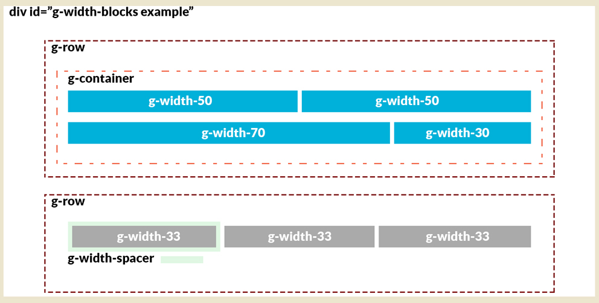

Sometimes, you will want to create custom responsive content within the bounds of a simple content area. For example, within an article/post on your site, as opposed to being created dynamically through a particle.

The way this is done in Gantry 5 is a lot like it was in Gantry 4, with a few minor differences in syntax.

When using these classes, create your HTML code for a gantry-width block, then set the percentage of the row that block should use.

You repeat this process until the accumulated total of your blocks is equal to a 100% for any given row.

This is the basic structure of the gantry-width blocks:
 


In **mobile** view, these blocks will stack on top of each other while in **tablet** or **desktop** view, these blocks will scale responsively.

If you want some spacing or a margin between your blocks, use the gantry-width spacer class.

Here is a quick breakdown of the available classes, and if you're familiar with Gantry 4, their equivalent class name in Gantry 4.

| Gantry 4 Class Name    | Gantry 5 Class Name |
| :-----                 | :-----              |
| gantry-row             | g-row               |
| gantry-width-container | g-width-container   |
| gantry-width-%%        | g-width-%%          |
| gantry-width-spacer    | g-width-spacer      |

The available custom widths are `.g-width-10`, `.g-width-15`, `.g-width-20`, `.g-width-25`, `.g-width-30`, `.g-width-33`, `.g-width-40`, `.g-width-50`, `.g-width-60`, `.g-width-66`, `.g-width-70`, `.g-width-75`, `.g-width-80`, `.g-width-90`.

Here are some examples along with the code that created them.

## Example 1


Here we use our Custom Gantry-Widths to create a one row/four column pricing table.

```html
<div class="g-width-spacer">
    <p class="nomarginbottom">All plans come with awesome support by email and phone. There is no hidden fee!</p>
</div>
<div class="g-width-container">
    <!-- Column1 - Basic -->
    <div class="g-width-25">
        <ul class="rt-table">
            <li class="rt-table-title">Basic</li>
            <li class="rt-table-price">$28</li>
            <li class="rt-table-description">Globally incubate standards compliant channels</li>
            <li class="rt-table-item">5GB Storage</li>
            <li class="rt-table-item">10 Users</li>
            <li class="rt-table-item">20 Emails</li>
            <li class="rt-table-cta-button"><a class="readon" href="http://www.rockettheme.com/joomla/templates/osmosis">Sign Up</a></li>
        </ul>
    </div>
    <!-- Column2 - Standard -->
    <div class="g-width-25">
        <ul class="rt-table">
            <li class="rt-table-title">Standard</li>
            <li class="rt-table-price">$58</li>
            <li class="rt-table-description">Globally incubate standards compliant channels</li>
            <li class="rt-table-item">25GB Storage</li>
            <li class="rt-table-item">20 Users</li>
            <li class="rt-table-item">30 Emails</li>
            <li class="rt-table-cta-button"><a class="readon" href="http://www.rockettheme.com/joomla/templates/osmosis">Sign Up</a></li>
        </ul>
    </div>
    <!-- Column3 - Titanium -->
    <div class="g-width-25">
        <ul class="rt-table">
            <li class="rt-table-title">Titanium</li>
            <li class="rt-table-price">$88</li>
            <li class="rt-table-description">Globally incubate standards compliant channels</li>
            <li class="rt-table-item">50GB Storage</li>
            <li class="rt-table-item">30 Users</li>
            <li class="rt-table-item">40 Emails</li>
            <li class="rt-table-cta-button"><a class="readon" href="http://www.rockettheme.com/joomla/templates/osmosis">Sign Up</a></li>
        </ul>
    </div>
    <!-- Column4 - Platinum -->
    <div class="g-width-25">
        <ul class="rt-table rt-table-last-col">
            <li class="rt-table-title">Platinum</li>
            <li class="rt-table-price">$288</li>
            <li class="rt-table-description">Globally incubate standards compliant channels</li>
            <li class="rt-table-item">500GB Storage</li>
            <li class="rt-table-item">100 Users</li>
            <li class="rt-table-item">200 Emails</li>
            <li class="rt-table-cta-button"><a class="readon" href="http://www.rockettheme.com/joomla/templates/osmosis">Sign Up</a></li>
        </ul>
    </div>
</div>
<div class="clear"></div>
```

## Example 2
 


This is a straight forward example of a one row/four column presentation of alternating text content and images.

```html
<div class="g-width-spacer">
    <p>Free <strong>10 days trial</strong> on all plans. No credit card needed! Need a bigger plan? <a href="http://www.rockettheme.com/joomla/templates/osmosis">View Professional Plan</a>.</p>
</div>
    <div class="g-row">
        <div class="g-width-container">
            <!-- Row1 Column1 - Text -->
            <div class="g-width-25">
                <div class="g-width-spacer">
                    <a href="#">Dropdown Menu</a>
                    <p>A Dropdown Menu system, with inline icons, multiple columns and much more.</p>
                    <p>
                        <a href="#" class="button button-3 button-small">Learn More</a>
                    </p>
                </div>
            </div>
            <!-- Row1 Column2 - Image -->
            <div class="g-width-25">
                <div class="g-width-spacer">
                    <span class="rt-image">
                        
                    </span>
                </div>
            </div>
            <!-- Row1 Column3 - Text -->
            <div class="g-width-25">
                <div class="g-width-spacer">
                    <a href="#">Positions</a>
                    <p>Unlimited positions, with drag and drop add, delete, move and resize capabilities.</p>
                    <p>
                        <a href="#" class="button button-3 button-small">Learn More</a>
                    </p>
                </div>
            </div>
            <!-- Row1 Column4 - Image -->
            <div class="g-width-25">
                <div class="g-width-spacer">
                    <span class="rt-image">
                        
                    </span>
                </div>
            </div>
        </div>
    </div>
</div>
```

## Example 3
 


The first Particle Block is a two row/two column photo gallery.

```html
<!-- Block-size50-Left - Row1 -->
<div class="g-row">
    <div class="g-width-container">
        <!-- Block-size50-Left - Row1 - Image Left-->
        <div class="g-width-50">
            <div class="g-width-spacer">
                <div class="rt-image-effect">
                    
                    <div class="rt-image-effect-caption">
                        <p>
                            <a href="/component/content/article?id=1&Itemid=111"><i class="fa fa-fw fa-file-text-o"></i></a>
                            <a href="http://www.rockettheme.com/joomla/templates/myriad"><i class="fa fa-fw fa-file-image-o"></i></a>
                            <a data-rokbox href="/images/rocketlauncher/home/fp-feature/img-01.jpg"><i class="fa fa-fw fa-search"></i></a>
                        </p>
                    </div>                      
                </div>  
            </div>
        </div>
        <!-- Block-size50-Left - Row1 - Image Right-->
        <div class="g-width-50">
            <div class="g-width-spacer">
                <div class="rt-image-effect">
                    
                    <div class="rt-image-effect-caption">
                        <p>
                            <a href="/component/content/article?id=1&Itemid=111"><i class="fa fa-fw fa-file-text-o"></i></a>
                            <a href="http://www.rockettheme.com/joomla/templates/myriad"><i class="fa fa-fw fa-file-image-o"></i></a>
                            <a data-rokbox href="/images/rocketlauncher/home/fp-feature/img-02.jpg"><i class="fa fa-fw fa-search"></i></a>
                        </p>
                    </div>                      
                </div>
            </div>
        </div>      
    </div>
</div>
<div class="clear"></div>
<div class="g-row">
    <div class="g-width-container">
        <!-- Block-size50-Left - Row2 - Image Left-->
        <div class="g-width-50">
            <div class="g-width-spacer">
                <div class="rt-image-effect">
                    
                    <div class="rt-image-effect-caption">
                        <p>
                            <a href="/component/content/article?id=1&Itemid=111"><i class="fa fa-fw fa-file-text-o"></i></a>
                            <a href="http://www.rockettheme.com/joomla/templates/myriad"><i class="fa fa-fw fa-file-image-o"></i></a>
                            <a data-rokbox href="/images/rocketlauncher/home/fp-feature/img-03.jpg"><i class="fa fa-fw fa-search"></i></a>
                        </p>
                    </div>                      
                </div>
            </div>
        </div>
        <!-- Block-size50-Left - Row2 - Image Right-->
        <div class="g-width-50">
            <div class="g-width-spacer">
                <div class="rt-image-effect">
                    
                    <div class="rt-image-effect-caption">
                        <p>
                            <a href="/component/content/article?id=1&Itemid=111"><i class="fa fa-fw fa-file-text-o"></i></a>
                            <a href="http://www.rockettheme.com/joomla/templates/myriad"><i class="fa fa-fw fa-file-image-o"></i></a>
                            <a data-rokbox href="/images/rocketlauncher/home/fp-feature/img-04.jpg"><i class="fa fa-fw fa-search"></i></a>
                        </p>
                    </div>                      
                </div>
            </div>
        </div>      
    </div>
</div>
<div class="clear"></div>
```

The second Particle Block is a one row/three column Image & Text layout.

```html
<!-- Block-size50-Right - Row1 -->
<div class="g-row">
    <!-- Block-size50-Right - Row1 - Column1-->
    <div class="g-width-33">
        <div class="g-width-spacer">
            <div class="rt-icon-badge rt-text-accent2"><span class="fa fa-desktop"></span></div>
            <h5 class="medpaddingtop rt-text-accent2">Responsive Layout</h5>
            <p>A responsive layout automatically adapts to the viewing device, allowing for tablets.</p>
            <a href="/component/content/article?id=1&Itemid=111" class="readon4">Read More</a>
        </div>
    </div>
    <!-- Block-size50-Right - Row1 - Column2-->
    <div class="g-width-33">
        <div class="g-width-spacer">
            <div class="rt-icon-badge rt-text-accent3"><span class="fa fa-th"></span></div>
            <h5 class="medpaddingtop rt-text-accent3">Editable Structure</h5>
            <p>The template manager offers configuration options to individually control each module.</p>
            <a href="/component/content/article?id=1&Itemid=111" class="readon3">Read More</a>
        </div>
    </div>
    <!-- Block-size50-Right - Row1 - Column3-->
    <div class="g-width-33">
        <div class="g-width-spacer">
            <div class="rt-icon-badge rt-text-accent2"><span class="fa fa-mobile-phone"></span></div>
            <h5 class="medpaddingtop rt-text-accent2">Mobile Support</h5>
            <p>Vermilion has responsive styling for smartphones, but also benefits from a mobile.</p>
            <a href="/component/content/article?id=1&Itemid=111" class="readon4">Read More</a>
        </div>
    </div>  
</div>
<div class="clear"></div>
```

This is what the iPhone 6 view looks like of the above three examples:


## Example 4


This is a one row/five column presentation of text content.

```html
<div class="customrt-center">
	<p>Will You be the Next to Join Our Happy Clients?</p>
<br>
<div class="g-row">
	<div class="g-width-container">
    <!-- Row1 - Column1-->
		<div class="g-width-20">
			<div class="g-width-spacer">
				<a target="_blank" href="http://www.rockettheme.com/joomla/templates/hadron"></a>
			</div>
		</div>
    <!-- Row1 - Column2-->
		<div class="g-width-20">
			<div class="g-width-spacer">
				<a target="_blank" href="http://www.rockettheme.com/joomla/templates/acacia"></a>
			</div>
		</div>
    <!-- Row1 - Column3-->
		<div class="g-width-20">
			<div class="g-width-spacer">
				<a target="_blank" href="http://www.rockettheme.com/joomla/templates/corvus"></a>
			</div>
		</div>
    <!-- Row1 - Column4-->
		<div class="g-width-20">
			<div class="g-width-spacer">
				<a target="_blank" href="http://www.rockettheme.com/joomla/templates/spectral"></a>
			</div>
		</div>
    <!-- Row1 - Column5-->
		<div class="g-width-20">
			<div class="g-width-spacer">
				<a target="_blank" href="http://www.rockettheme.com/joomla/templates/stratos"></a>
			</div>
		</div>
	</div>
</div>
<div class="clear"></div><br><br>
<p><a target="_blank" href="http://www.rockettheme.com/joomla/templates/ricochet" class="readon">Join Now</a></p></div>
```

## Example 5


This is a three row/two column presentation of Image & Text with the left-right positioning alternating for each row.

```html
<div class="example1">
    <!-- Row1 - Image Left -->
    <div class="g-row">
        <div class="g-width-spacer">
            <div class="g-width-container">
                <div class="g-width-33">
                    <div class="g-width-spacer">
                        <span class="rt-image">
                            
                        </span>
                    </div>
                </div>
                <div class="g-width-66">
                    <div class="g-width-spacer">
                        <a class="g-title-subhero" href="#">Dropdown Menu</a>
                        <p>A Dropdown Menu system, with inline icons, multiple columns and much more.</p>
                        <p>One of the newest additions to the Gantry framework coming in Gantry5 is the powerful Menu Editor.</p>
                        <p>This global administrative panel gives you the ability to quickly and easily enhance your site’s menus.</p>
                        <p>
                            <a href="#" class="button button-3 button-small">Learn More</a>
                        </p>
                    </div>
                </div>
            </div>
        </div>
    </div>
    <!-- Row2 - Image Right -->
    <div class="g-row">
        <div class="g-width-container">
            <div class="g-width-66">
                <div class="g-width-spacer">
                    <a class="g-title-subhero" href="#">Positions</a>
                    <p>Unlimited positions, with drag and drop add, delete, move and resize capabilities.</p>
                    <p>One of the most difficult and time-consuming tasks associated with migrating your Joomla site from one template to another is having to reassign all of your modules from one position naming scheme to another.</p>
                    <p>
                        <a href="#" class="button button-3 button-small">Learn More</a>
                    </p>
                </div>
            </div>
            <div class="g-width-33">
                <div class="g-width-spacer">
                    <span class="rt-image">
                        
                    </span>
                </div>
            </div>
        </div>
    </div>
    <!-- Row3 - Image Left -->
    <div class="g-row">
        <div class="g-width-container">
            <div class="g-width-33">
                <div class="g-width-spacer">
                    <span class="rt-image">
                        
                    </span>
                </div>
            </div>
            <div class="g-width-66">
                <div class="g-width-spacer">
                    <a class="g-title-subhero" href="#">Variations</a>
                    <p>A Dropdown Menu system, with inline icons, multiple columns and much more.</p>
                    <p>One of the newest additions to the Gantry framework coming in Gantry5 is the powerful Menu Editor.</p>
                    <p>This global administrative panel gives you the ability to quickly and easily enhance your site’s menus.</p>
                    <p>
                        <a href="#" class="button button-3 button-small">Learn More</a>
                    </p>
                </div>
            </div>
        </div>
    </div>
    <!-- Row4 - Image Right -->
    <div class="g-row">
        <div class="g-width-container">
            <div class="g-width-66">
                <div class="g-width-spacer">
                    <a class="g-title-subhero" href="#">Presets</a>
                    <p>Unlimited positions, with drag and drop add, delete, move and resize capabilities.</p>
                    <p>One of the most difficult and time-consuming tasks associated with migrating your Joomla site from one template to another is having to reassign all of your modules from one position naming scheme to another.</p>
                    <p>
                        <a href="#" class="button button-3 button-small">Learn More</a>
                    </p>
                </div>
            </div>
            <div class="g-width-33">
                <div class="g-width-spacer">
                    <span class="rt-image">
                        
                    </span>
                </div>
            </div>
        </div>
    </div>
    <!-- Row5 - Image Left -->
    <div class="g-row">
        <div class="g-width-container">
            <div class="g-width-33">
                <div class="g-width-spacer">
                    <span class="rt-image">
                        
                    </span>
                </div>
            </div>
            <div class="g-width-66">
                <div class="g-width-spacer">
                    <a class="g-title-subhero" href="#">Responsive</a>
                    <p>Unlimited positions, with drag and drop add, delete, move and resize capabilities.</p>
                    <p>One of the most difficult and time-consuming tasks associated with migrating your Joomla site from one template to another is having to reassign all of your modules from one position naming scheme to another.</p>
                    <p>
                        <a href="#" class="button button-3 button-small">Learn More</a>
                    </p>
                </div>
            </div>
        </div>
    </div>
    <!-- Row6 - Image Right -->
    <div class="g-row">
        <div class="g-width-container">
            <div class="g-width-66">
                <div class="g-width-spacer">
                    <a class="g-title-subhero" href="#">Typography</a>
                    <p>Unlimited positions, with drag and drop add, delete, move and resize capabilities.</p>
                    <p>One of the most difficult and time-consuming tasks associated with migrating your Joomla site from one template to another is having to reassign all of your modules from one position naming scheme to another.</p>
                    <p>
                        <a href="#" class="button button-3 button-small">Learn More</a>
                    </p>
                </div>
            </div>
            <div class="g-width-33">
                <div class="g-width-spacer">
                    <span class="rt-image">
                        
                    </span>
                </div>
            </div>
        </div>
    </div>
</div>
```

## Example 6


This is a complex example using five columns with multiple rows in each column.

```html
<div class="rt-center example1">
    <div class="g-row">
        <div class="g-width-spacer">
            <!-- COLUMN 1 -->
            <div class="g-width-25">
                <h2>On AIR</h2>
                <!-- COLUMN 1 ROW 1 -->
                <div class="g-width-container">
                    <!-- ROW 1 -->
                    <div class="g-width-50">
                        <div class="g-width-spacer">
                            <a href="#"><span>Nervousness</span><br></a>
                        </div>
                    </div>
                    <div class="g-width-50">
                        <div class="g-width-spacer">
                            <a href="#"><span>Stand-ups</span><br></a>
                        </div>
                    </div>
                </div>
                <div class="g-width-container">
                    <!-- ROW 2 -->
                    <div class="g-width-50">
                        <div class="g-width-spacer">
                            <a href="#"><span>Live Shots</span><br></a>
                        </div>
                    </div>
                    <div class="g-width-50">
                        <div class="g-width-spacer">
                            <a href="#"><span>Voice Quality</span><br></a>
                        </div>
                    </div>
                </div>
                <div class="g-width-container">
                    <!-- ROW 3 -->
                    <div class="g-width-100">
                        <div class="g-width-spacer">
                            <a href="#"><span>How to Use a Teleprompter</span><br></a>
                        </div>
                    </div>
                </div>
            </div>
            <!-- END OF COLUMN 1 -->
            <!-- COLUMN 2 -->
            <div class="g-width-25">
                <h2>Production</h2>
                <!-- COLUMN 2 ROW 1 -->
                <div class="g-width-container">
                    <!-- ROW 1 -->
                    <div class="g-width-50">
                        <div class="g-width-spacer">
                            <a href="#"><span>Field Videos </span><br></a>
                        </div>
                    </div>
                    <div class="g-width-50">
                        <div class="g-width-spacer">
                            <a href="#"><span>Interview Shots</span><br></a>
                        </div>
                    </div>
                </div>
                <div class="g-width-container">
                    <!-- ROW 2 -->
                    <div class="g-width-50">
                        <div class="g-width-spacer">
                            <a href="#"><span>Stand-up Shoot</span><br></a>
                        </div>
                    </div>
                    <div class="g-width-50">
                        <div class="g-width-spacer">
                            <a href="#"><span>Get Good Audio</span><br></a>
                        </div>
                    </div>
                </div>
            </div>
            <!-- END OF COLUMN 2 -->
            <!-- COLUMN 3 -->
            <div class="g-width-25">
                <h2>Broadcast Journalism</h2>
                <!-- COLUMN 3 ROW 1 -->
                <div class="g-width-container">
                    <!-- ROW 1 -->
                    <div class="g-width-50">
                        <div class="g-width-spacer">
                            <a href="#"><span>Why be a Journalist</span><br></a>
                        </div>
                    </div>
                    <div class="g-width-50">
                        <div class="g-width-spacer">
                            <a href="#"><span>Fairness & Accuracy</span><br></a>
                        </div>
                    </div>
                </div>
                <div class="g-width-container">
                    <!-- ROW 2 -->
                    <div class="g-width-100">
                        <div class="g-width-spacer">
                            <a href="#"><span>Characteristics of Good Reporter</span><br></a>
                        </div>
                    </div>
                </div>
                <div class="g-width-container">
                    <!-- ROW 3 -->
                    <div class="g-width-100">
                        <div class="g-width-spacer">
                            <a href="#"><span>Characteristics of News</span><br></a>
                        </div>
                    </div>
                </div>
                <div class="g-width-container">
                    <!-- ROW 4 -->
                    <div class="g-width-15">
                        <div class="g-width-spacer">
                            <a href="#"><span>Legal</span><br></a>
                        </div>
                    </div>
                    <div class="g-width-15">
                        <div class="g-width-spacer">
                            <a href="#"><span>Libel</span><br></a>
                        </div>
                    </div>
                    <div class="g-width-35">
                        <div class="g-width-spacer">
                            <a href="#"><span>Libel and Private People</span><br></a>
                        </div>
                    </div>
                    <div class="g-width-35">
                        <div class="g-width-spacer">
                            <a href="#"><span>Copyright Fair Use</span><br></a>
                        </div>
                    </div>
                </div>
                <div class="g-width-container">
                    <!-- ROW 5 -->
                    <div class="g-width-50">
                        <div class="g-width-spacer">
                            <a href="#"><span>Common Mistakes</span><br></a>
                        </div>
                    </div>
                    <div class="g-width-50">
                        <div class="g-width-spacer">
                            <a href="#"><span>Using Active Voice</span><br></a>
                        </div>
                    </div>
                </div>
            </div>
            <!-- END OF COLUMN 3 -->
            <!-- COLUMN 4 -->
            <div class="g-width-25">
                <h2>Interviewing</h2>
                <!-- COLUMN 4 ROW 1 -->
                <div class="g-width-container">
                    <!-- ROW 1 -->
                    <div class="g-width-100">
                        <div class="g-width-spacer">
                            <a href="#"><span>The Live Shot Interview</span><br></a>
                        </div>
                    </div>
                </div>
            </div>
            <!-- END OF COLUMN 4 -->
        </div>
    </div>
</div>
<!-- EXAMPLE END -->
```

This is what the iPhone 6 view looks like of the above three examples:


This is the CSS file that makes this all work, `[JOOMLA-ROOT]\templates\rt_templateName\custom\scss\g-width.scss`:

```css
/* GANTRY5 DEVELOPMENT MODE ENABLED.
 
   WARNING: This file is automatically generated by Gantry5. Any modifications to this file will be lost!
 
   For more information on modifying CSS, please read:
 
   http://docs.gantry.org/gantry5/configure/styles
   http://docs.gantry.org/gantry5/tutorials/adding-a-custom-style-sheet
*/
/***
 
gantry-row              g-row
gantry-width-container  g-width-container
gantry-width-xx         g-width-xx
gantry-width-spacer     g-width-spacer
 
***/
 
.g-width-container {
    -webkit-flex-flow: row wrap;
    -moz-flex-flow: row wrap;
    -ms-flex-flow: row wrap;
    flex-flow: row wrap;
}
.g-width-container {
    display: -webkit-flex;
    display: -moz-flex;
    display: -ms-flexbox;
    display: -ms-flex;
    display: flex;
}
.g-row, .g-row:before, .g-row:after {
  -webkit-box-sizing: border-box !important;
  -moz-box-sizing: border-box !important;
  box-sizing: border-box !important;
}
.g-row {
    margin: 0 -15px;
}
.g-container [class*="g-block"], .g-container [class*="g-width"] {
    min-width: 0;
}
.g-width-block {
    display: block;
    float: left;
}
.g-row .g-width-container {
  display: -webkit-box;
  display: -moz-box;
  display: box;
  display: -webkit-flex;
  display: -moz-flex;
  display: -ms-flexbox;
  display: flex;
  -webkit-flex-flow: row wrap;
  -moz-flex-flow: row wrap;
  flex-flow: row wrap;
  margin: -0.25rem;
}
.g-width-spacer {
    margin: 15px;
}
 
.gantry-block-center {
  margin: auto;
  float: none !important;
}
.g-width-10,
.g-width-15,
.g-width-20,
.g-width-25,
.g-width-30,
.g-width-33,
.g-width-40,
.g-width-50,
.g-width-60,
.g-width-66,
.g-width-70,
.g-width-75,
.g-width-80,
.g-width-85,
.g-width-90 {
  display: block;
  float: left;
}
.g-width-10 {
  width: 10%;
}
.g-width-15 {
  width: 15%;
}
.g-width-20 {
  width: 20%;
}
.g-width-25 {
  width: 25%;
}
.g-width-30 {
  width: 30%;
}
.g-width-33 {
  width: 33.3333333333%;
}
.g-width-40 {
  width: 40%;
}
.g-width-50 {
  width: 50%;
}
.g-width-60 {
  width: 60%;
}
.g-width-66 {
  width: 66.6666666667%;
}
.g-width-70 {
  width: 70%;
}
.g-width-75 {
  width: 75%;
}
.g-width-80 {
  width: 80%;
}
.g-width-85 {
  width: 85%;
}
.g-width-90 {
  width: 90%;
}
.g-width-100 {
  width: 100%;
}
// typically 30rem to 47.938rem
@include breakpoint(large-mobile-range) {
  .g-width-20, .g-width-25, .g-width-30, .g-width-33, .g-width-40, .g-width-50, .g-width-60, .g-width-66, .g-width-70, .g-width-75, .g-width-80, .g-width-85, .g-width-90 {
      width: 100%;
  }
}
```

To make it accessible you need to call it from your Custom CSS file, `[JOOMLA-ROOT]\templates\rt_templateName\custom\scss\custom.scss`:

```css
// import breakpoints
@import "dependencies";
 
// import gantry-width
@import "g-width";
```
