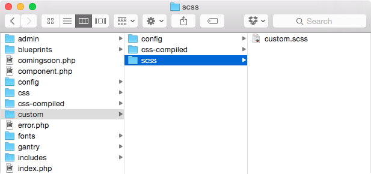

 {.border .shadow}

Adding a custom stylesheet is a fairly straightforward process. You just need to navigate in the directory structure to `(site root)/templates/(template directory)/custom/scss` and create a file called `custom.scss` if one doesn't already exist. This file will then be compiled as an override to the theme's core stylesheet files. Anything you place in this file will override classes and defaults assigned in other areas of the theme.

You can format the file's content in either **SCSS** or **CSS**. Gantry will automatically pick it up and compile it properly.
