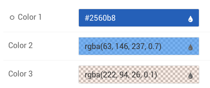
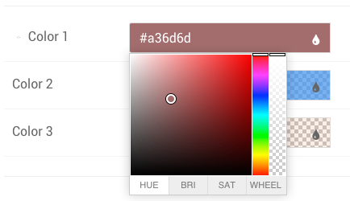

Gantry 5 includes a new **Color Picker** which gives you the ability to set colors for a particular element of your theme, a Particle, etc.

 {.border .shadow}

The **Color Picker** includes five integrated tools including **hue**, **saturation**, **brightness**, **opacity**, and a **color wheel**. These settings make it easy to quickly configure your color selection to meet your needs.

## Using the Color Picker

 {.border .shadow}

Gantry 5's **Color Picker** includes four major tabs, each with its own powerful tool to help you find and refine the color you are choosing. These tabs are:

| Tab    | Description                                                                                                                                                                                                                                                               |
| :----- | :-----                                                                                                                                                                                                                                                                    |
| HUE    | This tool gives you the ability to select a color based on hue, using the rainbow slider to the right to select a general color and the main area to refine this selection.                                                                                               |
| BRI    | This is the **Brightness** tool, giving you the ability to further refine your color selection by adjusting its brightness using the color slider on the right. The main area here serves to enable you to quickly navigate between colors.                               |
| SAT    | The **Saturation** tool is a quick and easy way to adjust the saturation of your color. Move the slider down to remove color, and up to add to its saturation level. Like the **Brightness** tool, the main area is used to quickly select between colors of the rainbow. |
| WHEEL  | This tool is a basic color wheel, a preferred method of color selection by many.                                                                                                                                                                                          |

In addition to these tools, you also have the ability to adjust the color's opacity setting using the transparency slider located on the far-right side of the **Color Picker**.

## Adding the Color Picker to Your Site

The Color Picker is a Gantry 5 input. If you want to add it to your theme or particle, you would do so by assigning the administrative input as `input.colorpicker` in the associated YAML file. 

Here is an example of how this would look in the YAML file of a section of a theme. In this example, the **feature.yaml** is located in `theme/blueprints/styles/`.

```yaml
name: Feature Colors
description: Feature colors for the Hydrogen theme
type: section

form:
  fields:

    background:
      type: input.colorpicker
      label: Background
      default: "#ffffff"
    text-color:
      type: input.colorpicker
      label: Text
      default: "#666666"
```

This example accomplishes two things. First, it creates the **Feature** section in the Gantry **Styles** administrative panel, as well as the **Background** and **Text** color settings you can easily configure from the Gantry 5 Administrator.

Second, it provides fields the theme can hook to, providing the color variable used when the page is rendered.

You can find more information about how to use YAML files in Gantry 5 [in our guide](../../advanced/particle-yaml-field-types).