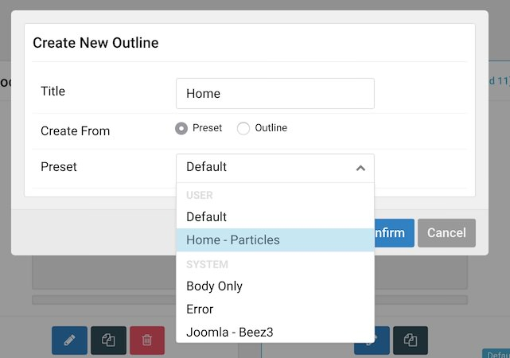
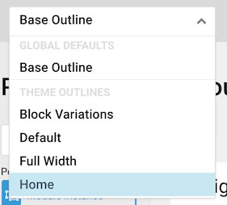
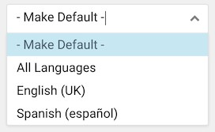

It's common practice to assign a default template using the Template Manager built in to Joomla. This manager is found by navigating to **Extensions > Templates** and is widely used to define a default administrative and front-end template. This is actually a little different with Gantry 5.

 {.border .shadow}

Default has a different meaning with Gantry 5. It isn't an assignment, it's actually used in absence of an assignment, also known as a fallback. If you have a page, for example, that doesn't have an outline assigned to it in the **Assignments** tab, it will use the layout from the default outline, instead.

In Gantry 5, assigning a default outline using the Templates settings page does not actually assign the home page. Home page outlines are assigned using the Assignments tab in the outline's settings within the Gantry 5 administrator.

## Home Page Example

 {.border .shadow}

Let's say you want to create a new outline and assign it to your home page. The first step would be to navigate to **Components > Gantry 5 Themes** then select the **Outline** tab in the upper-right area of the page. This will bring you to the **Outlines** panel. Here, you can select the blue `+` sign next to the page's title and create a new outline. In our example, we named this new outline `Home` and used the `Home - Particles` preset to pre-load its layout with particles. You can also base your home page's outline on an existing outline or load from any other preset that comes with the template you would like.

 {.border .shadow}

Next, we'll hit the **Back to Setup** button and switch over to the new **Home** outline we created. This can be done using the dropdown menu in the toolbar.

 {.border .shadow}

From there, you can switch over to the **Assignments** tab and select the **Home** option. This will set the new outline as the assigned resource for your site's home page. You have now created a new outline and properly assigned it as your site's home page. Any edits you make to this outline will appear in the home page of your website.

## Multilanguage Assignments

 {.border .shadow}

For multilanguage sites, every language can be assigned one default outline through the **Assignments** tab. This assignment overrides the "All Languages" default, and may not even be used in most multilanguage cases.

This tool is only used if you want to override the "All Languages" default. If, for example, you want a different layout or particles for your Spanish visitors than your English ones - you would create a new outline and assign it as the Spanish default.

If you need to have a single particle with multiple languages, you would be better served by using a module position and the **Gantry 5 Particle** module - with the modules assigned to specific languages. This allows Joomla to handle the particle assignments using its own language system, easily.
