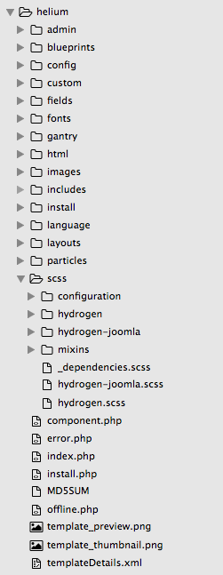
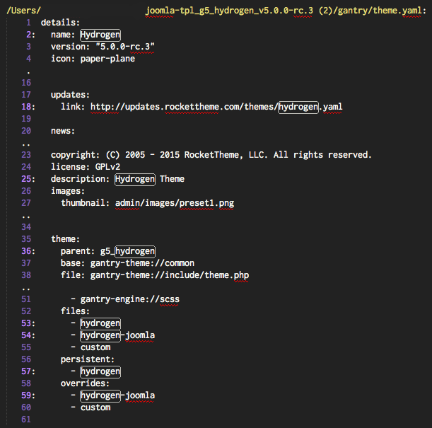
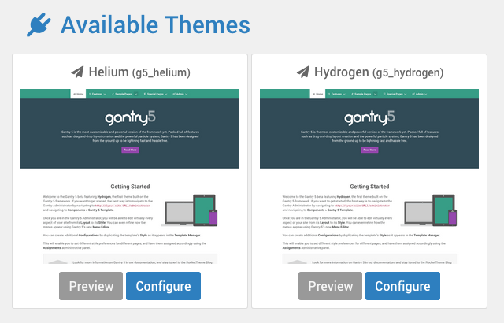

One really easy way to get started with Gantry 5 theme development is to take the free **Hydrogen** theme and to use it as a base by which you can create a unique, fully customized theme that meets your individual needs. 

If you have a client, for example, that wants to have a site created that is unlike anything that already exists, you could build a new theme from scratch, utilize a premium theme that has all the bells and whistles baked right in to help you hit the ground running, or use **Hydrogen** as a base by which you can create a custom theme for your customer, without having to recreate all the little bits and pieces that make a Gantry 5 theme work.

One important step to making a custom theme is renaming it. Doing this gives your created theme a name that your client, and yourself, can easily reference and understand. It gives you the ability to add some personal branding to your work, as well. 

Keep in mind that this also means that you become the primary source of updates and support for this new theme. This is a very advanced step, and will likely not be necessary for the vast majority of developers out there. It may also conflict with terms and conditions provided by some third-party theme providers.

In this guide, we will go over the steps you need to know to change the name of the free **Hydrogen** theme to **Helium**.

## Step 1: Download, Unzip, and Open Hydrogen

Everything we detail in this guide will be done with the assumption that you are modifying an unzipped download of the Hydrogen theme using a powerful text/code editor. One very popular option is [Sublime Text](http://www.sublimetext.com/) which is a cross-platform text editor for code that has very good expandability, plenty of useful plugins, and can be customized very easily to meet the individual developer's needs. 

Another popular choice is [Atom](https://atom.io/), which has a lot of the same functionality as Sublime Text, but is free and maintained by the folks at GitHub. Like Sublime Text, Atom is cross-platform compatible and will run on Windows, OS X, as well as many popular Linux distros.

Hydrogen itself is available for download on [Gantry.org](http://gantry.org/downloads) and carries the same [MIT/GPL version 2 or later license](http://docs.gantry.org/gantry5/basics/license-and-usage) as Gantry 5.

Once you have downloaded the latest version of the Hydrogen theme, unzip it and open the unzipped folder in your preferred text editor.

## Step 2: Change Names of Files and Directories

 {.shadow .border}

This is a great first step as it enables you to establish your new theme name at the directory structure level. With Hydrogen, this includes the parent folder the theme is contained within, and a several subfolders, including: `scss/hydrogen` and `scss/hydrogen-joomla`. As we are changing these to fall in line with the new Helium name, these folders would be renamed to `scss/helium` and `scss/helium-joomla`, respectively. 

Here are some of the files/directories you would want to rename to reflect the new theme name:

| File / Directory                               | Description                                                                                                                                                                                              |
| :-----                                         | :-----                                                                                                                                                                                                   |
| `language/en-GB/en-GB.tpl_g5_hydrogen.ini`     | This file designates the English values for the theme's name, description, and more for the front end of the site. You should replace all instances of the theme name in both the file name and content. |
| `language/en-GB/en-GB.tpl_g5_hydrogen.sys.ini` | This file designates the English values for the theme's name, description, and more for the administrative back end.                                                                                     |
| `scss/hydrogen-joomla.scss`                    | This file contains platform-specific styling for the theme.                                                                                                                                              |
| `scss/hydrogen.scss`                           | This file contains styling for the theme.                                                                                                                                                                |
| `scss/hydrogen/`                               | This directory contains SCSS files related to specific parts of the theme. For example, the **Header** section's styling rules are stored here.                                                          |
| `scss/hydrogen-joomla/`                        | This directory contains SCSS files related to specific parts of the theme. Unlike the other SCSS directory, this one is platform-specific.                                                               |

>>>> Changing directory names may result in a break in functionality as other aspects of the theme depend on that directory structure to incorporate data from files stored within them. This break will be resolved in the following steps.

There may be additional directories carrying the current theme name that need to be changed, as well. This varies from theme to theme, and may even change depending on which platform(s) it is built to support.

## Step 3: Search Files for the Theme Name

This is a pretty basic step, and one that really takes advantage of a good text editor. Searching all the theme files for instances of the theme's name (in this case, `hydrogen`) in a non-case sensitive way will give you an immediate glimpse of all the instances in which the current theme name is present.

 {.shadow .border}

This name may be referenced in a lot of places, including in directory path references, classes, text descriptions, and more.

You are going to want to replace `Hydrogen` with `Helium` everywhere in the theme's file base. This can be done very easily by doing a case-sensitive **Find and Replace** search throughout the theme's files using your text editor. Here are the different search and replacements we did to convert the Hydrogen theme.

| Find       | Replace  |
| :-----     | :-----   |
| `Hydrogen` | `Helium` |
| `hydrogen` | `helium` |
| `HYDROGEN` | `HELIUM` |

 {.shadow .border}

Once this is done, save your changes and zip the parent folder of the theme. Once this is done, you should be able to install the new theme with its new name. The **Helium** theme will also be able to be installed next to the **Hydrogen** theme without conflict.