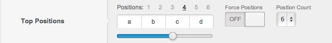

One of the key concepts that make Gantry so powerful is its ability to provide a wealth of power and functionality which can easily be accessed by the Joomla template. This makes it easier for you, the template developer, to write cleaner code. As a side benefit, it provides a level of abstraction that will allow you to go from Joomla 2.5 to 3.0+ without changing anything in your template. The Gantry library handles all the complicated bits for you.

http://youtube.com/embed/AKqppYSttEE

>>> Check out the Gantry introductory video to get a feel of the features and capabilities that you Gantry brings to the table. Powerful features, presets, layout configuration, responsive design, and much, much more.

Template index.php
------------------
Let's start digging into Gantry by taking a look at how the **index.php** looks:

```php
// no direct access
defined( '_JEXEC' ) or die( 'Restricted index access' );

// load and inititialize gantry class
require_once('lib/gantry/gantry.php');
$gantry->init();
```

This top code block is all you need to get Gantry up and running. By including the **gantry.php** bootstrap file, you are connecting to the Gantry framework and initializing it. A lot of heavy lifting gets processed in here, safely out of sight and mind. 

Next, we'll look at the start of the HTML:

```html
<!doctype html>
<html xml:lang="<?php echo $gantry->language; ?>" lang="<?php echo $gantry->language;?>" >
<head>
    <meta name="viewport" content="width=device-width, initial-scale=1.0">
    <?php
        $gantry->displayHead();
        $gantry->addStyle('grid-responsive.css', 5);
        $gantry->addLess('global.less', 'master.css', 8);
        $gantry->addScript('rokmediaqueries.js');
    ?>
</head>
```

Here, you can see the traditional Joomla calls to get the language have been replaced with equivalent Gantry calls. Also, there's a call to include the **head** elements. These include CSS and JavaScript that has been initialized and set up in other parts of the Gantry framework. Also, there's a call to add some stylesheets to the head of the template.

This call has built-in logic, which will include core Gantry CSS files, as well as any CSS files that match these names in the template CSS folders. Also, any browser-specific versions of these files will be added. For example, if you have `/css/master-ie8.css` in the template's css folder, it will get picked up also, but will only be presented to IE8 browsers.

An important new feature in Gantry 4 is the ability to add and compile LESS files into CSS by using the `addLess()` method. You can also include JavaScript files with the `addScript()` method. Let's take a look at the next bit of the file that includes some references to some module positions:

```php
<?php /** Begin Top Surround **/ if ($gantry->countModules('top')) : ?>
    <header id="rt-top-surround">
        <?php /** Begin Top **/ if ($gantry->countModules('top')) : ?>
        <div id="rt-top" <?php echo $gantry->displayClassesByTag('rt-top'); ?>>
            <div class="rt-container">
                <?php echo $gantry->displayModules('top','standard','standard'); ?>
                <div class="clear"></div>
            </div>
        </div>
        <?php /** End Top **/ endif; ?>
```

Now, you can see some of the elegance that Gantry provides. First, in the body tag, you see a call to `displayBodyTag()` method. This is grabbing all of the template parameters that have been designated via the `templateOptions.xml` to display in the body tag. It will output these in the format of **PARAM_NAME-PARAM_VALUE**.

This makes it really easy to style your CSS based on a template parameter, with no coding required on your part. Below that, you can see the comments that designate the **Top** position.

First, there's an **if** block to check to ensure there is content assigned to these positions. If there is no content, the entire **rt-top** HTML structure is not displayed. Inside the **rt-container** div is a call to **displayModules()** that takes a position name, in this case "top", a layout type (**standard**), and a module chrome (also **standard**). More on these a little later.

This function performs all the output logic for a possible 6 module positions: `top-a`, `top-b`, `top-c`, `top-d`, `top-e`, and `top-f`. You configure your modules with the Joomla Module Manager as you normally would, but this one method does all the calculation concerning how the modules should display.

XML Configuration
-----------------
In the case of the example we're discussing, we refer to a **top** position, but this really represents a group of up to six individual module positions within that one top position. The possible module positions available to you are defined in the _templateDetails.xml_ file, in the **position** XML element.

This is the standard location to define positions for Joomla. This is what is used by the Module Manager to show possible assignable positions to modules. All the custom Gantry configuration options are located in the __templateOptions.xml__ file. This file is broken down into fieldsets that define each 'tab' you see in the Template options.

The top of this file contains some base information about the template and its configuraiton. The **top** module position has it's own configuration in the layouts section, along with a default value and some configuration settings that define which options are available. The abbreviated XML for this looks like this:

```xml
<positions>
.....
<position>top-a</position>
<position>top-b</position>
<position>top-c</position>
<position>top-d</position>
<position>top-e</position>
<position>top-f</position>
.....
</positions>
.....
<fields name="top" type="position" label="TOP_POS" description="LAYOUT_POS_DESC">
    <field name="layout" type="positions" default="3,3,3,3" label="">
        <schemas>1,2,3,4,5,6</schemas>
        <words>2,3,4,5,6,7,8,9,10</words>
    </field>
    <field name="showall" type="toggle" default="0" label="FORCE_POS"/>
    <field name="showmax" type="showmax" default="6" label="POS_COUNT"/>
</fields>
.....
```

Template Parameters
-------------------
At this point, if you don't touch anything, the default layout will be an equal size for the published modules. However, with Gantry, you can completely control how much room each module position has to work with and this is controlled via the Template Parameters user interface. Below, you see a screenshot of how this **topPosition** parameter element is rendered in the template parameters.




Full coverage of the Gantry module layout configurations and how to set up different widths can be found in the [Layouts](../configure/layouts.md) section.

