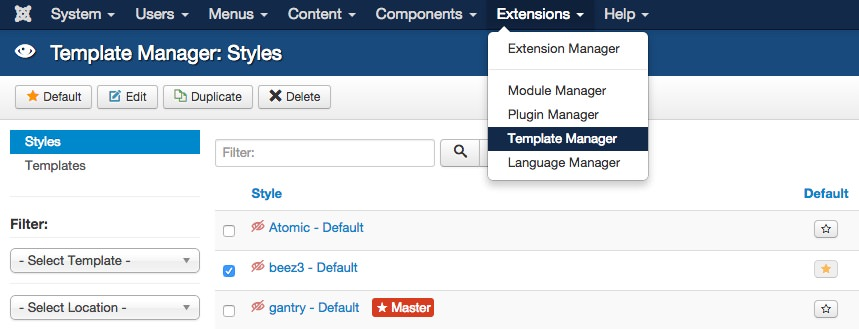
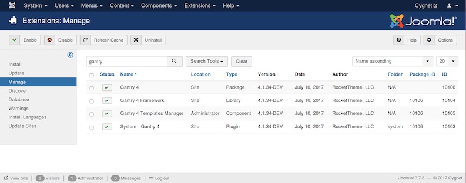
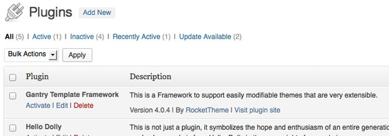

There are two main parts to Gantry -- the framework and the template. Therefore, there are two main parts to the uninstallation process. If you intend to uninstall only the template portion, then follow the instructions for removing the template only. Keeping the Gantry library installed really does cause any harm or reduced performance as it is only used by a Gantry-enabled template. If you wish to uninstall the library, you can follow those steps.

Unsetting the Gantry Template as Default
----------------------------------------



To uninstall the gantry template, you will first have to ensure that it is not set as the default template. Go to **Extensions → Template Manager**, select the checkbox to any other site template that is not gantry, and click **Default** in the button toolbar.




To uninstall the gantry template, you will first have to ensure that it's not activated. Go to **Appearance → Themes** and click on the **Activate** on any other template that is not gantry. After that, you can simply click on the **Delete** button next to the Gantry template.


{{ gravui_tabs({'Joomla':tab1, 'WordPress':tab2}) }}

Uninstall Gantry
----------------



Uninstall the Gantry component, library, plugin and template from **Extensions → Extensions Manager → Manage**. Insert **gantry** into the **Filter** and click **Search**. Select all Gantry elements you wish to uninstall, then click **Uninstall** in the button toolbar. Gantry will now be uninstalled.




Uninstall the Gantry plugin and template from **Plugins** admin page. Please search for **Gantry Template Framework** and **Deactivate** it first, then click **Delete** next to its name. Gantry will now be deleted.


{{ gravui_tabs({'Joomla':tab1, 'WordPress':tab2}) }}

