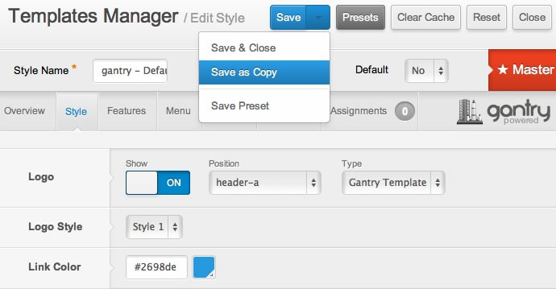
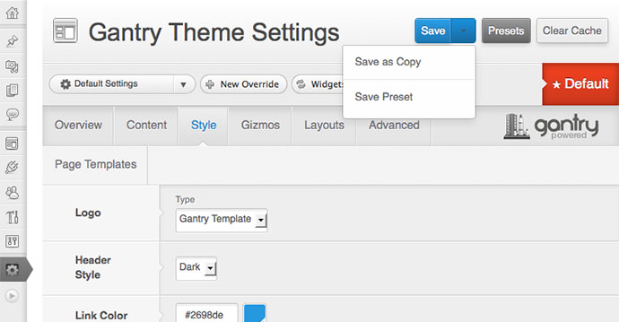
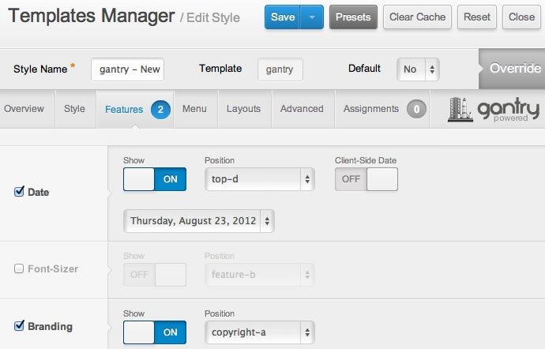
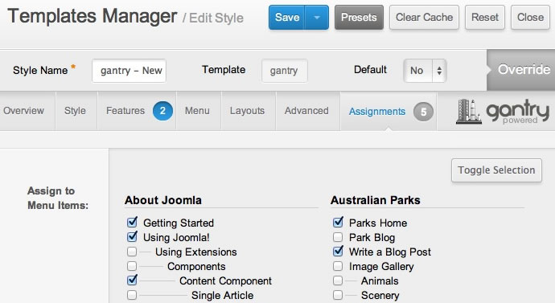
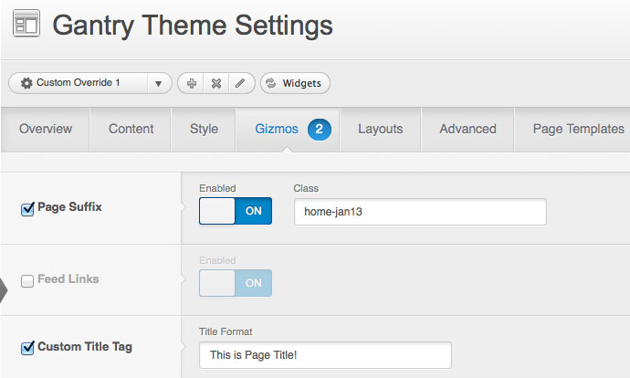
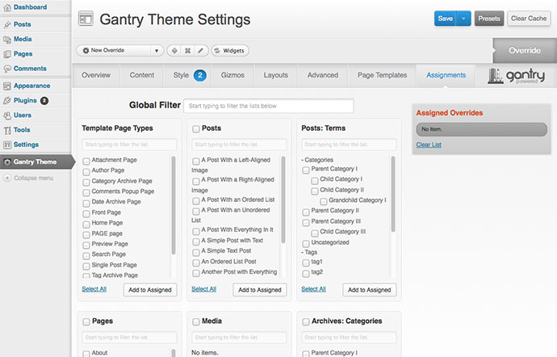

Gantry offers the ability to override default template configurations for individual menu items. A frequent example is to have different layout configurations for your site's front page than its subpages. Gantry makes this achievable in just a few clicks.

http://youtube.com/embed/xG1TJUM4SQ8

>>> Discover the power of Gantry and it's ability to configure any parameter based on template overrides using custom template styles. Gantry adds the power of inheritance of settings to enable easier per-menu custom configurations.

Creating an Override
--------------------



There are two methods for creating a new set of assignable configurations. The first is the **Save as Copy** method, which involves you editing the Gantry template master at **Extensions → Template Manager → gantry — Default (Master)**. Configure your settings, change the **Style Name**, and select **Save as Copy** from the **Save** dropdown.

Alternatively, from the **Template Manager**, you can select the checkbox for the Gantry template master and click **Duplicate** from the button toolbar. It will automatically create a copy and mark it as **Override**.




There are two methods of creating a new set of assignable configurations. The first is the **Save as Copy** method which involves you editing the Gantry theme at **Admin Dashboard → Theme Settings**. Configure your settings, select **Save as Copy** from the **Save** dropdown, and change the override name from **Duplicate Override** to your own.

Alternatively, you can simply click on the **New Override** button, change the name of the newly created override and modify all of the parameters from scratch. Please note that when creating a new override, the beggining parameters are always the same as the ones set in the **Default Settings** override.


{{ gravui_tabs({'Joomla':tab1, 'WordPress':tab2}) }}

Configuring an Override
-----------------------



Once an **Override** has been created, you simply need to open it and configure. Each tab will have greyed out parameters that can be activated via the checkbox.

Configure items, then click on the **Assignments** tab. All menu items are listed here, so just check the items you wish this particular Override to apply to.




Once an **Override** has been created, you simply need to switch to it (if you weren't automatically) and configure. Each tab will have greyed out parameters that can be activated via the checkbox.

Configure items, then click on the **Assignments** tab. All content type items are listed here, so just check the items you want this particular Override to apply to.


{{ gravui_tabs({'Joomla':tab1, 'WordPress':tab2}) }}

Override Examples
-----------------

Below is a simple example of an Override. The **Layouts → MainBody Positions** setting has been overridden for a menu item. Therefore, in the screenshots below, you can see that the sidebar allocation can be either left or right of the main body, and not applied globally. This is the same for other settings as well, as with Features or Styles.

| ![][example1] | ![][example2] |
| ------------- | ------------- |
| ![][config1]  | ![][config2]  |

[config1]: template-override-example-config1.jpg
[config2]: template-override-example-config2.jpg
[example1]: template-override-example1.jpg
[example2]: template-override-example2.jpg
