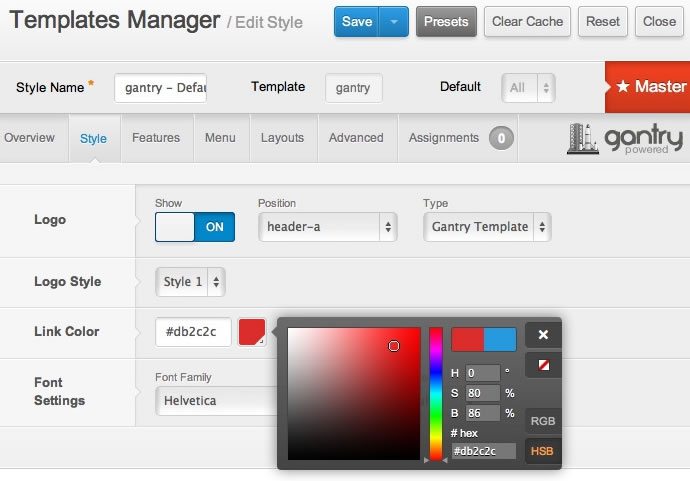
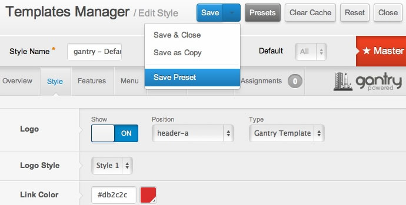
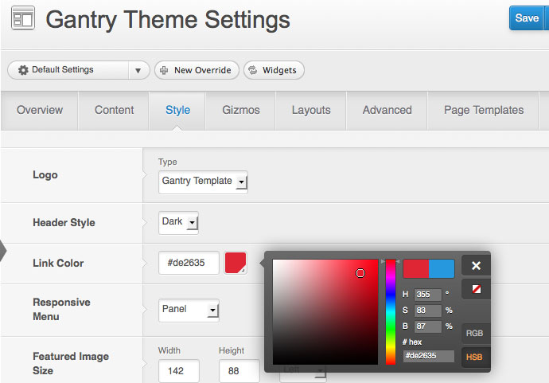
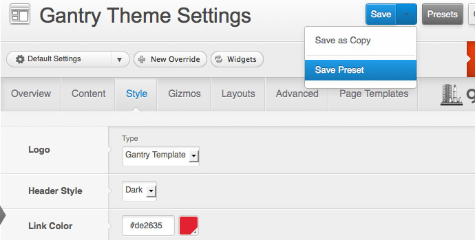
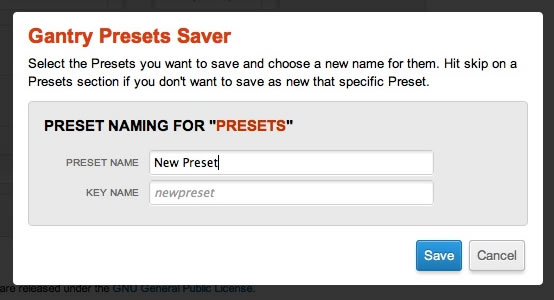
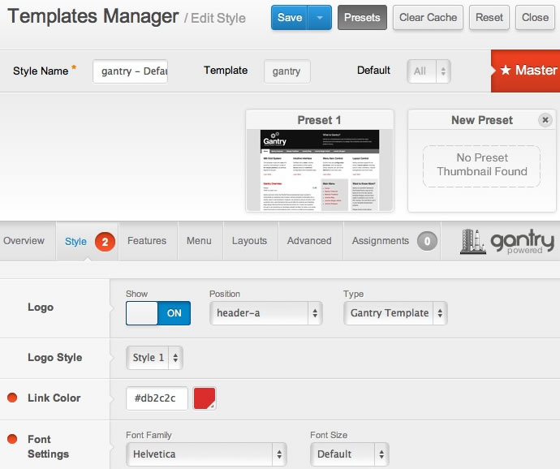

Gantry makes use of a powerful Preset system that allows developers and site builders to create preset styles and configurations.

[plugin:youtube](https://www.youtube.com/watch?v=n6FsulE58lU)

>>> Creating a custom preset is a very simple task with Gantry. Check out this short video on how to customize your layout then create a custom preset based on your configuration options.

Gantry Presets are a combination of Gantry features and configuration settings which allow you to create predefined groupings for the entire template, as well as on a per-menu item basis. Presets can consist of any Gantry configuration option such css style, link color, background, body graphic levels, font settings, and much more.

Creating a new Preset
---------------------

[ui-tabs position="top-left" active="0" theme="lite"]
[ui-tab title="Joomla"]

To configure a new preset, go to **Extensions → Template Manager → gantry — Default (Master) → Style**. Configure any style settings for the template such as Link Color.

 {.border .shadow}

Once configured, click **Save Preset** from the Save button dropdown.

 {.border .shadow}

The Gantry **Presets Saver** modal dialog box will appear. Enter your **Preset Name**, and the **Key Name** will be generated automatically. Then click **Save**.

 {.border .shadow}

[/ui-tab]
[ui-tab title="WordPress"]

To configure a new preset, go to **Admin Dashboard → Gantry Theme → Style**. From here, you can configure style settings for the template. In the example below, we'll change the link color.

 {.border .shadow}

Once configured, click **Save Preset** from the Save button dropdown.

 {.border .shadow}

The Gantry **Presets Saver** modal dialog box will appear. Enter your **Preset Name**, and the **Key Name** will be generated automatically. Then click **Save**.

 {.border .shadow}

[/ui-tab]
[/ui-tabs]

Select your new Preset
----------------------

Click on the **Presets** button to display all available presets. Your new preset will display in the preset slider. Click on the preset to load your custom style settings. Select **Save** to load the preset.

After a preset is created, you can create a thumbnail image in the `admin/presets/` folder with the filename structure **keyname.png**, where keyname is the Keyname from the modal dialog box.

 {.border .shadow}
