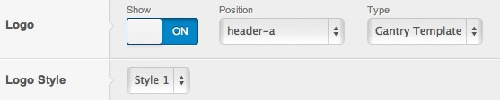
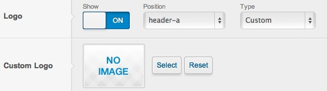
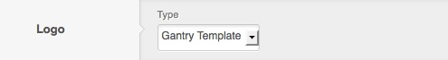
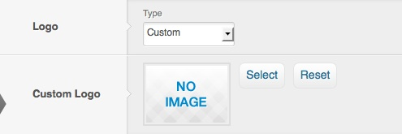
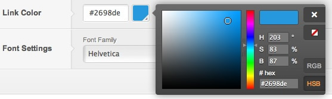
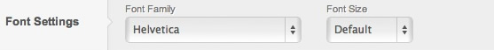
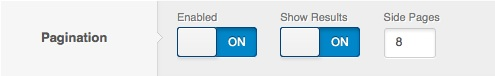
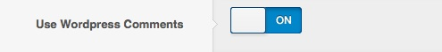
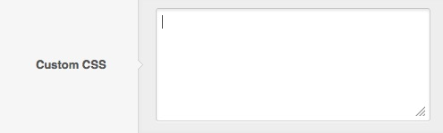

The **Style** panel in the Gantry based template administration interface provides several options for configuring the main stylistic aspects of the template. While the default Gantry template includes several options, you can easily add and configure many more, based on your template's needs. The following configuration options are available by default:

Logo
----

[ui-tabs position="top-left" active="0" theme="lite"]
[ui-tab title="Joomla"]

The Logo setting provides the ability to show/hide the logo, select its position, or changes its type. By default, this is **Gantry Template** which allows you to load three different style options for **Logo Style**.

 {.border .shadow}

The second logo type option is **Custom**. This will load the **Custom Logo** field, where you can **Select** an image through the Media Manager.

 {.border .shadow}

[/ui-tab]
[ui-tab title="WordPress"]

The *Logo* setting provides the ability to change its type. The default setting is **Gantry Template**, which loads the included template logo.

 {.border .shadow}

The second logo type option is **Custom**. This will load the **Custom Logo** field, where you can **Select** an image through the *Media Manager*.

 {.border .shadow}

[/ui-tab]
[/ui-tabs]

Link Color
----------

The Link Color setting provides the ability to easily change the main color for template links. Colors can be inputted via the color chooser popup selector, or manually using a hex code in the input field.

 {.border .shadow}

Font Settings
-------------

The Font Settings option provides the ability to change the font size as well as the default font family used in the template. Many popular web fonts are included as options and some templates also include additional custom font options.

 {.border .shadow}

WordPress Options
=====

Below are additional options in the Style tab which are specific to the WordPress platform.

Pagination
-------------------
The *Pagination Settings* setting allows you to decide how the pagination between content pages should look. This parameter allows you to decide if user should be able to see total number of pages, and how many side pages should be displayed next to the current page.

 {.border .shadow}

Use WordPress Comments
-------------------
The *Use WordPress Comments* setting gives you ability to disable the WordPress core comments on the front-end in case if you prefer to use a third-party solution.

 {.border .shadow}

Custom CSS
-------------------
The *Custom CSS* setting allows you to input your own, custom CSS code that will be added inline to the head section of the page. This way you can add custom styling (globally or per-override) to your page without modifying any of the template files.

 {.border .shadow}
