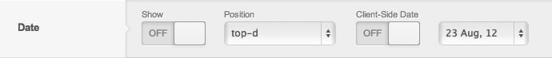
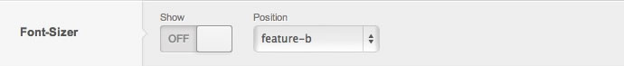
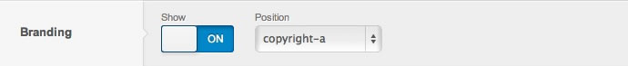
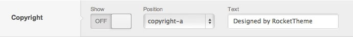
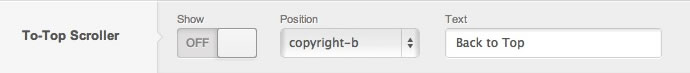
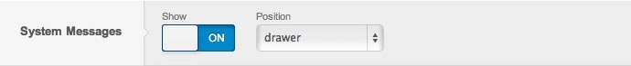
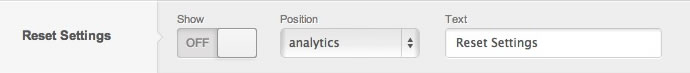

The **Features** tab in Gantry for Joomla gives you access to module-like features that enhance the look and functionality of your site. This includes things like the copyright notice at the bottom of the page, date display, and a place for you to put the **Google Analytics** code used to track analytical data for your site.

For WordPress, the equivalent tab is called **Gizmos**. Many of the features used in Joomla are represented by Widgets on WordPress. You can find out more about WordPress gizmos by visiting the [Gizmos guide](../gizmos).

http://youtube.com/embed/CiSkV5QVyhY
 
>>> A quick way to see the power of Gantry features is to check out this short screencast. It covers some of the basics of features and how they work and how they can be easily integrated into your design.

Date
----

The **Date** feature controls the output of the current date display. From this option, you can enable/disable the display of the date, enable/disable the use of client-side date, choose from several different date format options, and select a location for the date to display using any of the available module positions in the template.

Font Sizer
----------
The **Font Sizer** feature controls the output of the front end font sizer controls allowing users to increase or decrease font size. From this option you can enable/disable the display of the front end font sizer controls, as well as select a location for the font sizer to display in using any of the available module positions in the template.

Branding
--------
The **Branding** feature controls the output of the Gantry branding on the front end. From this option, you can enable/disable the display of the branding image and select which module position it loads in.

Copyright
---------
The **Copyright** feature controls the output of the copyright text. From this option, you can enable/disable the display of the copyright text and input custom copyright text to be displayed. You can even select a location for the copyright text to appear using any of the available module positions in the template.

To Top Scroller
---------------
The **To Top Scroller** feature controls the output of a link/button that, when clicked, will smoothly scroll the page back to the top. From this option, you can enable/disable the display of the to top button, input custom text to be displayed on the to top button, and select a location for the to top button to display in using any of the available module positions in the template.

System Messages
---------------
The **System Message** feature controls the output of the Joomla system messages. Joomla outputs system messages for various events, and as a feature, it's now possible to control the location of this output. From this option, you can enable/disable the display of Joomla system messages, as well as select a location for the Joomla system messages to display in using any of the available module positions in the template.

Reset Settings
--------------
The **Reset Settings** feature controls the output of a link/button that, when used, will reset all of the stored cookies and return the front end site settings to default. From this option, you can enable/disable the display of the Reset Settings button, control the text output, as well as select a location for the Reset Settings button to display in using any of the available module positions in the template.

Google Analytics
--------------
The Google Analytics feature allows you to enable Google Analytics tracking on your site in a quick and easy way. Just enable the feature and input your UA Key assigned to you by Google in the field provided.

