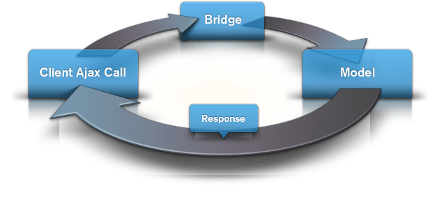

The Gantry framework comes with a built-in Ajax system which acts as a bridge between the client and the framework. Every Ajax call is directed to an "Ajax Model" that receives the Ajax parameters, which after its operations, is able to return a response with what the original Ajax Call request is expecting. Below, you can see a schematic sum of the process.



The real power of the Gantry framework's built-in Ajax system is the models. Every developer can create their own custom Ajax Models and use the Ajax calls client-side to retrieve specific types of data.

There are 2 Ajax systems in the Gantry framework that work exactly the same way with one exception: restrictions. In fact, the first can be used for everything regarding the template while the second can only be used in the admin side. This restriction makes it so that even by error you cannot use the admin Ajax System on the front end.

The Ajax URL
------------

In order to get started with a client-side Ajax call, you need to call the proper URL in order to trigger the Ajax Model mechanism of Gantry.

The URL is the same for both front and back end, with the **/administrator/** path addition when we are dealing with the back end. This looks like: `/index.php?option=com_gantry&task=ajax&format=raw&template=[your_active_template_name]`

If we split up the query, you will notice that it looks similar to a Joomla! component call. This is effectively what it is:

* __option__ → com_gantry
* __task__ → ajax
* __format__ → raw
* __template__ → [your_active_template_name]

All of these bits are fundamental in order for the Gantry Ajax mechanism to work. The **active_template_name** reference to the name of the frontend template that you are currently using. For instance, if we were using the default Gantry template, it would be `template=gantry`.

Gantry comes with a method that makes it easier to construct and output the Ajax URL. From PHP, you can run `$gantry->getAjaxUrl()`, and the same URL string above will be returned.

This is especially useful if you want to output the URL in a global JavaScript variable which you can then reference in your own script.

For example, in the **index.php** file of your template, you could output an inline script declaration similar to:

```php
<?php
// location: /templates/gantry/index.php
...
    $gantry->addInlineScript("var GantryAjaxURL = '".$gantry->getAjaxUrl()."';");
    // GantryAjaxURL => '/index.php?option=com_gantry&task=ajax&format=raw&template=gantry'
```

This allows you to access the **GantryAjaxURL** variable from your own scripts.


The Ajax Models
---------------
The Ajax Models are effectively PHP functions in which all the logic of a specific model goes in.

A model can have any kind of purpose. For instance, in the Gantry Admin we use Ajax models for:

* Clearing the cache
* Removing LESS compiled files
* Ajax saving
* Creating presets

As you can see, a model can be anything you can think of, and the mechanism running behind the scenes makes this a very powerful way to control anything you would like via Ajax.

The Ajax Models are located in the Gantry Library folder under **[your_site]/library/gantry/**. The front-end models are at the root location `ajax-models/`, while the backend models are inside the admin folder: `admin/ajax-models/`.

Due to the ability of the Gantry framework to override, you will never need to edit the models contained in the mentioned locations. In fact, you can just work at the template folder level, keeping the same structure.

So, your custom template Ajax models should be stored in **[your_site]/templates/[your_template]/ajax-models/**, while your custom admin Ajax models should be kept in **[your_site]/templates/[your_template]/admin/ajax-models/**.

Below, an example of a model which will return all of the POST requests back to the Ajax:

```php
<?php
// location: /templates/gantry/ajax-models/example.php

    defined('JPATH_BASE') or die();
    global $gantry;

    print_r(JRequest::get('post'));

?>
```

It is important to note that the Ajax Model filename is what identifies the model itself. The name, in this case **example**, is what we will use in the Ajax call from client-side to retrieve the data we need for this particular model.


The Ajax Call Syntax
--------------------
Now that we have a model, we are ready to create the JavaScript Ajax call. Gantry is based on MooTools 1.4, so the following examples will be written in MooTools syntax. This doesn't mean you can't use native JavaScript or any other framework to perform the same action.

Let's assume our **index.php** is loading a JS file named `ajax-call.js`, as well as providing us the GantryAjaxURL variable as described in **The Ajax URL** section.

```php
<?php
// location: /templates/gantry/index.php
...
    $gantry->addInlineScript("var GantryAjaxURL = '".$gantry->getAjaxUrl()."';");
    $gantry->addScript('ajax-call.js'); // /templates/gantry/js/ajax-call.js
...
```

The template is now set to load your custom script ajax-call. We will also be able to rely on the JavaScript variable GantryAjaxURL which contains the ajax url as a string.

Now the fun part -- the JavaScript:

```javascript
((function(){

window.addEvent('domready', function(){
    // Request Object
    var request = new Request({
        url: GantryAjaxURL, // <r;- remember, this is the ajax url, explained in The Ajax URL section.
        onSuccess: function(response){
            console.log(response);
        }
    });

    // Request post
    request.post({
        model: 'example', // <r;- the model must always be passed in
        animal: 'Cat',
        name: 'Pixel'
    });
});

})());
```

It is very simple. As you can see, we are creating a request object that we then use to request a POST. It is mandatory that the model (`model: 'example'`) is always present during a request, that is what identifies which model the Gantry Ajax system should load and run.

This is the output of the above example:

```php
Array
(
    [model] => example
    [animal] => Cat
    [name] => Pixel
)
```

The model we used is a very basic and simple example, but it is a good starting point. You can see much more advanced models if you explore the gantry library repository.
