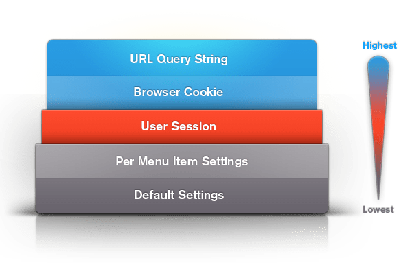

The Gantry framework has multiple methods of setting the value of a configuration parameter. This is one of the things that makes Gantry so flexible. You can have parameter settings which are per-menu item, and even override that with per user settings in the users session and cookies.

There are **static** and **dynamic** ways of setting the value of a parameter. The **static** ways of setting the values are the default and per-menu item configured in the template administration. The **dynamic** methods of setting the value use the user's session, the user's browser cookies, and the URL query string.


Parameter Value Precedence
--------------------------

[ui-tabs position="top-left" active="0" theme="lite"]
[ui-tab title="Joomla"]

All parameters start out with a default value that is set in `template-options.xml`. These values can be changed in multiple different ways, each overriding the next if it has a value. The order of precedence for setting values is shown here:



The highest method that sets a value will always win. For example, if a **backgroundlevel** is set to **high** by for a particular menu item, but it is set to **low** by a URL link passing it in on a query string, then it is going to be set to **low** when the page is displayed because the URL Query string has higher precedence than the per-menu item setting.

[/ui-tab]
[ui-tab title="WordPress"]

All parameters start out with a default value that is set in `templateDetails.xml`. But, these values can be changed in several different ways, each overriding the next (if it has a value). The order of precedence for setting values is displayed below:


The highest method which sets a value will always win. For example, if a **backgroundlevel** is set to **high** for a particular menu item, but is set to **low** by a URL link passing it in on a query string, it is going to be set to **low** when the page is displayed because the URL Query string has higher precedence than the per-override setting.

[/ui-tab]
[/ui-tabs]

Allowing Dynamic Parameter Values
---------------------------------

[ui-tabs position="top-left" active="0" theme="lite"]
[ui-tab title="Joomla"]

By default, all setting of a parameter value by a dynamic method is turned off. In order to allow setting of a value dynamically you have to enable it for every parameter you want and by the methods that the parameter is allowed to use. This is done in the `template-options.xml`. A parameter can have the following syntax with **setby**'s and **setin**'s. Here's an example:

```xml
<field name="backgroundlevel" default="med" type="slider" class="graphic-level" label="BG_LEVEL" description="BG_LEVEL_DESC" setbyurl="true" setinsession="true" setbysession="true" setincookie="true" setbycookie="true" isbodyclass="true">
    <option>low</option>
    <option>med</option>
    <option>high</option>
</field>
```

In the above example, the **backgroundlevel** can be set by the URL query string, a browser cookie, and by the users session. This is defined by the **setbyurl**, **setbycookie**, and **setbysession** attributes. If a value is set by any of those means, it is stored in the cookie and session as defined by the **setincookie** and **setinsession** attributes.

The attributes allowed are:

* __setbyurl__ - allows you to pass in a parameter via the query string url (default = false)
* __setbycookie__ - allows you to store the passed in value for an extended cookie set time (beyond a single php session) (default = false)
* __setincookie__ - allows you to get the param value from a cookie (default = false)
* __setbysession__ - allows you to store that passed value for the length of the session (default = false)
* __setinsession__ - allows you to get the param value from the session (default = false)
* __setinoverride__ - allows the param to be overridden in override styles (default = true)
* __isbodyclass__ - allows you to set the value of the param to be a class on the body tag for css targeting (default = false)

[/ui-tab]
[ui-tab title="WordPress"]

By default, all setting of a parameter value by a dynamic method is turned off. In order to allow setting of a value dynamically, you have to enable it for every parameter you want, and by the methods the parameter is allowed to use. This is done in `templateDetails.xml`. A parameter can have the following syntax with **setby**s and **setin**s. The following is an example of how this is done:

```xml
<param name="backgroundlevel" default="med" type="slider" class="graphic-level" label="BG_LEVEL" description="BG_LEVEL_DESC" setbyurl="true" setinsession="true" setbysession="true" setincookie="true" setbycookie="true" isbodyclass="true">
    <option>low</option>
    <option>med</option>
    <option>high</option>
</param>
```

In the above example, the **backgroundlevel** can be set by the URL query string, a browser cookie, and by the user's session. This is defined by the **setbyurl**, **setbycookie**, and **setbysession** attributes. If a value is set by any of those means, it is stored in the cookie and session as defined by the **setincookie** and **setinsession** attributes.

The attributes allowed are:

* __setbyurl__ - allows you to pass in a parameter via the query string url (default = false)
* __setbycookie__ - allows you to store the passed in value for an extended cookie set time (beyond a single php session) (default = false)
* __setincookie__ - allows you to get the param value from a cookie (default = false)
* __setbysession__ - allows you to store that passed value for the length of the session (default = false)
* __setinsession__ - allows you to get the param value from the session (default = false)
* __setinoverride__ - allows the param to be overridden in override styles (default = true)
* __isbodyclass__ - allows you to set the value of the param to be a class on the body tag for css targeting (default = false)

[/ui-tab]
[/ui-tabs]

Notes on Presets
----------------

Preset types can use the same dynamic values mechanisms to set the values of parameters. If a preset type is used to set a value dynamically, all of the parameters defined in the preset have their values set to that which is in the preset. If an individual parameter is set at the same time, then the individual parameter value overrides the one in the preset.

For example, if there are presets defined as follows:

```php
$gantry_presets = array(
    'presets' => array(
        'preset1' => array(
            'name' => 'Preset 1',
            'linkcolor' => '#00c',
            'backgroundlevel' => 'low',
        ),
        'preset2' => array(
            'name' => 'Preset 2',
            'linkcolor' => '#ff0000',
            'backgroundlevel' => 'med',
        )
      )
    )
);
```

Here's a look at how the parameters are defined:

```xml
<field name="presets" type="preset" mode="scroller" default="preset1" label="STYLE_PRESETS" description="STYLE_PRESETS_DESC" setbyurl="true" setinsession="true" setbysession="true" setbycookie="true" setinmenuitem="false" />
<field name="backgroundlevel" default="med" type="slider" class="graphic-level" label="BG_LEVEL" description="BG_LEVEL_DESC" setbyurl="true" setinsession="true" setbysession="true" setincookie="true" setbycookie="true" isbodyclass="true">
    <option>low</option>
    <option>med</option>
    <option>high</option>
</field>
```

A URL call with the query string:

```
?presets=preset2&backgroundlevel=high
```

Would give the following values:

```ini
linkcolor=#ff0000
backgroundlevel=high
```
