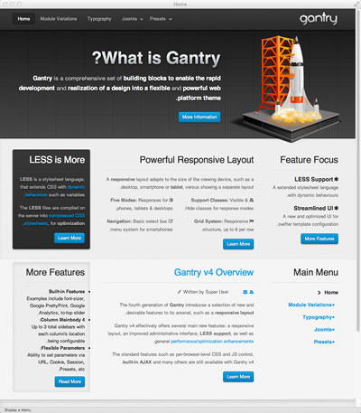

RTL stands for “right-to-left", a key component when delivering a website in an RTL language such as Hebrew, Arabic, Urdu, etc. Gantry has built-in RTL support which will automatically “flip” the content layouts and ordering to support RTL. We’ve also provided an override in the advanced section of the template details, so you can turn this default behavior off if you like. However, if the language file supports it, RTL will be enabled by default.



The toggle to tell Joomla that a language which should be displayed in RTL format is located in the language's XML file. In the case of the default en-GB language, there is a configuration file located here:

`YOUR_SITE/languages/en-GB/en-GB.xml`

This file looks like this:

```xml
<?xml version="1.0" encoding="utf-8"?>
<metafile version="2.5" client="site">
    <name>English (United Kingdom)</name>
    <version>2.5.5</version>
    <creationDate>2008-03-15</creationDate>
    <author>Joomla! Project</author>
    <authorEmail>admin\@joomla.org</authorEmail>
    <authorUrl>www.joomla.org</authorUrl>
    <copyright>Copyright (C) 2005 - 2012 Open Source Matters. All rights reserved.</copyright>
    <license>GNU General Public License version 2 or later; see LICENSE.txt</license>
    <description>en-GB site language</description>
    <files>
        <filename>en-GB.com_contact.ini</filename>
        ... snip ...
        <filename>en-GB.tpl_beez5.sys.ini</filename>
    </files>
    <metadata>
        <name>English (United Kingdom)</name>
        <tag>en-GB</tag>
        <rtl>0</rtl>
        <locale>en_GB.utf8, en_GB.UTF-8, en_GB, eng_GB, en, english, english-uk, uk, gbr, britain, england, great britain, uk, united kingdom, united-kingdom</locale>
        <firstDay>0</firstDay>
    </metadata>
    <params />
</metafile>
```

The relevant part is that `<rtl />` tag that is currently set to **0**. By changing this value to **1**, you effectively switch on RTL for this language.




You can force WordPress to display a language in RTL format. In this case, there is a configuration file located in `YOUR_SITE/wp-config.php`. Just edit the file and add the following code:

```php
$text_direction = 'rtl';
```

A visual example of how this looks/works can be seen below. The first image is in the default English in the traditional LTR format, while the second one is the same default English, but with the forced RTL in the `wp-config.php` file.


{{ gravui_tabs({'Joomla':tab1, 'WordPress':tab2}) }}

A visual example of how this looks/works can be seen below. The first image is in the default english in the traditional LTR format, while the second one is the same default english but with the RTL toggle enabled in the `en-GB.xml` language file.

|  |  |
| :--------------: | :--------------: |
|  Left To Right   |  Right To Left   |

RTL Limitations
---------------

Gantry provides a great deal of functionality to support RTL right out of the box. However, RTL is complicated and your specific layout will need extensive RTL support in your CSS files to properly handle the needs of your design when in RTL mode. 

For example, if you have a module header that is shaped like a ribbon that comes in on the left side of the module in regular LTR mode, then you must create a special version of this ribbon that comes in from the right for RTL mode. Also, you will have to provide the specific changes to the layout in your CSS file to ensure this image is rendered correctly.

To help out with this process, we have created a special feature that detects the RTL mode and inserts a class called **rtl** in the body tag. That way, you can add specific rules such as:

```css
body.rtl .module .ribbon { float: right; }
```

to just target the **.ribbon** class in RTL mode.

Other limitations are entirely based on the browsers. Some browsers support RTL mode very well. Not surprisingly, these are the browsers based on Mozilla and WebKit including: Firefox, Safari, Chrome, etc. 

Internet Explorer -- even version 9.0 -- does a very poor job of rendering in RTL mode. You will probably have to spend extensive time doing CSS work-arounds for these browsers. This is far beyond the scope of what Gantry can do for you.
