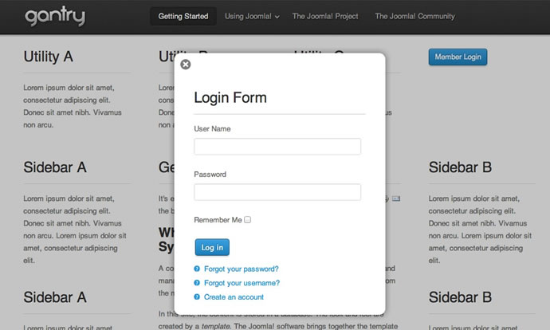

This tutorial details how to create a custom feature that utilizes RokBox to present a module position inside a modal popup box that will be triggered by a link/button on the front end. For this tutorial, we will be making a login module popup.

  {.border .shadow}

>>>>> The login popup functionality requires the [RokBox Plugin](http://www.rockettheme.com/joomla/extensions/rokbox) to be installed on your site. Before beginning, please ensure that you have downloaded and installed the [latest version of RokBox](http://www.rockettheme.com/joomla/extensions/rokbox).

>>>>> The Popup Login process is slightly different in Joomla and WordPress. In Joomla, this is treated as a **Feature** while it is a **Widget** in WordPress. This guide covers the Joomla method. For the WordPress method, see [our guide](../creating-a-popup-login-widget).


Step 1: Creating the Custom Feature
-----------------------------------
The logic for the link/button that triggers the popup module will be contained in a new file that we will create named  `login.php`. This is a custom feature that we'll create for this example and drop into the template's `features/` directory. Create this new PHP file with the following code:

```php
<?php
defined('JPATH_BASE') or die();

gantry_import('core.gantryfeature');

class GantryFeatureLogin extends GantryFeature {
    var $_feature_name = 'login';

    function render($position="") {
        ob_start();
        $user =& JFactory::getUser();
        ?>
        <div class="rt-block">
            <div class="rt-popupmodule-button">
            <?php if ($user->guest) : ?>
                <a data-rokbox href="#" class="buttontext button" data-rokbox-element="#rt-popuplogin">
                    <span class="desc"><?php echo $this->get('text'); ?></span>
                </a>
            <?php else : ?>
                <a data-rokbox href="#" class="buttontext button" data-rokbox-element="#rt-popuplogin">
                    <span class="desc"><?php echo $this->get('logouttext'); ?> <?php echo JText::sprintf($user->get('username')); ?></span>
                </a>
            <?php endif; ?>
            </div>
        </div>
        <?php
        return ob_get_clean();
    }
}
```

Essentially, when this feature is enabled and assigned, it will render the appropriate HTML necessary for the link/button styling and structure, as well as the RokBox link syntax that will trigger the popup effect.

While this code consists mostly of a standard set of divs to provide styling potential, there are some key RokBox syntax items as well as the reference for some dynamic text. Here's a breakdown:


RokBox Syntax
-------------

```html
<a data-rokbox href="#" class="buttontext button" data-rokbox-element="#rt-popuplogin">
```

The actual link makes use of the RokBox link syntax for calling a module into the popup. Using the datasets `data-rokbox` and `data-rokbox-element` we are referencing the module's surrounding div which tells RokBox which item needs to be placed into the popup. This surrounding div (#rt-popuplogin in our example) will be placed in a layout later on in the tutorial.


Link/Button Text
----------------

```html
<span class="desc"><?php echo $this->get('text'); ?></span>
```

In our example, we are making use of a dynamic call inside of the spans to insert the link text that will appear. This method allows us to have a nice custom text field in the template admin for easy changing of the link text, without having to edit the code. We will set up the rest of the logic for this dynamic text in later steps. Alternatively, you can simply place your desired link text in place of the echo.


Step 2: Creating a Custom Layout
--------------------------------
Next, we will be creating a custom layout taking advantage of Gantry's ability to define custom layouts for positions that allows for greater flexibility and much cleaner code in the index.

We will create a new file named `mod_login.php` and place it into the `/html/layouts` directory of the template. 

! If /html/layouts doesn't exist in your template, you can create this directory.

Paste the following code into your new file:

```php
<?php
defined('JPATH_BASE') or die();

gantry_import('core.gantrylayout');

/**
 *
 * @package gantry
 * @subpackage html.layouts
 */
class GantryLayoutMod_Login extends GantryLayout {
    var $render_params = array(
        'contents'       =>  null,
        'position'      =>  null,
        'gridCount'     =>  null,
        'pushPull'      =>  ''
    );
    function render($params = array()){
        global $gantry;

        $rparams = $this-> _getParams($params);
        ob_start();
    // XHTML LAYOUT
?>

<div id="rt-popuplogin">
  <?php echo $rparams->contents; ?>
</div>

<?php
        return ob_get_clean();
    }
}
```

This custom layout allows us to reference it in `index.php` using the name following the **mod_** which is simply **login**. After this, it will render all the HTML inside around the entire position This allows us to keep the **index.php** much more concise. For this example, we've used a single wrapper div `#rt-popuplogin`, but you can add as many elements as you need for any design considerations you have.


Step 3: Setting up the Module Chrome
------------------------------------
You can also setup a module chrome for the login feature, as defined in the above part. For this, open `/html/modules.php` and locate `?>` at the bottom of file. Immediately above, insert the following:

```php
function modChrome_login($module, &$params, &$attribs)
{
    if (!empty ($module->content)) : ?>
    <div class="rt-block">
        <div class="module-content">
            <?php if ($module->showtitle != 0) : ?>
            <h2 class="title"><?php echo $module->title; ?></h2>
            <?php endif; ?>
            <div class="module-inner">
                <?php echo $module->content; ?>
            </div>
        </div>
    </div>
    <?php endif;
}
```


Step 4: Defining the position in the index.php
----------------------------------------------
Now, we want to add the new module position which will be called into the RokBox popup. It is important to create a new module position for this purpose as it will be hidden by CSS until it is triggered, so we want it to be out of the normal flow of the page.

For this example, we are creating a position simply called **login**. So, we are going to add the following code near the very end of our template's `index.php` file immediately before the closing body tag:

```php
<?php /** Begin Popup **/
echo $gantry->displayModules('login','login','login');
/** End Popup **/ ?>
```

Inside of the **displayModules** function, we are making three references. The first refers to the name of the module position, the second to the layout we wish to use for this position (this is now referencing our **mod_login.php** layout we created in the previous step), and the third refers to the module chrome to be applied to each rendering of the module. This references your module chrome located in `/html/modules.php`. For this example, we are simply using the standard style.


Step 5: Setting up the Parameters
---------------------------------
Now, it's time to set up the parameters for this feature as well as define our new module position in the administration. This extra setup allows us to utilize the popup position as well as have the ability to customize the link text, enable/disable our popup login button, and even define which individual pages the feature will appear on. All of this is now possible from the Joomla administrator, without having to revisit editing our code.


#### Template Options

First, you'll need to open up the template's `templateDetails.xml` file, which is located in your template's root directory. A line needs to be added to the position section of this file. Look for the listing of module positions that begins with the tag `<position>` and at the bottom of the list, immediately before the `</position>` tag, add the following: `<position>login</position>`.

Next, we want to add the parameters for the feature itself in the **FEATURES** section. Find the following line in `template-options.xml`, which indicates the start of the Features panel:

```xml
<fieldset name="features" label="FEATURES">
```

Immediately following the previous line, you will want to insert the following code:

```xml
<fields name="login" type="chain" label="LOGIN">
    <field name="enabled" type="toggle" default="1" label="SHOW" />
    <field name="position" type="position" default="utility-c" label="POSITION" />
    <field name="text" type="text" default="Member Login" label="LOGIN_TEXT" class="text-medium" />
    <field name="logouttext" type="text" default="Logout" label="LOGOUT_TEXT" class="text-medium" />
</fields>
```

This code sets up the parameters for the login feature. It indicates which module position your link/button will appear, as well as states what the link text will be. In our example, it's Member Login. This will now be able to be edited via an input field in the template administration.


Step 6: Adding the CSS
----------------------
Lastly, in terms of coding, CSS will need to be added to style the module. Place the CSS in the most appropriate file, if you are using LESS, this will be `/less/template.less`, and if you are just using CSS, then `/css/template.css`. The following is required for the login to function:

```css
#rt-popuplogin { display: none; }
```

You will most likely want to add additional CSS, which you can do by using the **#rt-popuplogin** ID. This will apply strictly to the popup login.


Step 7: Putting it all together
-------------------------------
Now, all of our logic and core items are in place. We are ready to publish the login module and set the parameters. Go to **Extensions → Module Manager** and either create a new login module, or edit an existing one. Set the position to **login** and assign to all menu pages.

Next, go to **Extensions → Template Manager → YOUR_TEMPLATE → Features**. The login feature will appear at the top of this tab. Modify the settings to match your personal preferences then **Save**. Refresh your site to review the changes.

