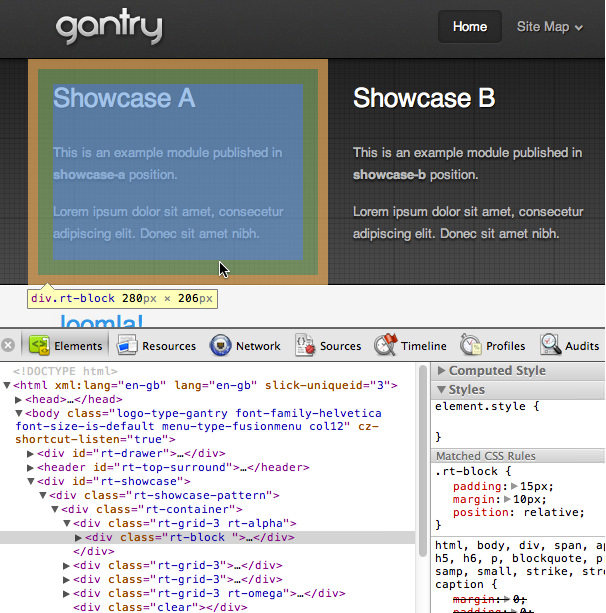
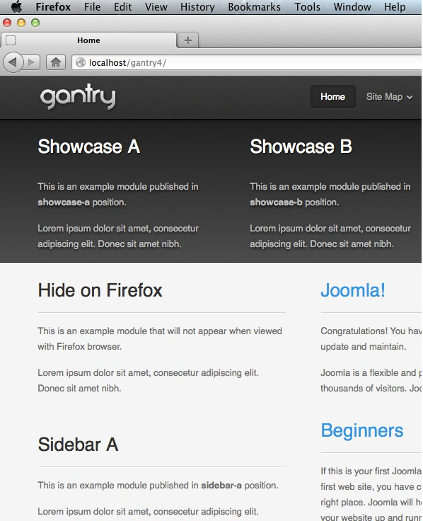
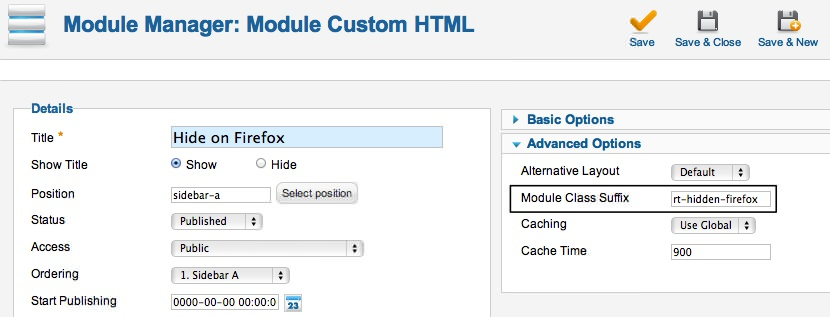

Adding a Custom Stylesheet
==========================
This tutorial will take you through the steps needed to add a custom stylesheet to your Gantry template, without worrying about lost changes when the template or Gantry framework are updated. We don't need to change any of the template files, so our custom stylesheet will not be overridden by any updates.


Custom Stylesheet with CSS
--------------------------
The Gantry template comes with structured CSS rules and properties which are compiled from the LESS files. However, there are some cases where we need to style the template without using LESS. One way is by using the custom CSS file with custom rules and properties to override a particular style in the template.


Step 1: Adding Your Custom CSS File
-----------------------------------
To create a custom CSS file, you just have to create a new css file at `/templates/[TEMPLATE]/css/` and name it **[TEMPLATE]-custom.css**. The new custom CSS file will automatically get loaded by the Gantry framework.


>> NOTE: The use of [TEMPLATE] in this guide is intended as a placeholder for the name of the template's primary directory. Replace [TEMPLATE] with the template directory name in order for these instructions to work with your site.


Step 2: Adding Your Custom Rules and Properties
-----------------------------------------------
You can now add the custom rules and properties inside the **[TEMPLATE]-custom.css** file to customize your Gantry template. If you want to override any existing rules from the template, you would need to use CSS Specificity.

We will see how we use our custom stylesheet in the example below.


Example 1: Override Existing Rules
----------------------------------
In this example, we will explain how to reduce the bottom padding and margin in the **showcase** position of the **default gantry template** which inherits rules from the `rt-block` element inside `rt-showcase`.



With Chrome Developer Tools, we can see that the default margin and padding are:

```css
.rt-block {padding: 15px; margin: 10px; position: relative;}
```

If we want to override the bottom padding and margin, we **can not** just put the same rule and just change the padding or bottom value, as seen here:

```css
.rt-block {padding: 15px 15px 0; margin: 10px 10px 0;}
```

There are many elements in the template that utilize `rt-block`, and these custom rules will affect them. Another possibility is, the custom rule will not work at all if your custom CSS file is loaded before the template CSS file that contains the existing rule.

Hence, we need to put the rule with more specific selectors. We need to create a blank file `css/gantry-custom.css`. As `rt-block` is wrapped inside `rt-showcase`, we can put the following rule inside `css/gantry-custom.css`.

```css
#rt-showcase .rt-block {padding: 15px 15px 0; margin: 10px 10px 0;}
```

Now, we can check the result with the Developer Tools again to confirm that our custom rule overrides the existing rule.


Example 2: Per-Browser Specific Custom Stylesheet
-------------------------------------------------
The Gantry Framework has the ability to load specific CSS file based on which browser and operating system is viewing the template. This ability can be also applied for our custom CSS file. You just need to create a new CSS file at `/templates/[TEMPLATE]/css/` and name it `[TEMPLATE]-custom-[BROWSER].css`. Please check the [Per-Browser Specific Control](../advanced/per_browser_control.md) page for possible name combinations.

In this example, we will explain how to hide a specific module when viewed with Firefox, while keeping it visible on other browsers. In the case of the **gantry default template**, we need to create `/templates/[TEMPLATE]/css/gantry-custom-firefox.css`.



Next, we need to put the custom rule inside `/templates/[TEMPLATE]/css/gantry-custom-firefox.css` like this:

```css
.rt-hidden-firefox {display: none;}
```

Now, we can put `rt-hidden-firefox` in the Module Class Suffix of the module we want to hide on Firefox.



Click the **Save & Close** button and confirm the result in Firefox and other browsers. We will see that the module will be hidden only on Firefox.


Per-Browser Specific Custom Stylesheet is not just limited to showing or hiding a specific module only, but we can also use this ability to create a new rule or to override some existing rules just for a specific browser, like Internet Explorer. Anything in CSS can be overridden on a per-browser basis.


Custom Stylesheet with LESS
---------------------------
Another way to add the custom style to the Gantry template is by adding a custom LESS file inside `/templates/[TEMPLATE]/less`. The custom LESS file name is formatted as  `[LESS_FILE_NAME]-custom.less` and will be compiled into the main compiled CSS file.


For example, in the default Gantry template, there is a file `less/template.less`. We can create a custom LESS file called `less/template-custom.less` and put our custom LESS elements in this file. Gantry will pick up the elements and compile it. You may also use other file names such as `less/style-custom.less`, `less/typography-custom.less`, and so on.


The only limitation with Custom LESS file is, that we **can not** use Per-Browser Specific Custom Stylesheet, such as `less/template-custom-firefox.less`. If you need to control some elements on specific browsers, we need to use the Custom CSS file described previously.
